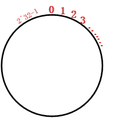
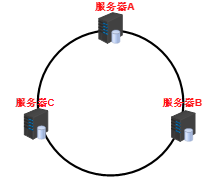
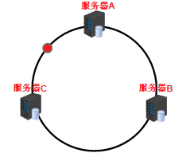

#### 一致性hash算法

##### 出现原因

* 分布式集群中，通过key 求 hash 取余节点数 决定 访问位置，实现数据分片

* 当节点数变化时（新增节点，节点出错），需要全部重新计算迁移

  
  
#####  一致性hash算法提出了在动态变化的Cache环境中，判定哈希算法好坏的四个定义：
*	**平衡性(Balance)** :  均匀分布，平衡性是指哈希的结果能够尽可能分布到所有的缓冲中去，这样可以使得所有的缓冲空间都得到利用。
*	**单调性(Monotonicity)**：节点发生变化时，尽量不影响原有数据的保存位置，尽可能减少因为节点变化导致原有数据的存储位置的变化。
*	**分散性(Spread)：**在分布式环境中，终端有可能看不到所有的缓冲，而是只能看到其中的一部分。
*	**负载(Load)：**


##### 原理

* 一致性hash是对2^32取模， 假设有一个圆环：
  * 对2 ^32取余是有依据的IPV4最大数量就是2^32，所以这样就能保证所有的ip的地址进行取余时不会重复—对应hash环上面的正数。
  * 
* 服务器位置确定（假定3台服务器ABC)：
  * 用服务器IP地址进行hash计算，使用hash后的结果改过对2^32取模，落在环上
  * 
* 从哪台服务器获取或者保持数据？
  * hash(key)  % 2 ^ 32 落在环上
  * 
  * 沿着顺时针方向遇到的第一个服务器就是A服务器，所以会被缓存到A服务器上


##### 一致性hash算法的优点

*  当服务器节点数量变化的时候只有一部分数据失效


##### hash环偏斜问题

* 集群集中在环的一部分，分布不均匀

##### 虚拟节点

* 将一个实际服务器节点映射在环上的多个虚拟节点

* 虚拟节点”的hash计算可以采用对应节点的IP地址加数字后缀的方式

  * Hash(“192.168.1.100#1”); // NODE1-1

* ```java
  虚拟节点越多，hash环上的节点就越多，缓存均匀分布的概率就越大
  ```

  


###### 使用一致性hash算法框架

* cassandra 集群
* redis集群


##  参考

* https://blog.csdn.net/qq_34672033/article/details/88916789
* https://mp.weixin.qq.com/s?__biz=MzIwMzY1OTU1NQ==&mid=2247492222&idx=2&sn=ab768f63c0a2b6942ab8c4e9a0657abc&chksm=96cea232a1b92b24b9b9df2f8c1ca8a3654263b4e55521ba0d93eb73784fb1a5401c9246b19e&scene=126&sessionid=1593997629&key=6f737cad8e87f27e431708af32247feb2e5ccebdfff74e83c51f2c3965dc4a41d69b104dc8a0aaa5b35101cbfba2b6d59bdf08f7fabb9e532c5721d7402737217faa6f1da5728f939031eb4ce4c91891&ascene=1&uin=Mjk1NTAwNzcwMg%3D%3D&devicetype=Windows+10+x64&version=62090070&lang=zh_CN&exportkey=AQ7n6VfYCkdpJsoam8btbRo%3D&pass_ticket=sevNJm0url4lVbyUnV2k6GyH5CYs9swmcBVVF3Bsm5L7SvnlqRLaz8jUj3pGRvft