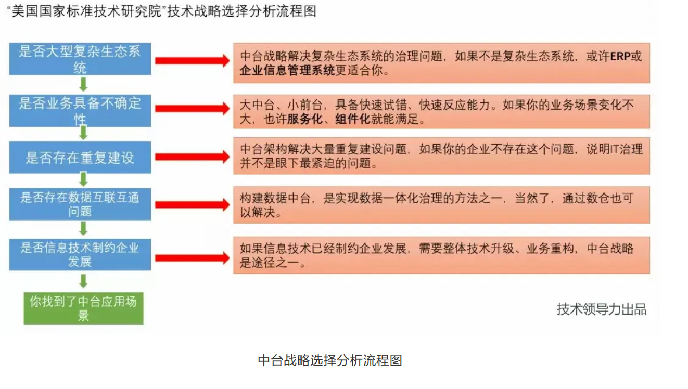

####   背景与适用场景

#### **数据中台架构核心组成**

* 底座是数据基础平台
  * 数据采集平台
  * 数据计算平台
  * 数据存储平台
* 中间两大块
  * 中台
    * 负责把模型组织成可以对外服务的数据：数据指标，数据标签
  * 公共数据区
    * 数据仓库（数据湖），负责公共数据模型研发，统一指标（标签）平台
* 上层是数据应用服务层
  * 将公共数据区的数据对外包装并提供服务：
    * 数据接口平台
    * 多维查询平台
    * 数据可视化平台
    * 数据分析平台
* 垂直贯穿平台：
  * 数据开发平台：数据接入，数据导出，模型设计工具，脚本开发工具，数据调度工具
  * 数据管理平台：元数据管理，数据质量管理，数据生命周期管理。

在数据中台的建设中一定不要忽视的是与业务的衔接，因为数据来源于业务并最终应用于业务，在数据中台的建设中需要有一系列的流程制度明确与业务的充分衔接，以保障数据源&数据产出的质量。

####  数据中台技术选型

* 数据抽取层
  * sqoop 结构化数据，关系型数据库
  * flume 非结构化，日志数据
* 数据存储层
  * hadoop 文件系统hdfs
  * kafka流数据总线
* 计算调度层
  * 离线计算：hive，spark
  * 实施计算：storm,spark-streaming,flink
  * 数据调度：airflow, azkaban,Oozie
* 数据引擎层 -- OLAP
  * ROLAP(RelationalOLAP) : 将分析用的多维数据存储在关系数据库中并根据应用的需要有选择的定义一批实视图作为表也存储在关系数据库中。
  * MOLAP(MultidimensionalOLAP):
* 数据可视化

####  是否需要中台

图中列出了5个条件判断：

1）是否大型复杂生态系统。如果企业的业态不是大型复杂生态型企业，也许企业信息化系统、ERP就可以解决企业IT治理的问题。何为复杂生态型企业？国内如：BATJ、海尔、华为、小米等都属于这类型企业。

2）是否业务具备不确定性。即市场环境变化快，如互联网行业，以及产业互联网相关行业，都属于这类型行业。

3）是否存在低水平重复建设。先决条件是企业体量够大，不管是自建技术团队还是跟外部第三方公司合作，是否存在重复建设，如整个企业光CRM就有5套，还不是一家公司的产品，就属于重复建设。

4）是否存在数据互联互通问题。即由于事业部制的组织架构，形成了部门墙，数据和系统也是烟囱式的，阿里的业务中台、数据中台解决也是这样的问题。

5）是否信息技术制约企业发展。尽管企业的IT建设一直在持续，但是在当今产业互联网时代、人工智能时代，企业的发展已经受到严重阻碍，也许你该引入中台架构进行变革了。

以上5个条件，任意满足3个及以上，就认为这个企业适合做中台战略升级。

#### 数据仓库

* 拉链表 --  拉链表是针对数据仓库设计中表存储数据的方式而定义的，顾名思义，所谓拉链，就是记录历史。记录一个事物从开始，一直到当前状态的所有变化的信息。
  * https://www.jianshu.com/p/799252156379
  
  * 实现方式：
    * 记录开始时间，表示新增的时间
    * 记录结束时间，表示该条记录的有效截至时间，新建结束时间默认为一个最大时间9999-12-31
    * 当变更某条id的数据时，更新之前id的结束时间，并且新增一条记录，开始时间为当前时间，结束时间为最大时间9999-12-31
    * 通过给record增加两个字段: 生效日期、失效日期，来记录数据的生命周期变化；好处是既节省存储空间，又保证历史数据变化的完整性，最重要的还能快速访问不同时段的数据快照
    
    
    

    
    

## 拉链表的适用场景

在数据仓库的数据模型设计中，常常会遇到下列情况：

1. 某个表存储某种类型数据多个维度的数据
2. 某些维度会发生一些变化，但是发生变化的维度不固定，即大部分维度都有可能改变
3. 变化频率不会特别高，按数据仓库建设的时间粒度来区分即可以感知到这种变化
4. 业务有需求获取历史上某一个时间点的历史快照信息，例如：对过去某个时间的所有数据做统计

#### 参考

*	https://blog.csdn.net/cqcre/article/details/96935800
*	https://baijiahao.baidu.com/s?id=1631521762109109243&wfr=spider&for=pc
*	https://blog.csdn.net/tianyeshiye/article/details/94742249
*	http://www.sohu.com/a/341025663_416839
*	https://mp.weixin.qq.com/s?__biz=MzAxOTY5MDMxNA==&mid=2455760216&idx=1&sn=032a3f8c917b3b7567eeb54813c4ce6e&chksm=8c686b7dbb1fe26bd19faf1c1a10ac115e3afca585f3eb0a7cf8476b7b5f88bac4d0171fe6a3&scene=21#wechat_redirect
*	https://mp.weixin.qq.com/s?__biz=MzA5MTc0NTMwNQ==&mid=2650719839&idx=2&sn=df7b2c9e4e48aa22740f31e17b15ae9a&chksm=887ddb29bf0a523feed0653f39e01fc5d1a2f0a05ae01216d873c2ffaf8f71ac07363a8bd0b4&scene=126&sessionid=1588727501&key=99ef7414318fbe180fe8c07f69864ed2cb3db872c9215d32645ee5e1a8214f72e63d4c6971f42cb890f8f71410011aade3344f7c32ed943346b6678866a1c8ecb3aa600a7a6ca190e35fae3096f77585&ascene=1&uin=Mjk1NTAwNzcwMg%3D%3D&devicetype=Windows+10&version=62080079&lang=zh_CN&exportkey=Adch28bLuZzeE%2Bsc%2B2ZusOQ%3D&pass_ticket=LPSbkDJNYtM03WvFhUCwCDhlPxk2J8JL7vu0h%2FKRQNaVG30YE5Z7z3K%2FQ4ckpqvB
*	[阿里的“数据+业务”双中台架构](https://mp.weixin.qq.com/s?__biz=MzU0OTE4MzYzMw==&mid=2247488702&idx=2&sn=efe90edaf09cc18124b303f3a7ebe70e&chksm=fbb29d40ccc514562f6925f12128424fb981ba4c80b55f92d0bcf0610aa460b8ee1091cd825e&scene=126&sessionid=1589847539&key=9d92d114a8d529e395039d6bdc8f3eb12ebd570a8ce90a2a4cfde08e05bc5520f7344733dddb70fc97236b3380f750626d1955fd3936bd1d657f640618b22de44915f6cbf0bc1f7aef5313cb3cbc15cc&ascene=1&uin=Mjk1NTAwNzcwMg%3D%3D&devicetype=Windows+10+x64&version=62090070&lang=zh_CN&exportkey=AV3%2FgW6%2FeTp8fbD32uaNubk%3D&pass_ticket=4EsceaY5CJcigCBVe%2BfahAdoHrVx5dIH1JNHKgR17nO5jdgfe%2FVzja8%2FDoFA3sBy)
*	https://mp.weixin.qq.com/s?__biz=MzA5MTc0NTMwNQ==&mid=2650720093&idx=2&sn=85b728f2eab9732ad096bea25106d677&chksm=887dda2bbf0a533d3f2b0bf8aaadbfee110254856836297ab076e6dd1918f5a6bd2288ac8403&scene=126&sessionid=1590065784&key=a8735ef5c0e4ac93a8aa3650ec692a7786e1f4594a82539888c9cf3f4a4a20c6d5341b9e3e58378bf3620ff0bd95efcb63f2a6859ea43ad2099adb21e1f2d0a8eba966169b19d16ff657263643a90852&ascene=1&uin=Mjk1NTAwNzcwMg%3D%3D&devicetype=Windows+10+x64&version=62090070&lang=zh_CN&exportkey=AUGsXKM1LoJepLTUUNaVV2Y%3D&pass_ticket=ZCx3%2BgwyVBYD370yknXzVxvXrTfSRwAW6PX0StAO6y5tYbV1XPsKU4Fgam1jko1H
