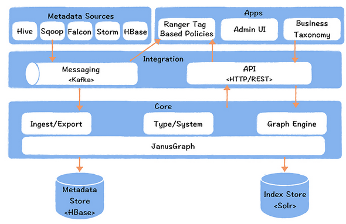

####  数据中台元数据

#####  元数据包括

* 数据字典 -- 描述数据的结构信息
  * 表名，注释信息，表的产出任务，有哪些字段， 字段含义，字段类型
* 数据血缘 -- 表的加工关系，由哪些表加工而来
  * 影响分析和故障溯源
* 数据特征 -- 数据的属性信息
  * 存储空间大小，访问热度，主题域，分层，表关联的指标

#####  业界元数据产品

* 开源的有 Netflix 的 Metacat、Apache Atlas；
  * metacat -- 多数据源集成型架构设计
    * 
  * Apache Atlas 实时数据血缘采集
    * 
  * 网易元数据
    * 

#####  数据地图：元数据中心的界面

* 数据地图是基于元数据中心构建的一站式企业数据资产目录，可以看作是元数据中心的界面
  * 数据开发、分析师、数据运营、算法工程师可以在数据地图上完成数据的检索，解决了“不知道有哪些数据？”“到哪里找数据？”“如何准确的理解数据”的难题
* 数据地图提供了多维度的检索功能，使用者可以按照表名、列名、注释、主题域、分层、指标进行检索，结果按照匹配相关度进行排序
* 当使用者定位到某一个表打开时，会进入详情页，详情页中会展示表的基础信息，字段信息、分区信息、产出信息以及数据血缘
* 数据血缘可以帮助使用者了解这个表的来源和去向，这个表可能影响的下游应用和报表，这个表的数据来源。
* 数据地图对于提高数据发现的效率，实现非技术人员自助取数有重要作用

####  指标统一

#####  规范化定义指标

* 