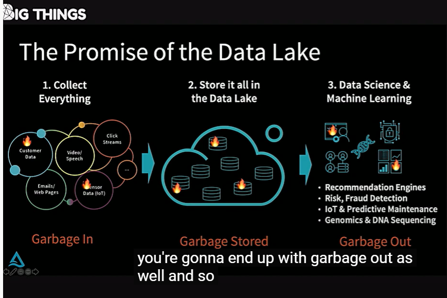
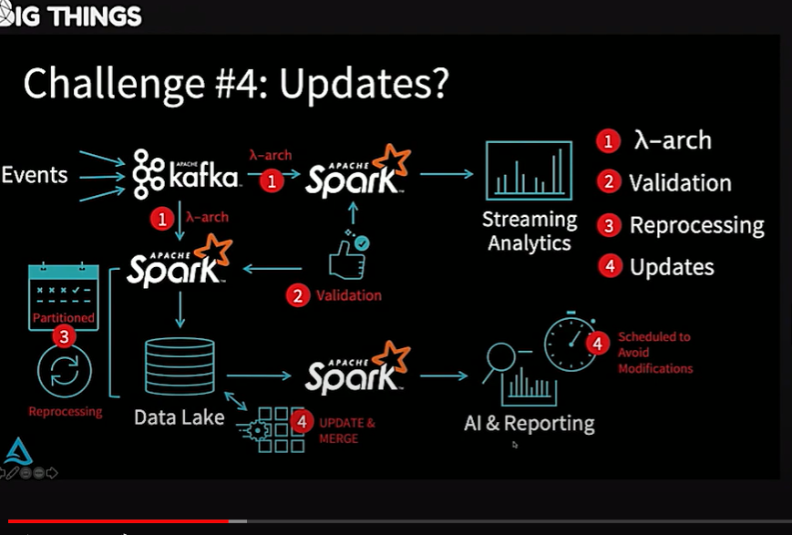
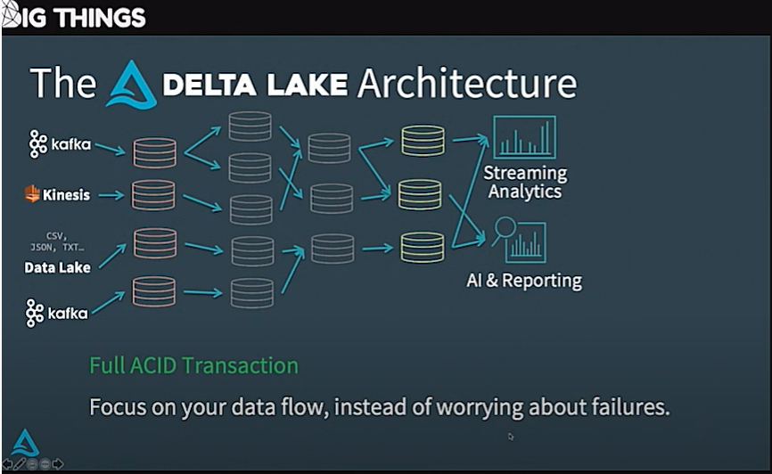
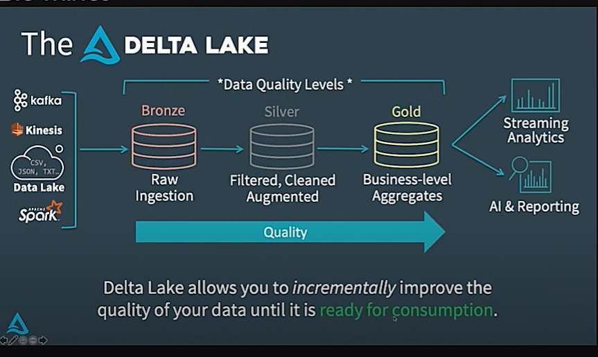
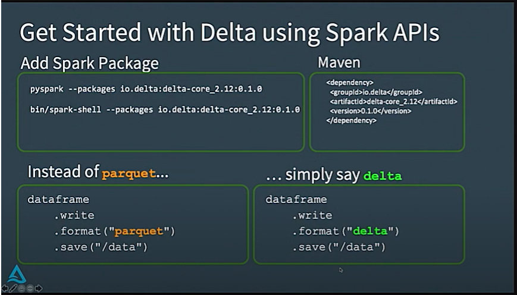
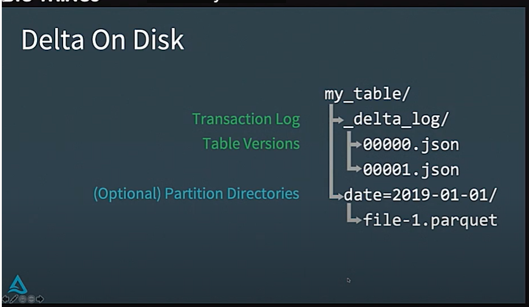
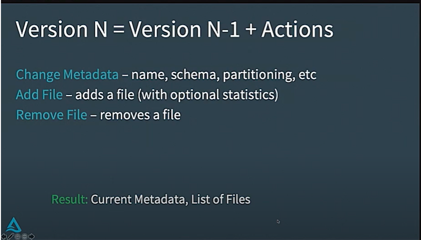
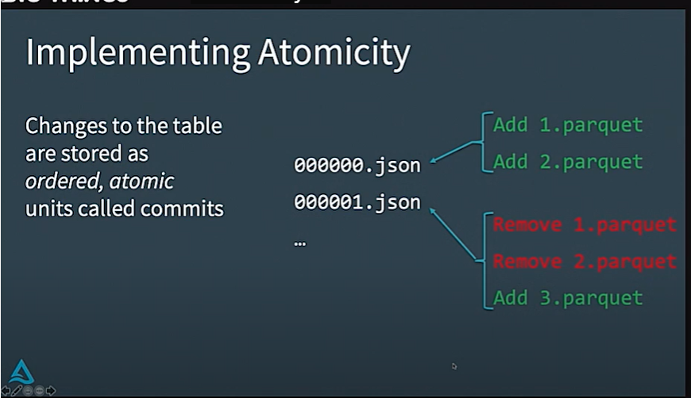
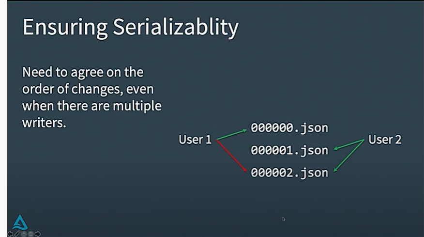

# Delta Lake: Reliability and Data Quality for Data Lakes and Apache Spark by Michael Armbrust

* 视频连接  
  * https://www.youtube.com/watch?v=GGkRwVHq-Zc
  * https://www.youtube.com/watch?v=7y0AAQ6qX5w&list=PLTPXxbhUt-YVPwG3OWNQ-1bJI_s_YRvqP&index=8
* 主题内容：
  * 数据湖简介
  * 数据库架构

#####   企业利用数据湖的步骤

* 一， 收集企业所有各种类型数据：业务系统数据，点击流数据，音频数据，视频数据等等
  * 企业拥有大量各种各样的数据：客户数据，视频数据，点击流，邮件，传感器数据等等 --- 企业的数据湖（data lake）
* 二，将所有数据存入数据湖：不需要任何数据处理ETL,存入结构化数据库，只需要直接原样保存到数据湖，等需要的时候再处理。
  * 因为在一开始还不能确定什么样的数据有价值，先原样收集起来等后期慢慢挖掘。
* 三， 数据分析 与 机器学习 ：

######  存在问题：

* 收集的数据有可能是没有价值的无效的，如：数据格式被修改了但是没有通知到数据组；有些机器正在删除数据，但是要延迟一点时间才能体现出来等
* 因为收集的数据是有问题的，所有存储的数据也是有问题的，有问题的数据进行分析的结果也是没有价值的。

#####  数据湖架构

###### 早期架构

* 1， 采用lambda架构 ：  一个流处理，一个离线处理，需要维护两套架构
  * 流处理用于实时数据分析
  * 离线处理用于报表机器学习等
* 2，数据验证：为了保证数据质量，需要对输入数据做验证，因为是lambda架构，同样的验证可能要做2次
* 3， 重新处理数据： 当原始数据有问题需要修复时，需要配置很多定时任务来重新处理数据
* 4，更新数据：在这个架构下面，数据更新会比较复杂

​		需要花很多精力来关注系统的问题：如何修复数据，如何更新数据；时间和精力被花费在解决一些共通的系统问题，而不是用在数据价值发现上。

######  早期架构问题总结

* 不支持原子性：当任务执行出错时，数据会存在不一致的状态
* 数据质量不能保证：不一致的数据，无用的数据会被保存
* 没有一致性和隔离性：批处理和流处理时会混合的读取和写入

#####  Delta lake架构

* 支持ACID事务
* 关注于数据处理流，不再是关注失败处理
* 统一了流处理和批处理，可以一致的方式处理

#####  数据质量

* Delta lake可以持续增量改善数据质量直到数据可以被消费

		

###### 数据质量的三个阶段

* 第一阶段--铜矿 ：
  *   原始数据保留
  * 保存时间长，长达数年
  * 避免容易出错的解析
* 第二阶段--银矿：
  * 过滤，清洗，参数化，提高数据质量
  * 出错调试用的数据表
* 第三阶段--金矿：
  * 根据业务汇总后的数据，可以给统计分析和报表机器学习等直接使用

######  通常通过流处理完成数据湖中的数据处理

* streaming  既可以处理低延迟的实时处理，同时也是一种增量处理的方式
* 对于低延迟的毫秒级别的应用： 可以使用spark 的 continally streaming （structed streaming)
* 对于秒级别，分钟级别的延迟的应用： 可以使用微批处理
* 对于天级别以上的应用：使用trigger once

####  delta lake使用

#####  delta lake 文件存储

* 每张表包含了事务日志文件目录和数据文件目录
* 事务日志目录为：_delta_log 
  * 目录保存了各种变更的版本信息json文件
* 数据文件可以按分区目录存放（分区信息保存在事务日志中）
  * 里面存放了实际的数据文件

######  版本更新

* 相当于更新日志，版本N = 上一个版本 +  当前的所有操作
* action可以是添加一个新列，实际上是对于 metada的更新
* action也可以是添加一行数据，可以会添加一个新的数据文件
* 删除数据操作，可以是移除一个数据文件

#####  原子性实现

* 场景：添加了两个小文件1 ，2  ，需要合并生成大文件，3 ； 添加合并后文件3的同时必须同时移除1，2，文件；必须要保证原子性操作，否则会数据不一致，少数据或者重复数据。
* 实现方式是通过分布式系统底层文件系统的原子性实现：
  * HDFS   或者 delta lake 使用 transactional  rename实现， 创建临时文件，然后重命名当文件不存在的时候才会成功

#####  串行化实现

* 当用户1 和 用户2 同时创建02版本时，只能有一个成功
* HDFS 或 delta lake 可以通过rename文件实现，当文件不存在时才能创建

