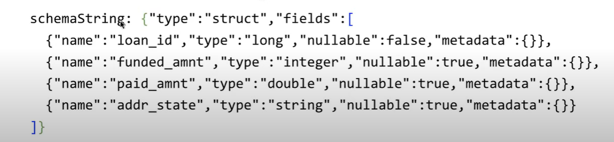

# Tech Talk | Diving into Delta Lake Part 2: Enforcing and Evolving the Schema

* https://www.youtube.com/watch?v=tjb10n5wVs8&list=PLTPXxbhUt-YVPwG3OWNQ-1bJI_s_YRvqP&index=16&t=0s

####  主题内容

* 数据，和我们的经验一样，一直在更新与积累
* 业务问题与需求一直在改变，所以数据结构也在改变
* 通过delta lake 数据改变，维度合并会变的简单
  * schema enforcement（schema  validation）
    * 防止用户不小心收集错误的或者垃圾数据
    * 拒绝不符合表的schema的数据写入
    * 在写入的时候验证schema
    * 如果schema不匹配，Delta lake取消事务，没有数据写入
    * 验证规则
      * 新的列不允许
      * 可以缺失一些列，缺失的用null写入
      * 默认列名是不区分大小写
  * schema 升级：可以自动添加新的列
    * 通过option('mergeSchema','true'),更新schema,在write,writeStream保存的时候
      * 读取兼容，之前的数据可以通过最新的schema读取数据
      * 可以在 append 或 overwrite的时候执行
      * 允许的更新schmea规则：
        * 添加新的一列
        * 将non-nullable 变为 nullable
        * 向上更新数据类型： ByteType - > ShortType ->IntegerType
    * 通过option("overwriteSchema","true")
      * 不兼容读取就的数据
      * 允许的操作：
        * 删除一列
        * 改变现有列的数据类型
        * 改变大小写名称（foo ->Foo)
  * schema 定义了表的结构，在delta lake中：
    * schema 通过JSON格式保存在 事务日志文件中
    * 

