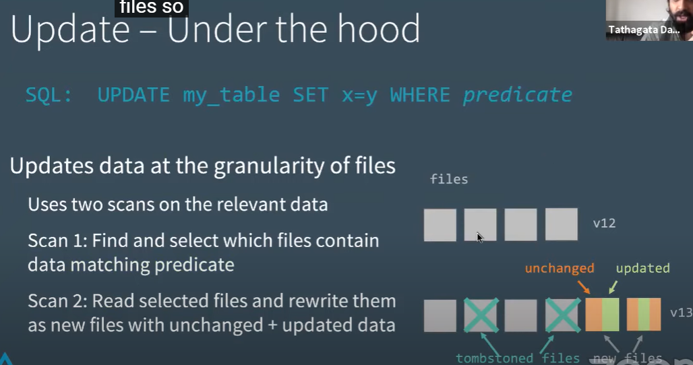
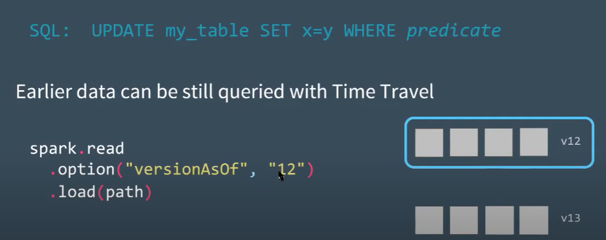
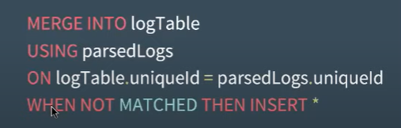
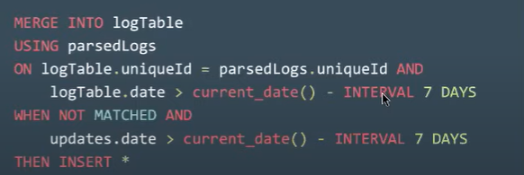
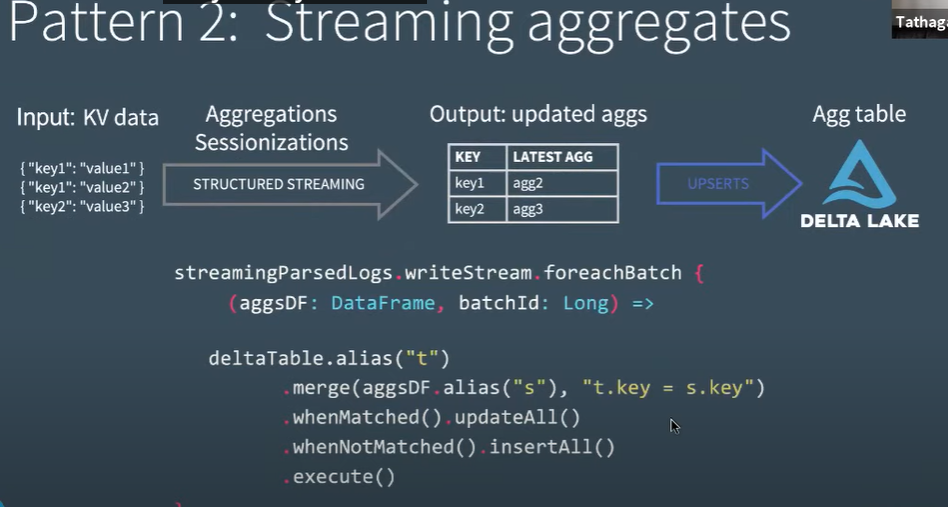

####   Tech Talk | Diving into Delta Lake Part 3: How do DELETE, UPDATE, and MERGE work

* https://www.youtube.com/watch?v=7ewmcdrylsA

####  update 更新操作

* SQL :   UPDATE  table SET x=y  WHERE  predicate

  

#####   底层操作进行了2次扫描

* 第一次从V12版本的4个数据文件中找到包含匹配条件的数据文件，匹配的文件中部分数据匹配，也有未匹配的数据
* 第二次读取V12匹配的文件，保留未匹配不需要更新的数据并合并更新的数据作为新的文件，旧的文件标记为墓碑文件，没有直接删除，后续可以删除或者读取旧的版本，提交新的更新版本V13

#####  读取之前的版本调试

#####  性能调优

* 第一次Scan可能会是全表扫描，取决于查询条件，分区表查询条件明确的时候，可以谓词下推，跳过不需要的分区
* 第二次Scan直接读取第一次标记的文件即可。
* Databricks Delta lake内部优化 --更好的过滤文件
  * Z-order  优化
  * bloom 过滤

#### DELETE 操作

* 删除操作不会直接删除物理文件，只是标记，直到vacuumed 命令进行清理
* 可以控制保留之前多少版本，以及多久时间

####  Merge 操作 类似 UPDATE 操作

* 性能调优
  * 添加明确的过滤条件，可以减少数据的匹配和加载
  * 调整shuffle的分区数
  * 调整broadcast 阈值，使用 broadcast join ( 其中一张表数据量较小的情况)
  * 保持合适的文件大小，太多小文件合并成大文件后，太大的文件会包含太多不匹配的数据。

####  重复数据处理

##### 数据不过期的情况

* 只需要处理不匹配的数据，直接插入,匹配字段需要是唯一字段
* 

#####  数据会过期（7天）

* 加入时间过滤条件
* 
* 

#### structured streaming  delta lake 数据更新支持

* 

