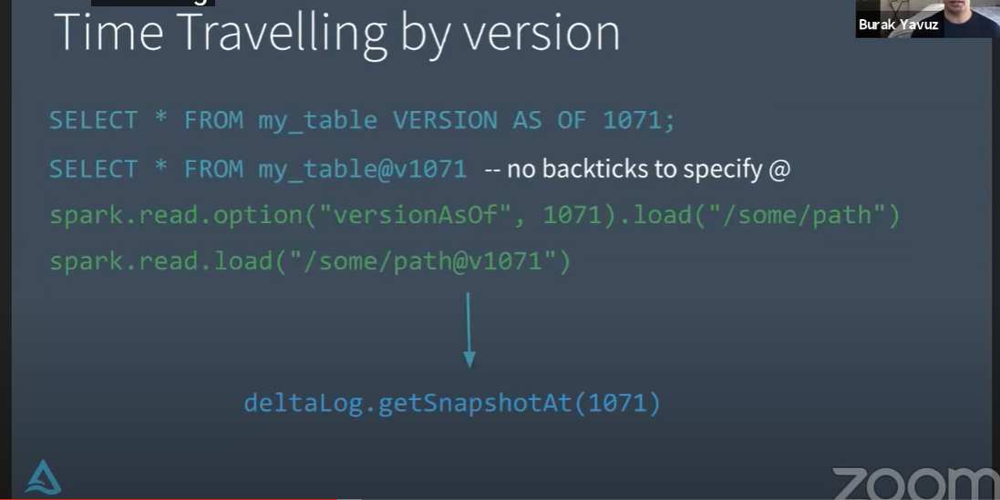

##  参考阅读
*	https://www.iteblog.com/archives/2584.html
*	https://www.iteblog.com/archives/2591.html
*	https://www.youtube.com/watch?v=F91G4RoA8is&list=PLTPXxbhUt-YVPwG3OWNQ-1bJI_s_YRvqP&index=15&t=23s

##	Transaction Log 
*	理解Transaction Log是理解Delta Lake的关键
*	Transaction Log 关联到了一些重要功能的实现，如：ACID事务，动态扩展元数据处理，时间追溯
*	Delta Lake transaction log 是在Delta Lake table 上执行过的有序的transaction记录。

##  Transaction Log 用途
*	建立在Apache spark之上，允许在同一个表上同时进行多个读写操作
*	中央仓库追踪所有用户对表的变化
*	当用户第一次读取Delta Lake表 或者查询时，日志就会被更新
*	Delta lake 通过 Transaction Log 机制保证 原子性

## Transaction Log 如何工作
*	用户的更新表的操作（INSERT,UPDATE,DELETE操作），Delta Lake将该操作分解为一系列离散步骤，这些步骤由以下一个或多个操作组成
	*	add file -- 添加一个数据文件
	*	remove file -- 删除一个数据文件
	*	update metadata -- 更新表的元数据（表面，schema,分区）
	*	set transaction -- structured streaming 任务提交的带id的微批处理数据集
	*	change protocol -- 修改协议，添加新功能
	*	commit info -- 包含此次提交相关的基础信息，如哪个操作，在哪里什么时候

##  The Delta Lake Transaction Log 文件层级结构
*	当用户创建Delta Lake 表时，该表对应的Transaction Log会被自动创建在 _delta_log 的子文件夹
	*	当用户修改表时，那些变化的记录会顺序的原子的提交到Transaction Log
*	每个commit被组织成json格式，文件开头为000000.json
*	后序的修改操作commit文件会自增000001.json,000002.json
*	
*	每10个文件提交会自动生成一个chcheckeckpoint
	*	checkpoint 文件保存了当前表的状态， 使用parquet格式，方便spark读取

####  time travel

#####  通过版本方式

##### 通过时间戳方式

#####  TIme travel 限制

* 事务日志的有效期： delta.logRetentionDuration
* 数据文件的有效期：delta.deletedFileRetentionDuration
  * 通过执行Vacuum, 删除这些失效的文件
* time travel 对于存储和性能的损耗，不建议支持年维度
  * 主要用来防止一开始错误使用数据，可以返回之前的版本重新尝试

