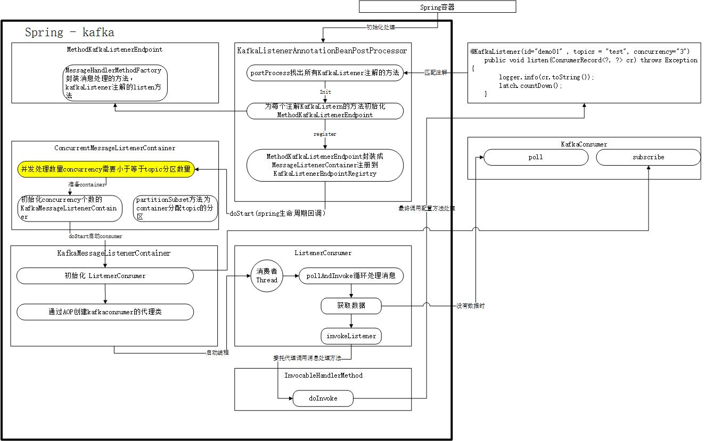

####  基础使用 -  V2.5 -

####  springboot集成kafka之spring-kafka
* [springboot集成测试代码地址](https://github.com/xif10416s/java_test)
* [官方教程](https://docs.spring.io/spring-kafka/docs/current/reference/html/)
* pom 导入 spark boot kafka依赖
  * ```
    <dependency>
                <groupId>org.springframework.kafka</groupId>
                <artifactId>spring-kafka</artifactId>
                <version>2.5.0.RELEASE</version>
            </dependency>
    ```
  
* spring-kafka配置信息：

  * application.properties -- 配置项参考KafkaProperties类

  * ```
    // 基础配置
    List<String> bootstrapServers: 消息代理broker地址与端口列表，127.0.0.1:9092,127.0.0.2:9092,127.0.0.3:9092
    clientId：客户端id,指定后服务端记录日志
    
    // Producer配置
    acks：0 直接返回， 1 leader接收成功就返回， -1 leader+follower 所有写入成功
    batchSize：发送数据的批次大小，默认单位bytes，可以指定单位，设置太小会降低吞吐量
    bufferMemory：producer缓存等待发送的消息内存大小
    compressionType：压缩算法，支持 GZIP、Snappy和LZ4
    keySerializer = StringSerializer.class; key的序列化方式，默认是string
    valueSerializer = StringSerializer.class;值的序列化方式
    retries：发送失败重试次数
    
    // consumer配置
    autoCommitInterval：自动提交间隔，需要开启enable.auto.commit
    autoOffsetReset：当没有初始化offset 或者 offset不存在时处理方式；earliest 设置offset到开始位置,处理之前的所有数据；latest 设置offset到最新消费位置，只消费新到来的消息；none 直接抛出异常
    enableAutoCommit：是否允许自动提交offset
    fetchMaxWait: 服务端最长等待时间，如果一直没有收集到最小拉取数量
    fetchMinSize：服务端收集的最小数据量返回给客户端
    groupId： consumer的groupid
    heartbeatInterval:	与coordinator的心跳间隔时间
    isolationLevel：事务中消息的隔离级别，默认为： IsolationLevel.READ_UNCOMMITTED;
    keyDeserializer：key反序列化方式--与producer配套
    valueDeserializer：value反序列化方式--与producer配套
    Map<String, String> properties ： 用来直接配置客户端信息，参考kafka配置项
    ```

    *  consumer 并发数量配置
  
      * 在spring-kafka在运行时会启动两类线程，一类是Consumer线程，另一类是Listener线程。前者用来直接调用kafka-client的poll()方法获取消息，后者才是调用我们代码中标有@KafkaListener注解方法的线程。如果直接使用kafka-client的话，那么正常的写法是一个while循环，在循环里面调用poll()，然后处理消息，这在kafka broker看来就是一个Consumer。如果你想用多个Consumer, 除了多启动几个进程以外，也可以在一个进程使用多个线程执行此while()循环。spring-kafka就是这么干的。
    
        对于spring.kafka.listener.concurrency=3这个参数来说，它设置的是每个@KafkaListener的并发个数。每添加一个@KafkaListener, spring-kafka都会启动concurrency条Consumer线程来监听这些topic(注解可以指定监听多个topic), 当enable-auto-commit设为true时会直接在当前线程，即kafka consumer所在线程调用我们的@KafkaListener方法，如果设为false，则是将消息投放到阻塞队列中，另一边由Listener线程取出执行


##### spring kafka consumer KafkaListener

* KafkaListener 处理类 KafkaListenerAnnotationBeanPostProcessor
* Spring-Kafka中消息监听大致分为两种类型，一种是单条数据消费，一种是批量消费；两者的区别只是在于监听器一次性获取消息的数量。
* kafka事务 -- 只需要配置producer的transactionIdPrefix
* 注解方法接受的参数：
  * 




#####  spring-kafka事务

* spring kafka 使用KafkaMessageListenerContainer封装读kafka，使用KafkaTemplate封装写kafka；
* 事务相关的实现也是围绕着KafkaMessageListenerContainer和KafkaTemplate展开的；


####  参考

* https://zhuanlan.zhihu.com/p/93445381
* https://blog.csdn.net/neosmith/article/details/89477794
* [spring-kafka](https://www.jianshu.com/c/0c9d83802b0c)
* https://programming.vip/docs/kafka-initial-learning-kafka-transaction-support.html
* [事务](https://www.zybuluo.com/tinadu/note/949867)
* [官网](https://docs.spring.io/spring-kafka/docs/current/reference/html/#transaction-id-prefix)
* [多线程](https://blog.csdn.net/Johnnyz1234/article/details/98318528?utm_medium=distribute.pc_relevant.none-task-blog-BlogCommendFromMachineLearnPai2-3.nonecase&depth_1-utm_source=distribute.pc_relevant.none-task-blog-BlogCommendFromMachineLearnPai2-3.nonecase)
* https://blog.csdn.net/xichenguan/article/details/88319595