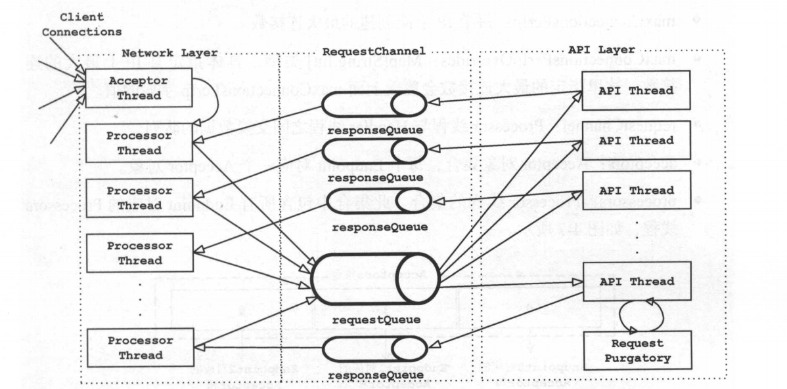
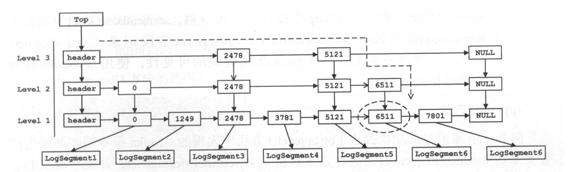

####   基础流程  - V2.5

#####  本地调试服务端启动 -- kafka.kafka.main()

###### 启动日志分析

```
starting (kafka.server.KafkaServer) --  启动kafkaServer
Connecting to zookeeper on localhost:2181 (kafka.server.KafkaServer)  -- kafkaServer链接zk
 [ZooKeeperClient Kafka server] Initializing a new session to localhost:2181. (kafka.zookeeper.ZooKeeperClient) -- kafkaServer 与zk 建立连接会话
 ThrottledChannelReaper-Fetch
 Loading logs. (kafka.log.LogManager)  -- 加载日志
 Starting log cleanup with a period of 300000 ms. (kafka.log.LogManager) -- 启动日志自动清理
 Starting log flusher with a default period of 9223372036854775807 ms. (kafka.log.LogManager)  -- TODO
 Awaiting socket connections on 0.0.0.0:9092. (kafka.network.Acceptor)  -- kafka server acceptor-- 等待连接请求
 Creating /brokers/ids/0 (is it secure? false) (kafka.zk.KafkaZkClient) -- 将启动的消息代理注册到zk，id是0
 
```


##### zookeeper目录分析

```
ls /
[admin, brokers, cluster, config, consumers, controller, controller_epoch, isr_change_notification, latest_producer_id_block, log_dir_event_notification, zookeeper]

controller--存储控制器broker信息：
{"version":1,"brokerid":0,"timestamp":"1589098072184"}

controller_epoch--
此值为一个数字,kafka集群中第一个broker第一次启动时为1，以后只要集群中center controller中央控制器所在broker变更或挂掉，就会重新选举新的center controller，每次center controller变更controller_epoch值就会 + 1;

brokers/ids -- 消息代理服务器信息
每个broker的配置文件中都需要指定一个数字类型的id(全局不可重复),此节点为临时znode(EPHEMERAL)，存放的内容格式如下:
get /brokers/ids/0
{"listener_security_protocol_map":{"PLAINTEXT":"PLAINTEXT"},"endpoints":["PLAINTEXT://ZJZL-20200417TL:9092"],"jmx_port":9999,"host":"ZJZL-20200417TL","timestamp":"1589098072058","port":9092,"version":4}
1. 每个消息代理服务器broker 都有唯一id,指定或自动生成
2. 每条消息存放了当前broker 对应的访问地址和端口
3. 该节点为临时节点znode(EPHEMERAL)


brokers/topics -- 服务器管理的topic信息
brokers/topics/topic名/partitions/[0,1,2,3...分区号]/state -- 对应文件系统中topic名-分区号（test-0,test-1)
分区目录节点名称state:Kafka的ISR的管理最终都会反馈到Zookeeper节点上
{"controller_epoch":2,"leader":0,"version":1,"leader_epoch":0,"isr":[0]}

consumer信息已经不由zk维护，kafka创建了一个__consumer_offsets的topic,默认有50个分区用来维护消费者消费offset信息，每个brocker只有一个topic

```


#####  kafka源码2.5项目核心模块

* clients  -- 客户端（生产者，消费者）
* connect -- kafka连接器组件
* core -- kafka核心组件
* streams -- kafka流处理库
* tools -- 工具类


#### kafka 服务端通信模块

#####  kafka 支持2中通信请求类型：

* 数据类型（data-plane）：
  * 来自客户端请求，或者其他broker的请求
  * 线程模型：
    * 每一个Listener一个accepter,负责处理新的连接
    * 可以在KafkaConfig中listeners配置多个listener
    * 每个accepter有N个process处理线程，负责各自selector的读取请求
    * M个handler线程，负责将处理结果响应返回给process线程
* 控制类型（control-plane):
  * 处理来自controller的请求，可以通过control.plane.listener.name指定，如果没有指定，所有controller请求交给data-plane处理
  * 线程模型：
    * 1个acceptor线程处理新的连接
    * 1个process线程处理selector监听的socket的读取请求
    * 1个handler线程，处理结果响应反馈给process


#####  process 与 handler 通信



####  日志存储

* kafak.log.Log
  * segments: ConcurrentNavigableMap[java.lang.Long, LogSegment] = new ConcurrentSkipListMap[java.lang.Long, LogSegment]
    * 使用调表结构对多个LogSegment的顺序组合
  * TODO: read ,append
* 


####  参考

* kafka技术内幕
* apache kafka源码分析