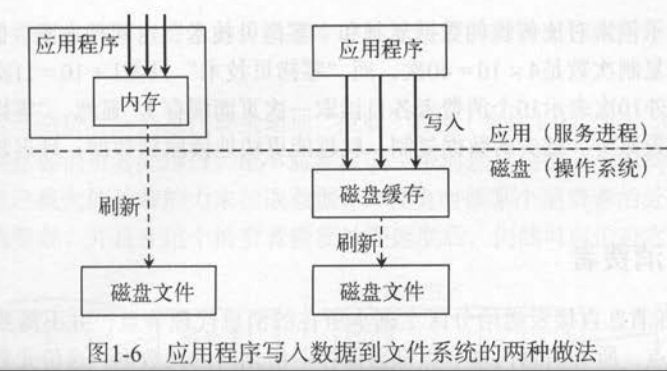
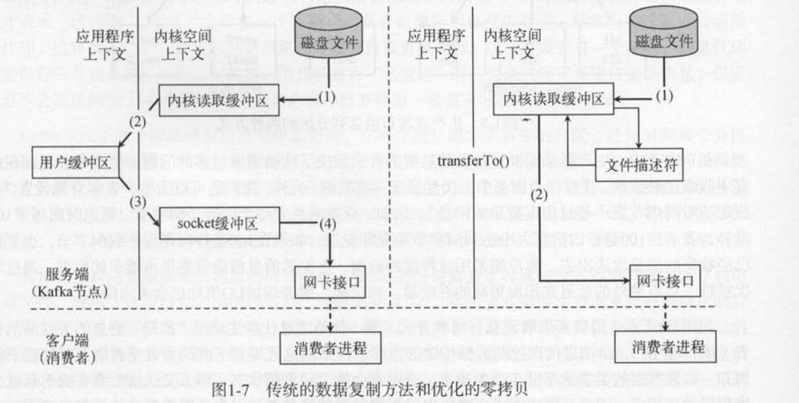

####  kafka作为流式数据平台的核心组件，包括4种核心api

* 生产者（producer) -- 应用程序，发布事件流到kafka的一个或多个主题
* 消费者（consumer)--应用程序订阅kafka的一个或多个主题，并处理事件流
* 连接器（connector)--将kafka主题和已有数据源进行连接，数据可以互相导入和导出
* 流处理（processor)--从kafka主题消费输入流，经过处理后产生输出流到输出主题

####   kafka吞吐量性能优化

* 写的快----磁盘读写优化
  * 预读（read-ahead) : 提前将一个比较大的磁盘块读入内存
  * 后写（write-behind): 将很多小的逻辑写操作合并起来组成大的物理写操作
  * 操作系统会将主内存剩余的所有空闲内存用作磁盘缓存（disk cacke/page cache)
    * 
    * kafka直接写入磁盘缓存，由操作系统定期刷新到磁盘文件
  * 顺序读写文件
  * 采用零拷贝技术读取文件数据通过网络发送给消费者
    * 
      * 减少了上下文应用程序和内核的上下文切换
      * 减少了应用程序和内核之间数据的冗余拷贝
      * 应用程序调用了netty 的 transferTo ， 内核调用了sendfile
* 生产者发送消息优化 -- 批处理 + 压缩
* 消费者批量拉取数据
  * 当消息代理没有数据或者数据量少的时候，消费者不断轮询，浪费资源
  * 可以为消费者客户端设置指定的字节数量，如果消息代理没有收集足够的数据，客户端的拉取请求不会立即返回

#### 副本与容错处理

* 每个topic有多个分区，每个分区可以有1个或者多个副本，副本数不超过消息代理服务数量

* 分区的第一个副本会成为leader，负责所有客户端的读写请求，其他副本同步拉去leader的数据

  * 一个分区只有一个leader副本负责所有读写请求，所以不同分区的leader副本会分散在不同的服务器上，实现负载均衡

* 当分区的leader副本出现问题时，会从该分区在同步状态的副本列表中选取一个作为主副本

* 备份副本从主副本消费消息的方式和普通消费者一样，只是回将消息存储到本地日志

* 容错处理

  * 存活节点（在ISR 同步副本列表中）：
    * 节点与zk保持心跳
    * 副本的消息不能落后主副本太多

#### 生产者客户端

#####  主要组件

* 应用程序使用kafkaProducer对象代表一个生产者客户端进程，消息回先放入队列中，有一个消息发送线程从队列中拉去消息，批量方式发送给服务器
* kafka的记录收集器RecordAccumulator负责缓存生产者客户端产生的消息
  * 新产生的消息向记录收集器中追加一条消息，追加的返回结果表示批次是否满了，满了就发送一批数据
  * 每个分区都有一个双向队列来缓存消息。
  * 每个批次可以看出队列的一个元素，
* 发送线程sender负责读取记录收集器的批量消息，通过网络发送给服务端
  * 客户端发送线程只需要一个，获取分区对应的主副本节点，取出分区缓存队列中的批次记录发送
  * 消息发送有两种发送方式：
    * 按照分区直接发送
      * 直接发送给分区主副本，多少个分区就可能有多少个连接，如果分区数大于服务器数量的情况，可能与同一台服务器建立了多个连接，因为多个分区在同一个服务器上
    * 按照分区的目标节点发送
      * 如果分区数大于服务器节点数的情况，一个服务器有多个分区的主副本，只需要与一个服务器建立连接。
* kafka使用Selector处理网络连接和读写处理，使用NetworkClient处理客户端的网络请求

##### 客户端网络连接对象networkClient

* 管理客户端和服务端之间的网络通信，包括连接建立，发送客户端请求，读取客户端响应
  * ready()方法：从记录收集器获取准备完毕的节点，并连接所有准备好的节点
  * send()方法：为每个节点创建一个客户端请求，将请求暂存到节点对于的通道中
  * poll()方法：轮询动作会真正执行网络请求，发送请求给节点，并读取响应
* 针对同一个服务端，如果上一个客户端请求还没有发送完成，不允许发送新的客户端请求
  * 客户端网络连接对象用inFightRequests变量在客户端缓存了还没有收到响应的客户端请求
  * inflightRequests类包含一个节点到双端队列的映射结构
  * 准备发送客户端请求时，请求将添加到指定节点对应的队列中
  * 在收到响应后，才会将请求从队列中移除

#####  Selector处理网络请求

* 生产者客户端会按照节点对消息进行分组，每个节点对应一个客户端请求，一个生产者客户端需要管理多个服务端节点的网络连接
* 使用了java nio 同步非阻塞方式管理连接和读写请求，用单个线程管理多个网络连接通道
  * 通过selector只需要一个线程可以和多个网络通信

#### 消费者客户端

##### 再平衡

* 当topic的分区数变化，或者同一个组的消费者数量变化是需要执行rebalance
* 消费组的所有消费者都参与再平衡
* 虽然分区是以消费者级别被消费的，但是分区的消费进度保存成消费组级别的
  * 

##### ZKrebalanceListener.rebalance()执行再平衡操作

* 关闭数据拉取线程，清空队列和消息流，提交偏移量
* 释放分区的所有权，删除zk中分区和消费者的所有关系
* 将所有分区重新分配给每个消费者，每个消费者都会分到不同的分区
* 将分区对对应的消费者所有关系写入zk，记录分区的所有权信息
* 重启消费者的拉取线程管理器，管理每个分区的拉取线程

