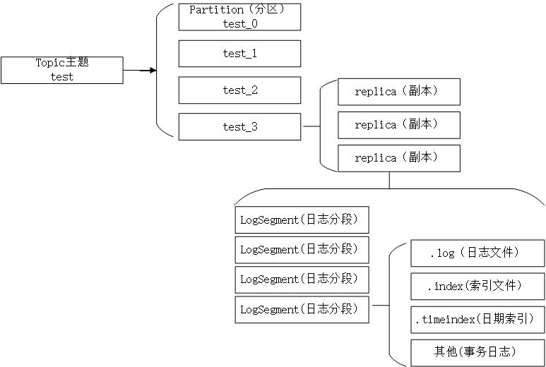
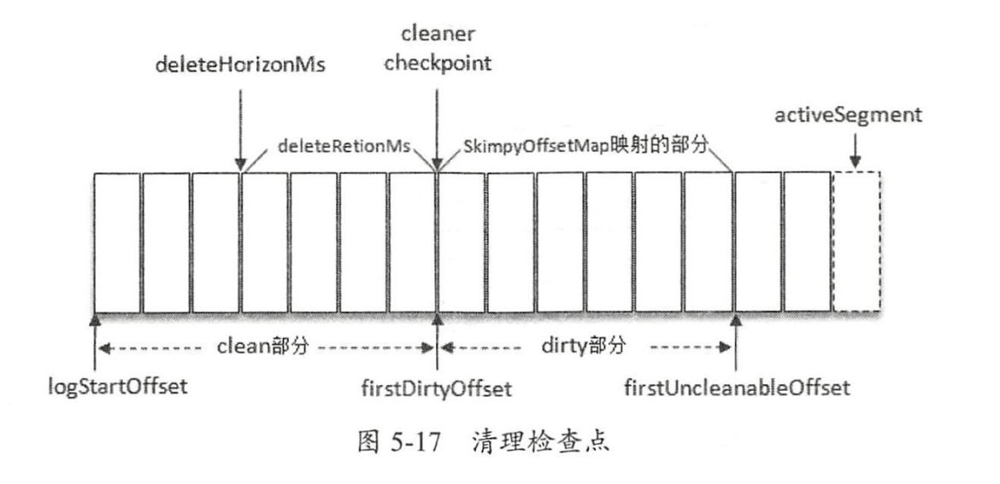
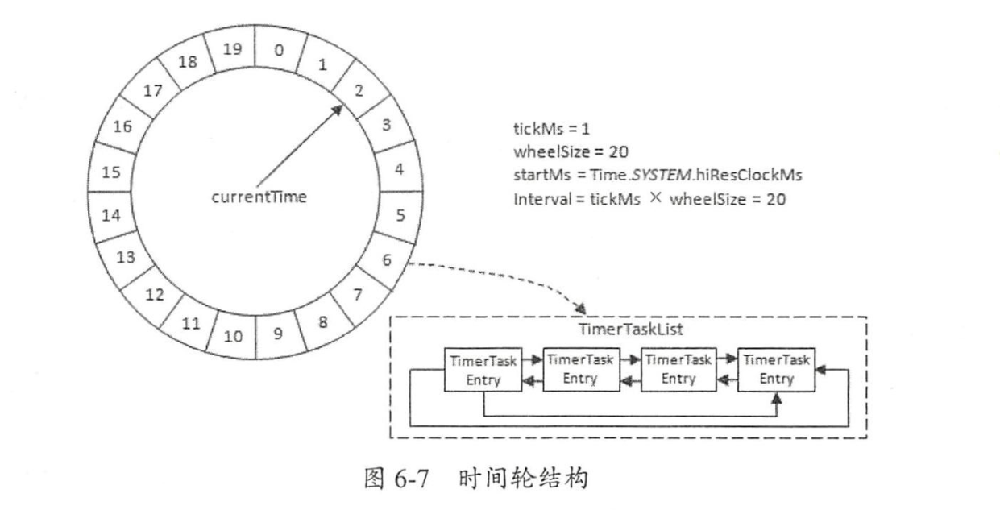
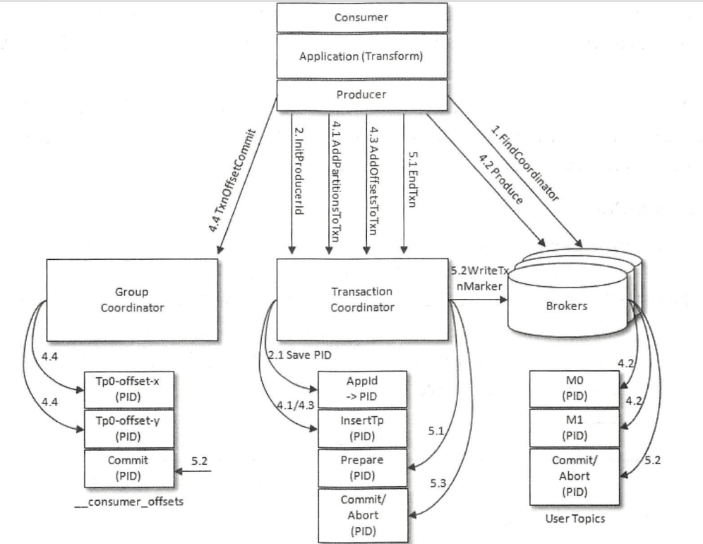

####   基础

#####   服务端基础参数配置

*  zookeeper.connect  -- broker 连接zookeeper集群的服务地址
  * 主机地址：端口号，多地址用都好隔开
  * 添加chroot路径，为kafka集群设置根路径， localhost:2181,localhost2:2181/kafka
* listeners -- broker监听 客户端连接的地址 
  * kafka支持协议PLAINTEXT(默认)，SSL,SASL_SSL
    * PLAINTEXT://192.168.0.2:9092
  * 如果不指定，则表示绑定默认网卡，
  * 公有云机器多网卡配置，包含私网网卡与公网网卡，可以设置advertised.liseners 参数绑定公网ip共外部客户端使用，配置lisnteners参数绑定私网ip供broker间通信
* broker.id  -- kafka集群broker唯一标识
  * 如果没有设置，kafka自动生成
* log.dir 与 log.dirs --  配置消息保持路径
  * 默认为/tmp/kafka-logs
* message.max.bytes  -- 指定broker所能接受消息的最大值
  * 默认967kb左右
  * Producer发送消息大于设置值，RecordTooLargeException

####  生产者

#####  生产者基本参数

* bootstarp.servers: 指定生产者客户端连接kafka集群所需要的broker地址清单
* key.serializer 与value.serializer :  定义序列化方式
* acks:指定分区必须要多少个副本写入成功后，才认为这条消息是发送成功
  * 1 （默认） leader写入成功就返回
  * 0，直接返回不用任何确认
  * -1 或者 all , 所有副本都确认完成
* max.request.size:  限制生产者客户单发送消息的最大值，默认1mb
* retries: 重试次数，默认0，不重试
  * retry.backoff.ms 默认100 ， 重试间隔
* compression.type : 默认不压缩，支持：gzip,snappy,lz4
* connections.max.idle.ms: 默认9分钟，指定多久后关闭限制的连接
* linger.ms: 指定生产者发送producerBatch之前等待更多消息加入的时间。
  * 生产者客户端在ProducerBatch被填满或者等待时间超过linger.ms值时发送
  * 增大会增加消息的延迟，但可以提升吞吐量
* receive.buffer.bytes: socket接收消息缓冲区SO_RECBUF的大小，默认32kb
* send.buffer.bytes:socket发送消息缓冲区（SO_SNDBUF)的大小，128kb
* request.timeout.ms:  配置Producer等待请求响应的最长时间默认30000ms,
  * 这个参数需要比broker端参数replica.lag.time.max.ms的只要大，可以减少客户端重试导致消息重复消费的概率
* 通过ProducerConfig配置参数，避免属性拼写错误

#####  消息的发送

* ProducerRecord构建发送消息：topic, partitin， timestamp, key , value, headers
* 发送消息三种模式：
  * 发完结束，fire-and-forget
  * 同步发送
  * 异步发送
* 默认分区器DefaultPartitioner：
  * key不为null:  对key做MurmurHash2 的hash运算，计算分区号
  * key为null，采用轮询方式发送

#####  整体架构

* kafka生产者端主要有2个线程：
  * 主线程：负责消息构建，拦截器，序列化，缓存
  * sender线程：负责发送消息
* RecordAccumulator 消息缓存器，实现批量发送，减小网络传输的资源消耗
  * 缓存大小buffer.memory 默认32mb
  * 数据结构：ConcurrentMap<TopicPartition, Deque<ProducerBatch>> batches
    * 每个topic的partition维持一个双端队列Deque
    * 每个Deque的元素是ProducerBatch, 执行一个消息批次，是一组ProducerRecord
      * 为了是字节使用更加经凑，将小的ProducerRecord拼接成大的ProducerBatch
        * 不是简单的放入列表，转换为内存字节放入一个DataOutPutStream中
  * 通过BufferPool实现ByteBuffer复用，实现缓存的高效利用，避免频繁创建ByteBuffer与释放。
    * 只有在batch.size以内创建的ProducerBatch才能被BufferPool复用
* Sender从RecordAccumulator中获取消息之后，会进一步将<TopicPartition, Deque<ProducerBatch>>转换为<node,list<ProducerBatch>
  * node表示kafka集群的broker节点，因为发送消息只需要知道发给那个节点，具体通信的对象是broker
  * 之后还会封装成<Node,Request>发往各个node，
    * request是kafka各种协议请求
  * 在sender发送到kafka之前，request会保存到InFlightRequests中Map<NodeId,Deque<Request>>
    * 缓存了已经发出去但是还没有收到响应的请求
    * 通过配置参数可以限制每个链接最多缓存的请求数量：max.in.flight.requests.per.connection,默认5
      * 每个连接默认最多等待5个发送后没后收到响应消息的request
      * 一旦超过这个配置数量，就不能向这个连接发送请求

####  消费者

#####  消费者与消费组

* 同一个消费组的消费者，每条消息只会被一个消费者处理，点对点模式
* 不同消费组，广播所有消费者，每条消息被所有消费者处理，发布订阅模式

#####  基础参数

* bootstrap.servers:  服务端broker通信地址
* group.id:  不设置为空，必须有值，表示一个group消费组
* key.deserializer与 value.deserializer:  反序列化操作，与kafka producer相对应
* fetch.min.bytes : poll 方法最小拉取的数据量，默认1B ,
  * 小于该值时，会等待，提高值可以提高吞吐量，但是延迟可能增加
* fetch.max.bytes: poll方法一次最多拉取的数据量，默认50m,
* fetch.max.wait.ms:  配合fetch.min.bytes。等待超时时间，默认500ms
* max.partition.fetch.bytes: 每个分区返回给Consumer的最大数据量，1m
* max.poll.records: 一次拉取的最大消息数，默认500条
* connection.max.idel.ms：多久后关闭限制的链接，默认9分钟
* exclude.internal.topics:  是否公开内部topic -> __consumer_offsets  与 __transaction_state
* receive.buffer.bytes 与 send.buffer.bytes ： 与服务端通信的socket缓冲大小
* request.timeout.ms:  consumer等待请求的最大响应时间默认30000ms
* metadata.max.age.ms : 元数据的过期时间，默认5分钟，如果元数据在5分钟内没有更新，会被强制更新
* isolation.level : 事务的隔离级别
  * read_uncommitted --可以读取producer未提交事务的数据， HW处位置
  * read_commited -- 只能读取producer提交事务的数据

* 推荐使用ConsumerConfig配置，避免写错

#####  起始消费位置

* 适用场景：
  * 新的消费组建立，没有可查找的消费位移
  * 消费组订阅了新的主体，也没有可查找的消费位移
  * 消费组的位移信息过期被删除后，也没有可查找的消费位移
* 在没有可查找的位移时位移指定配置：auto.offset.reset
  * latest :  从最新的位置开始消费，只消费新来的数据
  * earliest : 从最早的位置开始消费，消费之前所有的数据
  * none :  抛出异常
* 通过seek方法指定消费的起始位置，在poll执行方法里面执行，消费历史数据
  * 可以配合数据库，将offset保存到db
* offsetsForTImes, 通过timestamp 来指定分区的位置

#####  在均衡

* 分区的所属权从一个消费者转移到另一个消费者，高可用，高伸缩性
* 再均衡期间，消费组不可用
* 如果消费组消费了部分数据，未提交发生再均衡，可能会重复消费

####  主题与分区

* 主题是对于消息的分类，每个主题可以再细分成一个或者多个分区
  * 分区可以为kafka提供可伸缩性，和水平扩展的能力
  * 每个分区可以有多个副本，小于broker数量，提供数据冗余，提高可靠性
* 每个分区在物理结构上对应一个文件目录，每个分区的日志安数据量分段为多个logSegment，每个分段包含：日志文件，索引文件，快照文件等

####  日志存储

######  日志关系

* log中追加消息是顺序写入，只有最后一个称为activeSegment的分段日志才可以写入数据，当满足一定条件，会创建新的activeSegment
* .log结尾的是日志数据文件，为了快速检索，会有对于的偏移量索引文件（.index）与时间戳索引文件（.timeindex)
* 每个LogSegment都有一个基准的偏移量baseOffset, 表示当前第一条消息的offset
  * 偏移量是一个64位的长整型数，日志文件和两个索引文件都是根据基准偏移量baseOffset命名的，名称固定为20位的数字，没有到达则0填充

######  消息压缩

* kafka将多条消息一起压缩，并且生产者发送的压缩数据在broker中也是保持压缩状态进行存储的，消费组从服务端获取的也是压缩的消息，消费组在处理消息之前才会解压消息
* 压缩方式配置：compression.type 

#####  日志索引

######   每个日志分段文件对应两个索引文件

* .index 文件（ 偏移量索引文件） ：  建立消息偏移量 offset 到 物理地址之间的映射关系，方便快速定位消息所在的物理文件位置
* .timestamp(时间戳索引文件) ： 根据指定的时间戳来查找对应的偏移量信息

######  索引存储

* kafka 索引文件以稀疏索引（spare index） 方式构造消息的索引，不保证每个消息在索引文件中都有对应的索引项
* 每当写入一定量的消息（有broker的log.index.interval.bytes 默认4k) ,  偏移量索引文件和时间戳索引文件分别增加一个偏移索引项和时间戳索引项，调整log.index.interval.bytes大小可以控制索引项的密度
* 稀疏索引通过MappedByteBuffer将索引文件映射到内存中，加快查询速度
  * 使用二分查找一个范围，要找到对于物理文件位置还炫耀根据偏移索引文件再次定位
  * 稀疏索引 方式 在磁盘空间，内存空间，查找时间的折中

###### 索引文件切分条件

* 当前日志分段文件超过broker配置的log.segment.bytes 值默认1gb
* 当前日志分段中消息的最大时间戳与当前系统的时间戳的差值大于log.roll.ms或log.roll.hours参数配置的值默认168 即7天
* 偏移量索引文件或时间戳索引文件的大小达到broker的log.index.size.max.bytes 默认10mb

######  日志清理策略

* 日志删除 ： 按一定的保留策略直接删除不符合条件的日志分段
* 日志压缩：针对每个消息的key整合，保留相同key的最后一个版本
  * log compaction (压紧）:  是针对key的合并，没有算法
  * message compression (压缩）: 消息压缩，kafka支持gzip, snappy， lz4 
* 每一个日志目录下有一个名为“cleaner-offset-checkpoint" 文件： 清理检查点文件，用来记录每个主题的每个分区中已经清理的偏移量
  * 通过清理检查点，将log分成两个部分clean部分 + dirty部分
  * 清理的同时，客户端可以读取日志中的消息
  * 

####  磁盘存储

#####  磁盘读写性能

* 6快，7200r/min 的 raid-5 阵列的磁盘族，顺序写入速度可以达到600mb/s
* 操作系统对于顺序读写优化，预读（read-ahead, 提前将一个比较大的磁盘块读入内存）
* 后写（write-behind,将很多小的逻辑写操作合并起来组成一个大的物理写操作)

#####  页缓存

* 操作系统实现的一种主要的磁盘缓存，减少对磁盘的i/o的操作
  * 把磁盘中的数据缓存到内存中，把对磁盘的访问变成对内存的访问

#####  零拷贝

* 将数据直接从磁盘文件复制到网卡设备中，避免用户态与核心态上下文切换，以及中间复制数据
* 底层通过linux   sendfile方法实现，java 为 FileChannel.transferTo()

####  kafka服务端

######  时间轮 TimingWheel

* kafka存在大量的延时操作，如：延时生成，延时拉取，延时删除
* 采用时间轮--一个存储定时任务的环形队列
  * 底层采用数组，每一个元素可以放一个定时任务列表TimerTaskList,
    * TimerTaskList为一个环形的双向链表，每一个数据项为定时任务想，为实际执行的任务
  * 时间轮结构
    * 

######  控制器

* kafka集群有一个或多个broker ,  其中一个broker会被选举为控制器（kafka controller) ,负责管理整个集群中所有分区和副本的状态
  * 当某个分区leader副本出现故障时，有控制器负责为该分区选举新的leader副本
  * 当检测到某个分区的ISR集合发生变化时，由控制器负责通知所有broker更新元数据信息
* kafka控制器选举工作以来zookeeper，成功竞选为控制器的broker会在zookeeper中创建/controller的临时节点
* kafka 作为Controller控制器的额外工作：
  * 监听分区相关的变化：
    *  Zookeeper 中 /admin/reassign_partitions节点注册PartitionReassignmentHandler,处理分区重分配的动作
    * zookeeper 的/ isr_change_notification节点注册IsrChangeNotificetionHandler，处理ISR集合变更的动作
  * 监听主题相关的变化
    * zookeeper中/brokers/topics 节点添加TopicChangehandler ,处理主题增减的变化
  * 监听broker相关的变化
    * 为zookeeper中的/brokers/ids 添加BrokerChangeHandler，处理broker增减变化
  * 监听主题中的分区分配变化
  * 启动并管理分区状态机和副本状态机
  * 更新集群的元数据信息

######  kafka服务优雅关闭

* 脚本工具 kafka-server-stop.sh 
  * 可能ps命令出错，导致无法执行 ， 使用 ps ax 
* 手动关闭
  * 获取kafka 服务进程号PIDS
  * kill -s  TERM  $PIDS    或 kill  -15 

####  深入客户端

#####  分区分配策略 --  partition.assignment.strategy

* RangeAssignor 默认 -- 按照消费者总数和分区总数进行整除运算获取一个跨度，然后分区按照跨度进行平均分配，保证分区尽可能均匀地分配给所有的消费者
* RoundRobinAssignor -- 将消费组内所有消费者及消费者订阅的所有主题的分区按照字典序排序，然后通过轮询方式逐个将分区依次分配个每个消费者，
* StickyAssignor -- 

#####  消费者协调器和组协调器

* 消费组分成多个子集，每个消费组的子集在服务端对应一个GroupCoordinator对其进行管理
  * ​	GroupCoordinator是kafka服务端中用于管理消费的组件
* 消费者客户端中的ConsumerCoordinator组件负责与GroupCorrdinator进行交互

######  再均衡步骤

* 第一阶段（FIND_COORDINATOR)
  * 找到所属消费组对应的GroupCoordinator所在的broker,并创建于该broker的相互通信的网络连接
    * 向集群中的负载最小的节点发送**FindCoordinatorRequest** 来找到对应的GroupCoordinator
* 第二阶段（JOIN_GROUP)
  * 在成功找到消费组所对应的GroupCoordinator之后就进入加入消费组的阶段，消费者向GroupCorrdinator发送**JoinGroupRequest**
  * GroupCorrdinator为消费组内的消费者选举一个消费者组的leader
  * 选举分区分配策略，分配好每个消费者消费哪些分区
* 第三阶段（SYNC_GROUP)
  * leader消费者根据选定的分区分配策略实施具体分区分配，然后将分配的方案同步给各个消费者	
    * 同步分配方案通过GroupCoordinator扶着转发同步分配方案
    * 各个消费会向GroupCoordinator 发送**SyncGroupRequest**请求来同步分配方案
* 第四阶段（HEARTBEAT）
  * 进入这个阶段开始正常工作状态，消费这通过向GroupCorrdinator发送心跳维持消费组的从属关系

###### 消费组元数据信息__consumer_offsets

####  事务

#####  流式应用 consumer-transform-produce

* 消费者消费消息，转换消息，然后发送消息的过程，消费和生产并存
* 通过提供唯一transactionId
  * 显示设置方式：properties.put("transactional.id","transactionId")
* transactionalId 与 PID一一对应

#####  kafkaproducer 5个事务方法

* initTransactions()   :  初始化事务，执行的前提是已经配置了transactionalId
* beginTransaction(): 开启事务
* sendOffsetsTOTransaction():  为消费者提供在事务内的位移提交操作
* commitTransaction() : 提交事务
* abortTransaction(): 回滚事务

#####  consumer-transform-produce 流程

