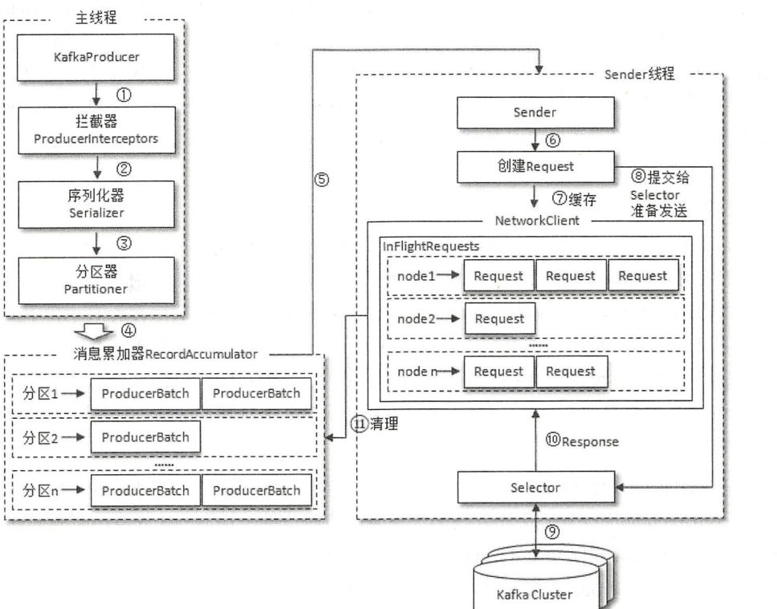

####   基础

#####   服务端基础参数配置

*  zookeeper.connect  -- broker 连接zookeeper集群的服务地址
  * 主机地址：端口号，多地址用都好隔开
  * 添加chroot路径，为kafka集群设置根路径， localhost:2181,localhost2:2181/kafka
* listeners -- broker监听 客户端连接的地址 
  * kafka支持协议PLAINTEXT(默认)，SSL,SASL_SSL
    * PLAINTEXT://192.168.0.2:9092
  * 如果不指定，则表示绑定默认网卡，
  * 公有云机器多网卡配置，包含私网网卡与公网网卡，可以设置advertised.liseners 参数绑定公网ip共外部客户端使用，配置lisnteners参数绑定私网ip供broker间通信
* broker.id  -- kafka集群broker唯一标识
  * 如果没有设置，kafka自动生成
* log.dir 与 log.dirs --  配置消息保持路径
  * 默认为/tmp/kafka-logs
* message.max.bytes  -- 指定broker所能接受消息的最大值
  * 默认967kb左右
  * Producer发送消息大于设置值，RecordTooLargeException

####  生产者

#####  生产者基本参数

* bootstarp.servers: 指定生产者客户端连接kafka集群所需要的broker地址清单
* key.serializer 与value.serializer :  定义序列化方式
* acks:指定分区必须要多少个副本写入成功后，才认为这条消息是发送成功
  * 1 （默认） leader写入成功就返回
  * 0，直接返回不用任何确认
  * -1 或者 all , 所有副本都确认完成
* max.request.size:  限制生产者客户单发送消息的最大值，默认1mb
* retries: 重试次数，默认0，不重试
  * retry.backoff.ms 默认100 ， 重试间隔
* compression.type : 默认不压缩，支持：gzip,snappy,lz4
* connections.max.idle.ms: 默认9分钟，指定多久后关闭限制的连接
* linger.ms: 指定生产者发送producerBatch之前等待更多消息加入的时间。
  * 生产者客户端在ProducerBatch被填满或者等待时间超过linger.ms值时发送
  * 增大会增加消息的延迟，但可以提升吞吐量
* receive.buffer.bytes: socket接收消息缓冲区SO_RECBUF的大小，默认32kb
* send.buffer.bytes:socket发送消息缓冲区（SO_SNDBUF)的大小，128kb
* request.timeout.ms:  配置Producer等待请求响应的最长时间默认30000ms,
  * 这个参数需要比broker端参数replica.lag.time.max.ms的只要大，可以减少客户端重试导致消息重复消费的概率
* 通过ProducerConfig配置参数，避免属性拼写错误

#####  消息的发送

* ProducerRecord构建发送消息：topic, partitin， timestamp, key , value, headers
* 发送消息三种模式：
  * 发完结束，fire-and-forget
  * 同步发送
  * 异步发送
* 默认分区器DefaultPartitioner：
  * key不为null:  对key做MurmurHash2 的hash运算，计算分区号
  * key为null，采用轮询方式发送

#####  整体架构

* kafka生产者端主要有2个线程：
  * 主线程：负责消息构建，拦截器，序列化，缓存
  * sender线程：负责发送消息
* RecordAccumulator 消息缓存器，实现批量发送，减小网络传输的资源消耗
  * 缓存大小buffer.memory 默认32mb
  * 数据结构：ConcurrentMap<TopicPartition, Deque<ProducerBatch>> batches
    * 每个topic的partition维持一个双端队列Deque
    * 每个Deque的元素是ProducerBatch, 执行一个消息批次，是一组ProducerRecord
      * 为了是字节使用更加经凑，将小的ProducerRecord拼接成大的ProducerBatch
        * 不是简单的放入列表，转换为内存字节放入一个DataOutPutStream中
  * 通过BufferPool实现ByteBuffer复用，实现缓存的高效利用，避免频繁创建ByteBuffer与释放。
    * 只有在batch.size以内创建的ProducerBatch才能被BufferPool复用
* Sender从RecordAccumulator中获取消息之后，会进一步将<TopicPartition, Deque<ProducerBatch>>转换为<node,list<ProducerBatch>
  * node表示kafka集群的broker节点，因为发送消息只需要知道发给那个节点，具体通信的对象是broker
  * 之后还会封装成<Node,Request>发往各个node，
    * request是kafka各种协议请求
  * 在sender发送到kafka之前，request会保存到InFlightRequests中Map<NodeId,Deque<Request>>
    * 缓存了已经发出去但是还没有收到响应的请求
    * 通过配置参数可以限制每个链接最多缓存的请求数量：max.in.flight.requests.per.connection,默认5
      * 每个连接默认最多等待5个发送后没后收到响应消息的request
      * 一旦超过这个配置数量，就不能向这个连接发送请求

####  消费者

#####  消费者与消费组

* 同一个消费组的消费者，每条消息只会被一个消费者处理，点对点模式
* 不同消费组，广播所有消费者，每条消息被所有消费者处理，发布订阅模式

#####  基础参数

* bootstrap.servers:  服务端broker通信地址
* group.id:  不设置为空，必须有值，表示一个group消费组
* key.deserializer与 value.deserializer:  反序列化操作，与kafka producer相对应
* fetch.min.bytes : poll 方法最小拉取的数据量，默认1B ,
  * 小于该值时，会等待，提高值可以提高吞吐量，但是延迟可能增加
* fetch.max.bytes: poll方法一次最多拉取的数据量，默认50m,
* fetch.max.wait.ms:  配合fetch.min.bytes。等待超时时间，默认500ms
* max.partition.fetch.bytes: 每个分区返回给Consumer的最大数据量，1m
* max.poll.records: 一次拉取的最大消息数，默认500条
* connection.max.idel.ms：多久后关闭限制的链接，默认9分钟
* exclude.internal.topics:  是否公开内部topic -> __consumer_offsets  与 __transaction_state
* receive.buffer.bytes 与 send.buffer.bytes ： 与服务端通信的socket缓冲大小
* request.timeout.ms:  consumer等待请求的最大响应时间默认30000ms
* metadata.max.age.ms : 元数据的过期时间，默认5分钟，如果元数据在5分钟内没有更新，会被强制更新
* isolation.level : 事务的隔离级别
  * read_uncommitted --可以读取producer未提交事务的数据， HW处位置
  * read_commited -- 只能读取producer提交事务的数据

* 推荐使用ConsumerConfig配置，避免写错

#####  起始消费位置

* 适用场景：
  * 新的消费组建立，没有可查找的消费位移
  * 消费组订阅了新的主体，也没有可查找的消费位移
  * 消费组的位移信息过期被删除后，也没有可查找的消费位移
* 在没有可查找的位移时位移指定配置：auto.offset.reset
  * latest :  从最新的位置开始消费，只消费新来的数据
  * earliest : 从最早的位置开始消费，消费之前所有的数据
  * none :  抛出异常
* 通过seek方法指定消费的起始位置，在poll执行方法里面执行，消费历史数据
  * 可以配合数据库，将offset保存到db
* offsetsForTImes, 通过timestamp 来指定分区的位置

#####  在均衡

* 分区的所属权从一个消费者转移到另一个消费者，高可用，高伸缩性
* 再均衡期间，消费组不可用
* 如果消费组消费了部分数据，未提交发生再均衡，可能会重复消费

####  主题与分区

* 主题是对于消息的分类，每个主题可以再细分成一个或者多个分区
  * 分区可以为kafka提供可伸缩性，和水平扩展的能力
  * 每个分区可以有多个副本，小于broker数量，提供数据冗余，提高可靠性
* 每个分区在物理结构上对应一个文件目录，每个分区的日志安数据量分段为多个logSegment，每个分段包含：日志文件，索引文件，快照文件等
* 