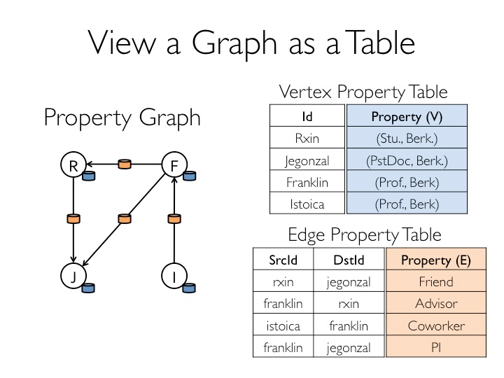
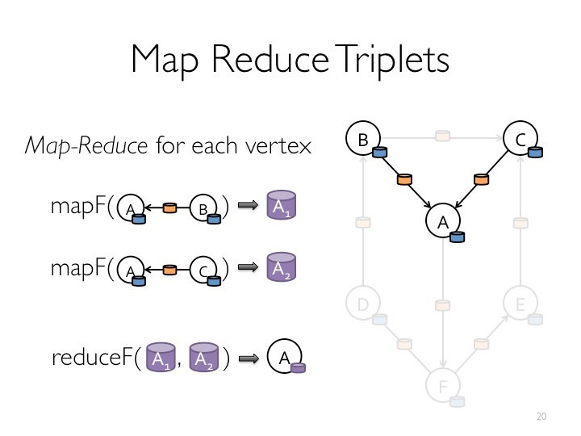

#graphx
##property graph 
*   Table
    -   Vertex Property Table和Edge Property Table等的组合
    -   继承了Spark RDD的API(fiter,map等)。

*   Graph
    -   reverse/subgraph/mapV(E)/joinV(E)/mrTriplets等操作

*   graphx借鉴powerGraph，使用的是vertexcut(点分割)方式存储图
*   图存储模式
    -   边分割
        -   每个顶点都存储一次，但有的边会被打断分到两台机器上。这样做的好处是节省存储空间；坏处是对图进行基于边的计算时，对于一条两个顶点被分到不同机器上的边来说，要跨机器通信传输数据，内网通信流量大。 
    -   点分割
        -   每条边只存储一次，都只会出现在一台机器上。邻居多的点会被复制到多台机器上，增加了存储开销，同时会引发数据同步问题。好处是可以大幅减少内网通信量
*   GraphOps
    -   计算度（Degree）信息
        -   inDegrees
        -   outDegrees
        -   每一个顶点边的数量
*   Graph Algorithms
    -   PageRank
        -   计算每个节点的重要度
    -   Connected Components
        -   群组，subGrahp，独立的子图
        -   标记每个用户和属于这个组的最小vertexId
        -   最小id数就是组的数
        -   连通图：检测连通图的目的是弄清一个图有几个连通部分及每个连通部分有多少顶点。这样可以将一个大图分割为多个小图，并去掉零碎的连通部分，从而可以在多个小子图上进行更加精细的操作。目前，GraphX提供了ConnectedComponents和StronglyConnected-Components算法，使用它们可以快速计算出相应的连通图。
        -   最小编号的顶点标记图的连通体
    -   Triangle Counting
        -   大家的关注关系中就会有很多三角形，这说明社区很强很稳定，大家的联系都比较紧密；如果说只是你一个人关注很多人，这说明你的社交群体是非常小的。
        -   社交网络拥有越多的三角形，其联系也就业紧密
    -   Pregel
        -   递归计算
            -   更高级的Pregel操作是一个约束到图拓扑的批量同步（bulk-synchronous）并行消息抽象
        -   最短路径
            -   在第一次迭代的时候，所有的顶点都会接收到initialMsg消息，在次轮迭代的时候，如果顶点没有接收到消息，verteProgram就不会被调用。
        -   http://www.ithao123.cn/content-3510265.html
    -   相邻聚合（Neighborhood Aggregation）
        -   知道每一个用户的追随者数量或者追随者的平均年龄
    -   信息聚集（Aggregate Messages (aggregateMessages)）

