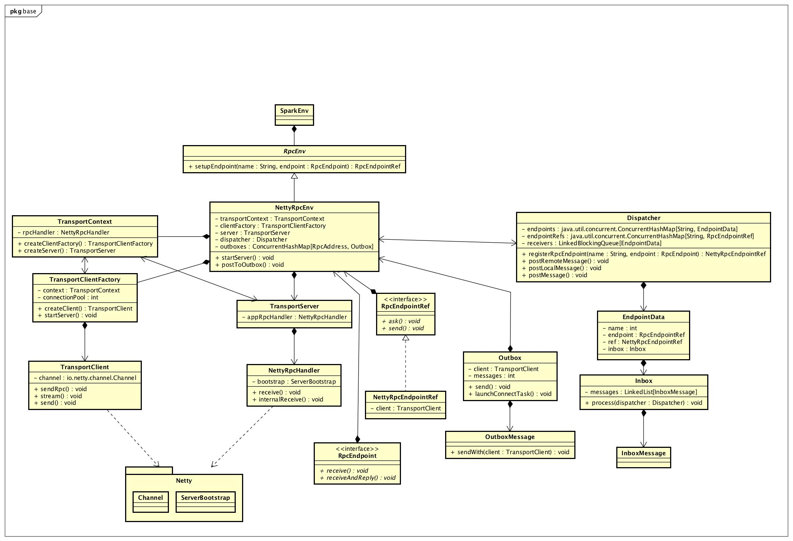

#   SparkContext -- v 2.2
##  初始化过程  -- driver
*   前置条件SparkConf设置：
    -   spark.master 必须设置 
        -   本地模式为 local[*]
        -   集群模式为 master地址，如：spark://192.168.0.147:7077
*   初始化或者从缓存获取SparkContext ：
    -   SparkContext##getOrCreate(config: SparkConf)
*   初始化context 
    -   new SparkContext(config)
*   重要组件初始化并启动
    -   SparkUI
        +   客户端webui,默认端口4040
    -   schedulerBackend [后台线程]:   SchedulerBackend，管理系统，决定如何获取资源，配合TaskSchedulerImpl运行task
        +   意图：不同集群资源获取方式不一样，相对于不同的集群提供不同的策略实现
        +   接口方法
            *   reviveOffers,找到合适work的合适的executor资源给task运行   
        +   在standalone模式下，StandaloneSchedulerBackend负责集群资源的获取和调度。继承自CoarseGrainedSchedulerBackend。
            *   **客户端通信线程**:StandaloneAppClient
                -   `client = new StandaloneAppClient(sc.env.rpcEnv, masters, appDesc, this, conf)`
                -   将driver app信息注册到spark 的master，包含driver端的通信地址
                -   监听并处理来自master过来的消息
        +   在本地模式下，LocalSchedulerBackend
    -   TaskScheduler :
        +   接收 DAGScheduler 划分好stage之后包含task列表的set
        +   负责发送task给集群运行，已经失败重试等操作
        +   接口方法
            *   submitTasks：提交任务执行
    -   persistentRdds :一个线程安全的map,跟踪所有缓存rdd, gc是自动释放缓存
        +   `val map: ConcurrentMap[Int, RDD[_]] = new MapMaker().weakValues().makeMap[Int, RDD[_]]()
    map.asScala`
        +   MapMaker:
            *   Google Collections中的MapMaker融合了Weak Reference，线程安全，高并发性能，异步超时清理，自定义构建元素等强大功能于一身。
    -   DAGScheduler ： DAG计算
        +   为每一个job计算DAG图，把划分的stage作为taskset的形式提交给TaskScheduler执行task
    -   SparkEnv ：给spark实例(master,worker）保存运行时环境变量，是全局变量，所有线程都可以访问相同的sparkEnv
        +   SecurityManager ： 负责全局安全权限控制
        +   RpcEnv：NettyRpcEnv ，rpc调用环境信息
            *   RpcEndpoint需要注册到RpcEnv，用来接收消息
            *   处理消息发送
        +   SerializerManager：为spark各种组件提供序列化，压缩，加密等配置信息
        +   BroadcastManager：消息广播管理
        +   MapOutputTrackerMaster(for driver)/MapOutputTrackerWorker(for execute)：一个map,用来跟踪 stage中输出内容的位置，key为shuffleid,value为一组blockManagerId
        +   ShuffleManager: Shuffle管理
            *   driver or executor  created in SparkEnv
        +   MemoryManager： 内存管理
            *   控制内存在execution 和 storage之间共享
            *   execution memory：
                -   运行时需要的内存如：shuffles, joins,sorts and aggregations
            *   storage memory：
                -   缓存数据，如调用rdd.cache
        +   blockTransferService: 从远程获取blocks，的传输方式默认：NettyBlockTransferService，通过netty传输
        +   BlockManagerMaster：master的block管理，与driver通信
            *   ` val blockManagerMaster = new BlockManagerMaster(registerOrLookupEndpoint(
      BlockManagerMaster.DRIVER_ENDPOINT_NAME,
      new BlockManagerMasterEndpoint(rpcEnv, isLocal, conf, listenerBus)),
      conf, isDriver)`
                -  在master上注册driver,返回和master的通信RpcEndpointRef
        +   blockManager
            *   管理每个节点（driver和executors)上的消息块
            *   提供了一套管理接口：存放或者接收来自本地和远程的各种消息块
                -   getBlockData
                -   putBlockData
            *   消息快存储在内存，或者磁盘
                -   memoryStore
                -   diskStore
        +   StandaloneSchedulerBackend#StandaloneAppClient#tryRegisterAllMasters，将driverapp注册到 master
            -   val masterRef = rpcEnv.setupEndpointRef(masterAddress, Master.ENDPOINT_NAME),远程调用master地址的RpcEndpointVerifier，检查master地址是否可以连接
                +   最终通过TransportClient，与master server通信发送消息
                +   message.sendWith(_client)
            -   masterRef.send(RegisterApplication(appDescription, self))，向master发送app注册消息
*   启动线程
    -   Dispatcher , 线程前缀 dispatcher-event-loop默认线程数=可用cpu数，
        +   Runtime.getRuntime.availableProcessors()
    -   TransportServer,线程前缀 rpc-server,默认工作线程 8个
    -   MapOutputTrackerMaster,线程前缀 map-output-dispatcher,默认工作线程 8个
    -   NettyBlockTransferService
    -   appclient-registration-retry-thread
    -   dag-scheduler-event-loop
    -   dispatch-event-loop
    -   driver-revive-thread
    -   heartbeat-receive-event-loop-thread]
    -   rpc
        +   rpc-client
        +   rpc-server
    -   shuffle-server
*   Endpoint 远程通信 -- Standalone cluster
    -   SparkEnv#createDriverEnv#NettyRpcEnv#server =>TransportServer 
        +   driver端的rpc server 
        +   高效的流服务，默认使用NIO,使用Netty实现
        +   线程前缀 rpc-server，默认工作线程 8个
        +   NettyRpcHandler 处理接收到的消息
        +   RpcEndpointVerifier & NettyRpcEndpointRef(spark://endpoint-verifier@192.168.80.18:50637)
            *   检查某个endpoint是否存在
    -   MapOutputTrackerMasterEndpoint & NettyRpcEndpointRef(spark://MapOutputTracker@192.168.80.18:50637)
        +   name:MapOutputTracker
        +   外部调用获取某个shuffleid对应的映射输出地址
    -   BlockManager#BlockManagerSlaveEndpoint  
        +    name:BlockManagerEndpoint1
        +    执行master发过来的命令
            *    RemoveBlock，RemoveRdd,RemoveShuffle,RemoveBroadcast等
    -   SparkEnv#OutputCommitCoordinatorEndpoint
        +   name:OutputCommitCoordinator
        +   handleAskPermissionToCommit,
    -   BlockManagerMasterEndpoint
        +   name:BlockManagerMaster
        +   block 管理
    -   StandaloneSchedulerBackend#StandaloneAppClient#ClientEndpoint
        +   
    -   HeartbeatReceiver
    -   CoarseGrainedScheduler

##  远程通信
###  类图

###  基本流程

###  RpcEndpoint
*   rpc通信对象，处理接收到的消息
*   receive：处理来自 `RpcEndpointRef.send` 或者 `RpcCallContext.reply`的消息
*   receiveAndReply：处理RpcEndpointRef.ask的消息

###  RpcEndpointRef -- NettyRpcEndpointRef
*   RpcEndpoint的远程引用
*   client: TransportClient
    -   
*   send：单向发送消息，Fire-and-forget semantics 
*   ask：双向，发送消息之后返回feature,接受返回消息

###  NettyRpcEndpointRef
*   行为由创建的地方决定，

### RpcEnv创建
*   new NettyRpcEnv
    -   new Dispatcher
        +   消息总线，路由消息到各个对应的endpoint
        +   主要成员
            *   endpoints: ConcurrentMap[String, EndpointData] 
            *   endpointRefs: ConcurrentMap[RpcEndpoint, RpcEndpointRef]
            *   receivers = new LinkedBlockingQueue[EndpointData]
            *   dispatcher-event-loop 线程，线程前缀 dispatcher-event-loop默认线程数=可用cpu数，
    -   TransportClientFactory，启动netty client workerGroup
    -   NettyRpcEnv#startServer，启动netty server
        -   server: TransportServer
            +   new TransportServer
                *   new ServerBootstrap，启动一个netty服务
                *   NettyRpcHandler负责处理连接
                *   启动
    -   Dispatcher#registerRpcEndpoint
        +   new NettyRpcEndpointRef 
            *   endpointAddress =>spark://endpoint-verifier@192.168.81.81:52930
                -   和driver通信的地址
        +   endpointRefs.put(data.endpoint, data.ref)
            *   EndpointData = new EndpointData(name, endpoint, endpointRef)
                -   一组端对端的通信，持有一个通信地址Inbox
                -   Inbox，为endpoint存储消息，并交给endpoint处理
        +   receivers.offer(data)
    -   outboxes = new ConcurrentHashMap\[RpcAddress, Outbox\]()
        +   发送消息的邮箱，实现异步发送消息
        +   client: TransportClient
            *   netty client
            *   sendRpc
        +   messages = new java.util.LinkedList[OutboxMessage]

##  
