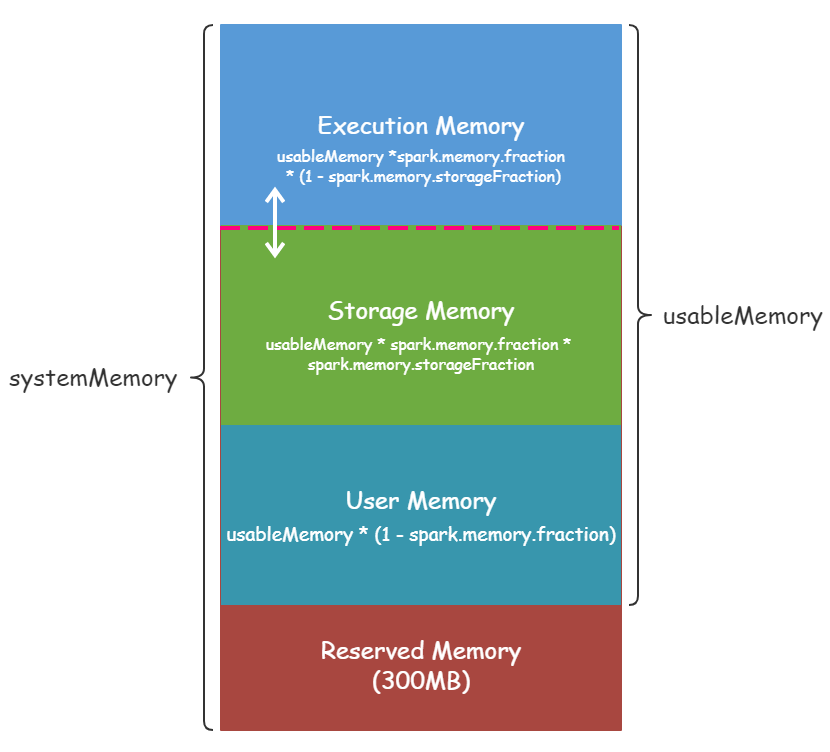
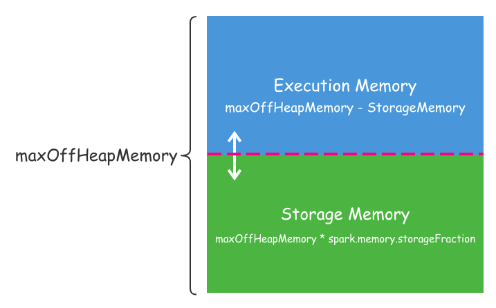

# 5-spark-memory.md

### 内存分类
*   堆内内存(On-heap Memory)
	*	默认情况下，Spark 仅仅使用了堆内内存。Executor 端的堆内内存区域大致可以分为以下四大块：
		*	Execution 内存：主要用于存放 Shuffle、Join、Sort、Aggregation 等计算过程中的临时数据
		*	Storage 内存：主要用于存储 spark 的 cache 数据，例如RDD的缓存、unroll数据；
		*	用户内存（User Memory）：主要用于存储 RDD 转换操作所需要的数据，例如 RDD 依赖等信息。
		*	预留内存（Reserved Memory）：系统预留内存，会用来存储Spark内部对象。
		*	
		*	systemMemory = Runtime.getRuntime.maxMemory，其实就是通过参数 spark.executor.memory 或 --executor-memory 配置的。
		*	usableMemory = systemMemory - reservedMemory
*	堆外内存(Off-heap Memory)
	*	默认情况下，堆外内存是关闭的，我们可以通过 spark.memory.offHeap.enabled 参数启用，并且通过 spark.memory.offHeap.size 设置堆外内存大小，单位为字节
	*	这个时候 Executor 中的 Execution 内存是堆内的 Execution 内存和堆外的 Execution 内存之和
	*	

###	spark 内存构建MemoryManager -- 在 sparkEnv中 
*	MemoryManager分为2大类
	*	StaticMemoryManager -- spark.memory.useLegacyMode 为true 时（默认false)
		*	在spark1.6之前采用静态内存管理
	*	UnifiedMemoryManager 
		*	动态管理	execution 与 storage 的空间交换
		*	reservedMemory 默认 300m ， 所以 usableMemory = systemMemory - 300m
	*	相关配置
		*	spark.memory.fraction *  usableMemory -- 决定了 (execution  + storage) 的内存
			*	userMemory * (1- spark.memory.fraction) 
		*	spark.memory.storageFraction 为 spark.memory.fraction *  usableMemory 比例中 storage 内存占比
			*	1 -  spark.memory.storageFraction 为 execution 内存占比
		*	案例
			*	--executor-memory 10g  -- 10240m  , spark.memory.fraction = 0.6 , spark.memory.storageFraction = 0.7
			*	usableMemory = 10240m   - 300m = 9940‬m
			*   User Memory = 9940‬ * ( 1- 0.6) = 3976m
			*	execution = 9940‬ * 0.6 * (1-0.7) = 1789m
			*	storeage = 9940 * 0.6 * 0.7 =8150m
	*	spark.memory.offHeap.size  -- 堆外内存大小

##  spark cache and load block size 

## Peak Execution memory 
*   refers to the memory used by internal data structures created during shuffles, aggregations and joins.

#### 参考
*	https://www.iteblog.com/archives/2342.html
