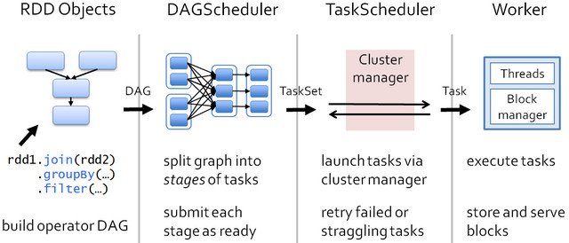
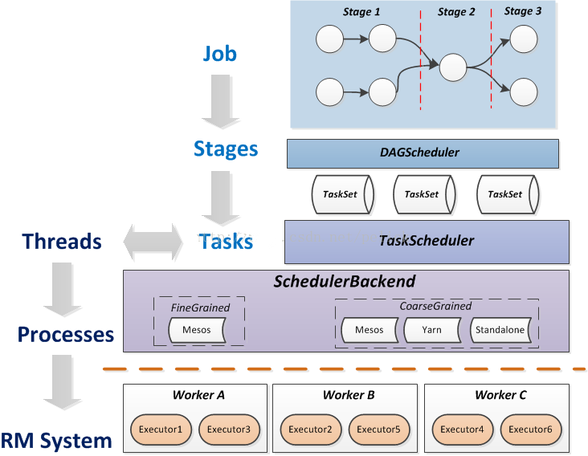
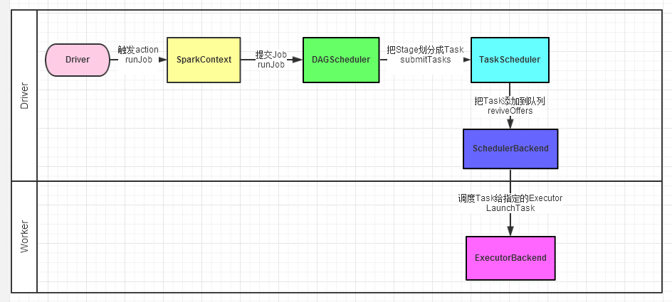
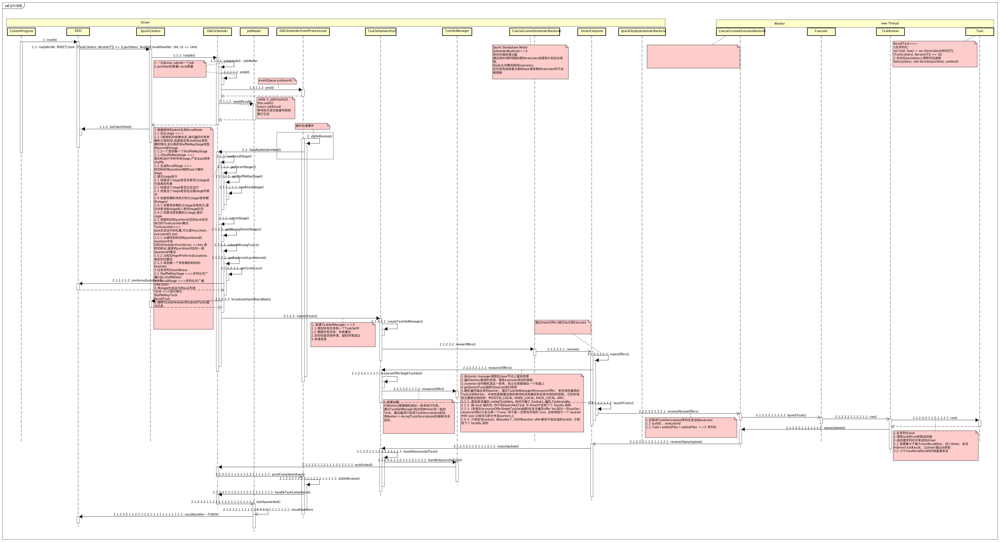

#Resilient Distributed Datasets (RDDs)
##基本流程

##driver worker 通信关系

###rdd执行时序图

###概述
*   *1.*   构造RDD,从不同的数据源加载数据
    -   测试方式`rdd1: RDD[Int] = sc.makeRDD(1 to 1000, 10)` <=ParallelCollectionRDD

##org.apache.spark.rdd
#####RDD  extends Serializable
*   是什么 
    -    弹性分布式数据集

#####ParallelCollectionRDD  extends RDD[T]

