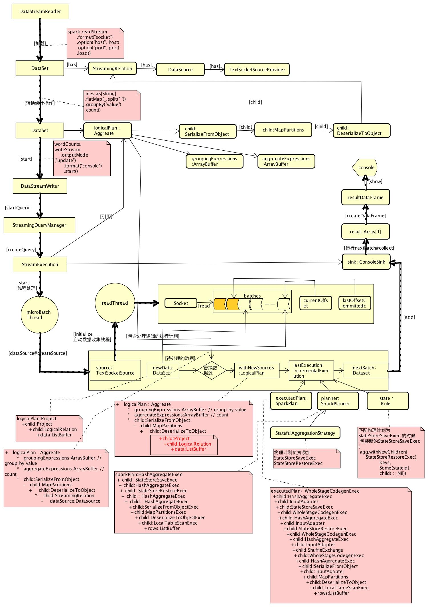

#   基本流程 spark 2.2.1
##  StructuredNetworkWordCount 统计来自socket的word count


###  创建stream，指定数据源
*   DataStreamReader--从外部存储加载流数据的接口
```
      lines = spark.readStream.format("socket")
      .option("host", host)
      .option("port", port)
      .load() 
```
####   加载数据流为 DataFrame， DataStreamReader#load
*   与普通DataFrame初始化相似，只是使用StreamingRelation
*   新建DataSource，根据format和option初始化对应的StreamSourceProvider
    -   providingClass => org.apache.spark.sql.execution.streaming.TextSocketSourceProvider
        -   Source:TextSocketSource
*   包装成StreamingRelation(dataSource)
*   创建DataFrame，Dataset.ofRows(sparkSession, StreamingRelation(dataSource))

####  对于DataSet的基本操作
*   把输入内容分隔单词，val words = lines.as[String].flatMap(_.split(" "))
*   聚合操作，wordCounts = words.groupBy("value").count()
    -   DataSet#count还是一个转换操作，并不是action,与RDD#count不同
```
wordCounts:[value:string,count:bigint]
    +   logicalPlan : Aggreate
        *   groupingExpressions:ArrayBuffer // group by value
        *   aggregateExpressions:ArrayBuffer // count
        *   child:SerializeFromObject 
            -   child:MapPartitions 
                +    child:DeserializeToObject
                    *    child:StreamingRelation
                        -    dataSource:Datasource


```

#### 初始化writeStream，并启动
*   wordCounts.writeStream.outputMode("update").format("console"）.start()
*   根据不同source会指定不同的sink，也就是怎么处理结果集
    -   memory  : MemorySink
    -   foreach : ForeachSink
    -   console : dataSource.createSink(outputMode)
*   开始数据流操作，streamingQueryManager.startQuery

#### 数据流查询启动streamingQueryManager.startQuery
*   默认触发器，Trigger.ProcessingTime(0L)
*   创建StreamingQueryWrapper查询
    -   new StreamingQueryWrapper(new StreamExecution())
    -   StreamingQueryWrapper在StreamExecution的基础上增加一些统计信息查询
    -   StreamExecution流处理执行器

####  流处理器：StreamExecution
#####  启动 StreamExecution#start
*   microBatchThread.start()，启动工作线程
    -   logicalPlan初始化
        +   sources ： Source = TextSocketSource 创建并初始化，单独线程开始接受数据
            *   TextSocketSource主要方法
                -   initialize，初始化sockert,启动线程读取数据放入缓存
                -   getOffset，获取目前为止接受到数据的位置
                -   getBatch，获取一段数据并转化成DataFrame
                -   commit,提交已经处理的offset
    -   ProcessingTimeExecutor,定时批处理触发器
        +   如果指定intervalMs>0，会等intervalMs时间后触发下一个批次处理
        +   如果指定intervalMs = 0 , 上一个批次处理完就接着处理下一个
    -   批处理执行逻辑
        +   首次启动时会检查checkpoint,是否需要从上一次批处理恢复，如果不需要则构造一个新的批处理constructNextBatch
            *   检查数据源是否有新的没处理数据，也就是currentOffset和commitOffset不同的时候
            *   watermarking 处理//TODO
            *   删除过期的日志minBatchesToRetain < currentBatchId，只保存指定的最小批次的数据
                -   offsetLog.purge(currentBatchId - minBatchesToRetain)
                -   batchCommitLog.purge(currentBatchId - minBatchesToRetain)
        +   执行批处理 runBatch
            *   如果有数据可以执行，获取数据newData，batch = source.getBatch(current, available)
                -   从数据源获取上一次提交位置开始到现在最新的数据位置的数据，转换成dataFrame
                    +   newData：Dataset[value]
                        *   logicalPlan:Project
                            -   child:LogicalRelation
                                +   data:ListBuffer // 从source获取的批数据
                -   withNewSources = 执行逻辑 + 数据结合 
                    +   把之前定义包含所有操作逻辑的logicalPlan 中 描述数据计划替换成当前需要处理的批处理的计划newData.logicalPlan
                -   创建增量执行计划，lastExecution = new IncrementalExecution
                    +   继承自QueryExecution，增量执行计划，维持中间状态
                    +   planner: SparkPlanner增加策略
                        *   StatefulAggregationStrategy
                        *   FlatMapGroupsWithStateStrategy
                        *   StreamingRelationStrategy
                        *   StreamingDeduplicationStrategy
                    +   增加state： new Rule[SparkPlan]
                -   生成新的Dataset(sparkSessionToRunBatch, lastExecution, RowEncoder(lastExecution.analyzed.schema))
                -    添加dataset到sink,sink.addBatch(currentBatchId, nextBatch)
            *   如果没有数据
                -   通过conf配置spark.sql.streaming.noDataProgressEventInterval，指定没有数据时的等待时间，默认10秒

#####  sink处理dataset [ConsoleSink]
*   data.collect() 执行计划，流程就是普通Dataset的collect处理
*   将返回值包装成新的DataFrame，调用show 方法 打印到控制台


###  IncrementalExecution extends QueryExecution
#### 重写planner: SparkPlanner
*   添加额外的策略，extraPlanningStrategies
    -   StatefulAggregationStrategy ==》 对于聚合操作，添加增量计算处理，保持中间结果 // TODO
        1.  Partial先在本地执行聚合操作
        1.  执行shuffle操作
        2.  PartialMerge合并操作
        3.  从StateStore（文件系统）读取中间状态，并且更新内容，当前批次的结果 与 之前的结果合并
        4.  PartialMerge合并
        5.  将结果保存StateStoreSave，为下一个批次做准备
        6.  完成操作输出当前批次处理的结果
    -   FlatMapGroupsWithStateStrategy
        +   带状态的map操作实现
    -   StreamingRelationStrategy
    -   StreamingDeduplicationStrategy
        +   deduplicate operator

####  val state = new Rule[SparkPlan] ，准备执行计划的时候执行
*    专门给StateStoreSaveExec，StreamingDeduplicateExec，FlatMapGroupsWithStateExec绑定 stateId,
    -    stateId 由checkpointLocation ，operatorId ， batchId决定

###  StateStoreRestoreExec //TODO

###  StateStoreSaveExec 
