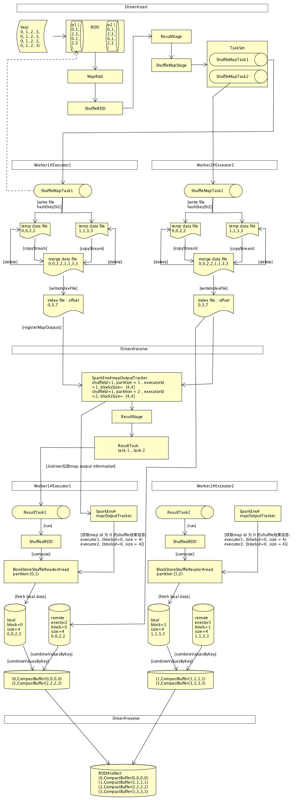

#   shuffle过程
##  RDD#groupBy操作为例子：`val groupRdd = spark.sparkContext.parallelize(Seq(0, 1, 2, 3, 0, 1, 2, 3, 0, 1, 2, 3, 0, 1, 2, 3), 4).groupBy(f => f)`
*   
*   映射成key，value的pair形式，this.map(t => (cleanF(t), t))
    -   包装成 MapPartitionsRDD
*   隐式调用，PairRDDFunctions#groupByKey
    -   定义三个函数
        +   val createCombiner = (v: V) => CompactBuffer(v)
            *   如何创建合并对象
            *   CompactBuffer为一个高效存储处理的array
        +    val mergeValue = (buf: CompactBuffer[V], v: V) => buf += v
            *    定义如何合并元素，就是往array中添加元素
        +   mergeCombiners = (c1: CompactBuffer[V], c2: CompactBuffer[V]) => c1 ++= c2
            *   定义如何将两个合并对象合并成一个对象
    -   包装成  ShuffledRDD\[K, V, C\](self, partitioner)
        .setSerializer(serializer)
        .setAggregator(aggregator)
        .setMapSideCombine(mapSideCombine)
        -   val aggregator = new Aggregator\[K, V, C\](
      self.context.clean(createCombiner),
      self.context.clean(mergeValue),
      self.context.clean(mergeCombiners)) 为之前定义的三个合并相关的函数

##  执行actions,触发任务提交，RDD#count
*   RDD形式
    -   ShuffledRDD  <-- 对于pair形式的rdd,隐式调用PairRDDFunctions#groupByKey生成
        +   prev: MapPartitionsRDD <-- groupby时候先映射成key,value的map操作生成，转出pair形式rdd
            *   prev:ParallelCollectionRDD <-- sc.parallelize 生成，实际处理数据的RDD
                -   data : 1 to n
                -   dependencies_: OneToOneDependecy
                    +   _rdd:ParallelCollectionRDD
        +   dependencies_: ShuffleDependency <-- ShuffledRDD的getDependencies时设置
            *   _rdd:MapPartitionsRDD
            *   shuffleHandler: BypassMergeSortShuffleHandle
*   stage划分
    -   ResultStage
        +   parents ： \[ShuffleMapStage\]
            *   shuffleDep :  ShuffleDependency
            *   **rdd : MapPartitionsRDD**  <-- shuffle task执行时计算的rdd
        +   **rdd : ShuffledRDD**  <-- 计算result stage时，先计算的是ShuffledRDD
*   stage提交计算
    -   首先提交最父层stage, 也就是ShuffleMapStage
    -   stage 转换成一组TaskSet，每个task为ShuffleMapTask

## worker端executor执行ShuffleMapTask
*   ShuffleMapTask#runTask运行shuffle task
*   获取shuffleManager: `val manager = SparkEnv.get.shuffleManager`
*   获取ShuffleWriter：` writer = manager.getWriter[Any, Any](dep.shuffleHandle, partitionId, context)`
    -   shuffleHandle为BypassMergeSortShuffleHandle，所以使用了BypassMergeSortShuffleWriter
*   BypassMergeSortShuffleWriter执行写入操作： `writer.write(rdd.iterator(partition, context).asInstanceOf[Iterator[_ <: Product2[Any, Any]]])`
    -   数据被写入worker机器的文件
    -   临时文件路径
        +   /private/var/folders/vd/txsj8y2d227c538pykv3k0nr0000gn/T/spark-4b5c9efc-08c4-44c8-9da2-14a4208c6cba/executor-f05860ee-1029-4925-b792-001391d74d07/blockmgr-d8334fc6-96a0-4190-abad-04f2817ec14d/0c/shuffle_0_0_0.data
    -   可以通过shuffleBlockResolver根据shuffleId和partitionid找到对应的数据文件
    -   rdd.iterator == MapPartitionsRDD.iterator
        +   递归调用
            -   先计算ParallelCollectionRDD.iterator读取实际数据
            -   在计算MapPartitionsRDD.iterator映射成key,value元素pairRDD
        +   最终被写入文件
*    给driver发送结束状态消息，execBackend.statusUpdate(taskId, TaskState.FINISHED, serializedResult)  ， serializedResult 为MapStatus 

## driver端接受到完成消息并处理
*   DagScheduler#handleTaskCompletion
    -   将结果转换成MapStatus，val status = event.result.asInstanceOf[MapStatus]
        +   结果中记录了shuffle中间结果的地址
    -   添加到stage的output
        +   shuffleStage.addOutputLoc(smt.partitionId, status)
    -   等所有shuffleTask完成，将shuffle输出结果注册到mapOutputTracker
        +   mapOutputTracker.registerMapOutputs(
                shuffleStage.shuffleDep.shuffleId,
                shuffleStage.outputLocInMapOutputTrackerFormat(),
                changeEpoch = true)
    -   ShuffleStage执行完成，提交childStage也就是ResultStage执行

##  worker端executor执行ResultTask【rdd : ShuffledRDD】
###    执行ShuffledRDD#iterator
*   获取shuffleReader,SparkEnv.get.shuffleManager.getReader(dep.shuffleHandle, split.index, split.index + 1, context) =>BlockStoreShuffleReader
    -   从当前partition开始到下一个partition,但是下一个partition不被读取，也就是只读取当前partition数据
*   BlockStoreShuffleReader#read读取shuffle之前保存在文件的内容
    -   shuffleTask的输出结果位置都保存在了mapOutputTracker，可以根据shuffleid获取当前partition获取结果信息
    -   读取数据
    -   通过之前定义的Aggregator，合并相同key的元素
*   TODO
    -   一个partiotion只读取当前partition的shuffle数据？
    -   合并细节，夸partition的数据如何合并

## BypassMergeSortShuffleWriter详解
### 基础
-   基于排序的，hash风格的shuffle
-   记录被写入独立的文件，每个reduce 分区 一个 文件，每个文件的内容都是排序的
-   最后把所有分区文件内容整体排序后合并到一个文件中
-   所有记录不会被缓存在内存
*   可以通过IndexShuffleBlockResolver读取文件内容
-   因为每个partition会有单独的序列化和文件流，所以在partition过多的情况性能会下降

### BypassMergeSortShuffleWriter#write
*   生成n个临时文件 ，n为分区数,每个临时文件对应一个blockid
    -   `Tuple2<TempShuffleBlockId, File> tempShuffleBlockIdPlusFile = blockManager.diskBlockManager().createTempShuffleBlock();`
    -    根据File，和bolckid初始化n个 **DiskBlockObjectWriter**
        +    每个需要处理的partition会有所有partition数量的writers,也就是说n个partition会有n*n个 DiskBlockObjectWriter
        +    将jvm对象写入文件，运行追加内容到指定的block
*   遍历所有rdd的partition的数据，hash[key]决定用哪个DiskBlockObjectWriter写入
    -   partitionWriters[partitioner.getPartition(key)].write(key, record._2());
    -   将rdd的一个partition数据写入到n个文件中去（n为partition数）
*   刷新文件写入提交所有数据并返回写入数据的信息
    -   commitAndGet(): FileSegment
        +    FileSegment(val file: File, val offset: Long, val length: Long) ，文件的数据访问信息

### BypassMergeSortShuffleWriter#writePartitionedFile合并之前的n个文件到一个文件
*   合并文件，Utils.copyStream(in, out, false, transferToEnabled);
    -   合并完成后删除之前的文件
    -   返回每个partition的对应的写入文件的长度的数组
*   创建索引文件，记录每个block的起始位置和长度.
*   返回shuffle结果MapStatus，shuffle 写入完成

## BlockStoreShuffleReader#read读取shuffle内容
### ShuffleBlockFetcherIterator
*   获取block的iterator,从本地或者远程获取指定分区的block数据
*   获取当前分区的所有shuflle block信息， mapOutputTracker.getMapSizesByExecutorId(handle.shuffleId, startPartition, endPartition)
*   initialize ，初始化
    -   划分block,哪些需要远程获取，哪些本地获取，splitLocalRemoteBlocks
        +   本地保存在localBlocks
        +   远程收集在fetchRequests
    -   拉取远程block，fetchUpToMaxBytes
        +   results.put(new SuccessFetchResult(BlockId(blockId), address, sizeMap(blockId), buf,
              remainingBlocks.isEmpty))
    -   拉取本地block,fetchLocalBlocks
        +   results.put(new SuccessFetchResult(blockId, blockManager.blockManagerId, 0, buf, false))

### 合并各个task计算的相同key的结果
*    dep.aggregator.get.combineValuesByKey(keyValuesIterator, context)

   