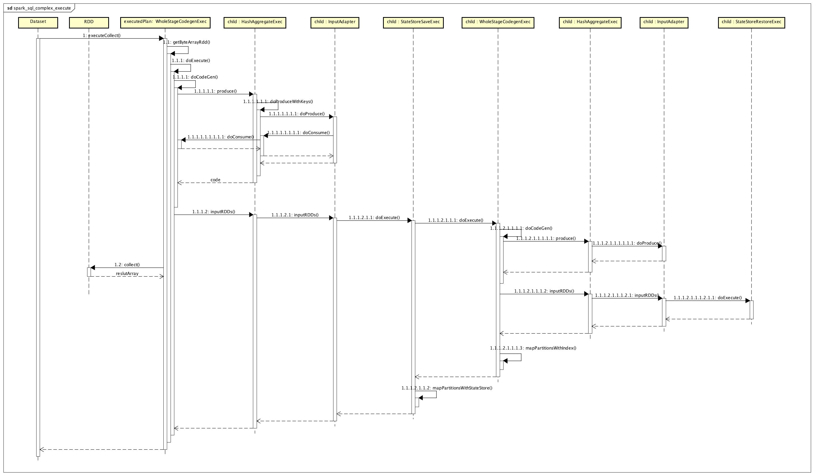

#   复杂流程的spark sql 的执行计划的处理

##  以StructuredStream生成的可执行计划executedPlan为例，分析具体执行的流程。
*   基本功能描述：
    *    1. socket流处理时候，带状态的统计单词的个数，下面是一批数据生成的执行计划
```
// 物理计划
sparkPlan:HashAggregateExec
 + child: StateStoreSaveExec
  + child:HashAggregateExec
   + child :StateStoreRestoreExec
    + child : HashAggregateExec
      + child : HashAggregateExec
         +child:SerializeFromObjectExec 
          +child:MapPartitionsExec
             +child:DeserializeToObjectExec
               +child:LocalTableScanExec
                   +rows:ListBuffer


//可执行计划结构
executedPlan：WholeStageCodegenExec
 +child:HashAggregateExec
  +child:InputAdapter
   +child:StateStoreSaveExec
    +child:WholeStageCodegenExec
     +child:HashAggregateExec
      +child:InputAdapter
        +child:StateStoreRestoreExec
          +child:WholeStageCodegenExec
            +child:HashAggregateExec
             +child:InputAdapter    
              +child:ShuffleExchange
               +child:WholeStageCodegenExec
                +child:HashAggregateExec
                  +child:SerializeFromObjectExec
                   +child:InputAdapter
                     +child:MapPartitionsExec
                       +child:DeserializeToObjectExec
                         +child:LocalTableScanExec
                            +rows:ListBuffer

//可执行计划全局代码生成RDD结构
byteArrayRdd:MapPartitionsRDD
 +  prev :  MapPartitionsRDD  
   +  prev : StateStoreRDD 
     +  dataRDD : MapPartitionsRDD
       +  prev :  StateStoreRDD
         +  dataRDD : MapPartitionsRDD
           + prev : ShuffledRowRDD
             +  dependency: ShufflDependency
               + _rdd: MapPartitionsRDD
                 + prev :  MapPartitionsRDD  
                   + prev :  MapPartitionsRDD  
                     + prev :  MapPartitionsRDD  
                      + prev :  MapPartitionsRDD  
                       + prev : ParalleCollectionRDD
                        + data                    
```




##  调用总结
1.   getByteArrayRdd ==》 SparkSql DataSet处理入口action函数如：collectFromPlan,首先都会执行executedPlan：WholeStageCodegenExec的getByteArrayRdd,如executeCollect函数
    -   最终返回一个压缩有的RDD[Array[Byte]]
2.   doExecute ==》 WholeStageCodegenExec#doExecute开始计划执行
    -   doCodeGen 逻辑执行代码生成，也就是while内的代码块
        +   由当前WholeStageCodegenExec的最后一个计划负责生成while语句块
            *  可以是  InputAdapter 也可以是其他计划的doProduce方法生成
        +   递归调用父类consume方法生成while内的执行逻辑
    -   inputRDDs 获取输入rdd
        +   如果是InputAdapter会调用子类的doExecute
            *   如果InputAdapter子类是WholeStageCodegenExec 则重复 [2]
3.  inputRDDs.mapPartitionsWithIndex，遍历每个partition
    -   编译并初始化动态生成的类     
    -   将partition的iterator转换为动态类的iterator
4.  将 RDD[InternalRow]  编码并压缩为 RDD[Array[Byte]]
5.  执行 RDD
