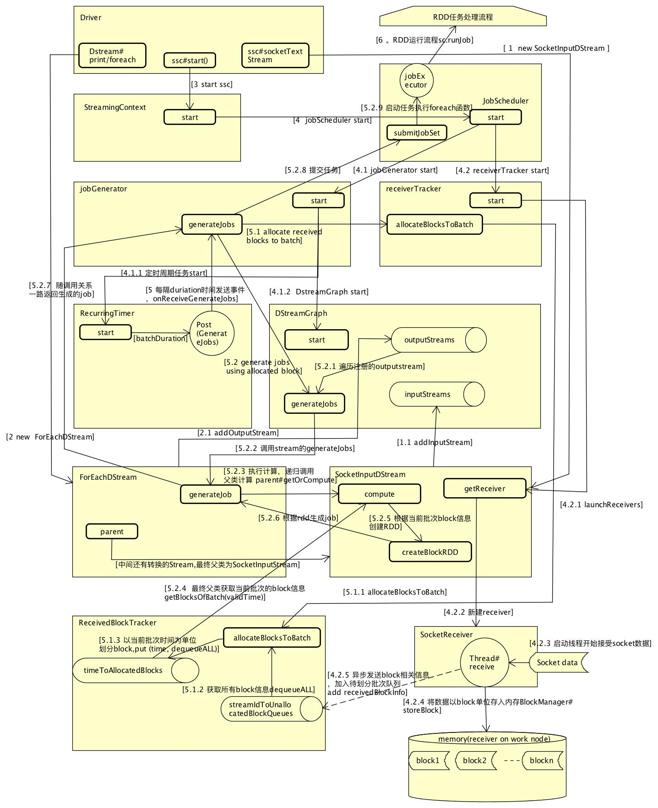

#  spark streaming  -- socketTextStream 基本处理
##   主要功能及组件
-   DStreams
    -   相同类型的一组RDD,代表连续的数据流
    +   可以由实时数据流创建,TCP sockets , kafka ,flume ,现有DStreams转换操作,
    +   该类提供了基础的map,fliter,widow,PairDStreamFunction ==>join,groupByKeyAndWindow
    +   batchInterval＝＞　batchDuration，执行任务的周期，包含一个或者多个ｂｌｏｃｋ
    +   blockInterval　＝＞　receiver接收到数据后创建ｂｌｏｃｋ的周期
    +   receiver方式
        *   一个DStream关联一个ｒｅｃｅｉｖｅｒ，需要从多个Receiver并行读取需要创建多个DStream,一个Receiver运行载一个Ｅｘｅｃｕｔｏｒ，占用１个ｃｐｕ
        +   来自数据源的数据接收到以后，ｒｅｃｅｉｖｅｒ会每隔blockInterval时间生成ｂｌｏｃｋ
    +   batchInterval　间隔的block被创建成RDD,block数就是ＲＤＤ的分区数，分区数对应task数， blockInterval== batchinterval 　意味着只有一个分区，本地执行
        -   task数（partition数） = batchInterval / blockInterval
-   DStreamGraph
    +   generateJobs：根据分配的block,生成jobs(周期性的产生一个job)
-   InputDStream
    +   继承自DStream，所有输入流的基类
    +   spark stream 系统会调用 start 和stop来开始或者停止接受数据
    -   一些不需要在worker 节点运行接受输入数据的操作，可以直接继承这个类，只运行在driver 节点.
        -   例如:FileInputDStream => 监控 HDFS目录生成的新文件
    -   需要在ｗｏｒｋｅｒ节点上接收数据的，需要继承ReceiverInputDStream
*   Receiver -- 数据接收抽象基类
    *   在ｗｏｒｋｅｒ节点获取数据的对象
    -   ReceiverSupervisorImpl
        +   监督并处理运行在work节点的receiver接受到的数据
        -   pushSingle　将接收到的数据添加数据到BlockGenerator的ｂｕｆｆｅｒ
            +   socket receiver 通过这个方法记录数据,测试用，数据量小，直接在内存保存
        -   pushArrayBuffer 
            -   通过blockManager存储ｂｌｏｃｋ //TODO 
            -   通知driver 有新的blockInfo
            -   flume && kafka receiver 使用这个方法记录数据
        -   BlockGenerator
            -   waitToPush -- 单条数据推送
                -   限制每秒中能处理多少个消息
                -   可以通过spark.streaming.receiver.maxRate 参数配置，默认Long.MaxValue，不限速
                -   实现方案：
                    +   com.google.common.util.concurrent.RateLimiter
            -   启动线程，
                -   blockIntervalTimer线程
                    -   一个线程负责把ｒｅｃｅｉｖｅｒ中获取的数据分批block，缓存到推送队列blocksForPushing
                    -  分批时间间隔 "spark.streaming.blockInterval", "200ms" 
                -   blockPushingThread线程
                    -   通知receiver调用pushArrayBuffer把这些分批好的块push到block manager
*   ReceiverTracker
    -   管理ReceiverInputDStreams的执行
        +   负责发起启动receivers 的事件，启动receiver
    -   ReceivedBlockTracker
        +   跟踪接受到的数据block,划分批次
*   StreamingContext
    -   spark流处理上下文，用来创建DStream
*   JobScheduler
    -   通过JobGenerator生成job ,在spark上运行
    -   RecurringTimer
        +   ssc.graph.batchDuration.milliseconds 为周期生成GenerateJobs事件
    -   jobExecutor 执行任务的线程池，默认只有1个线程 -- 运行在driver上
        +   numConcurrentJobs = ssc.conf.getInt("spark.streaming.concurrentJobs", 1)
        +   执行的job 也是stream包的job
            *   org.apache.spark.streaming.scheduler.job
*   JobGenerator
    -   根据Receiver接受到的数据划分批次，在指定的间隔放入合适的block
    -   启动2个线程
        +   一个线程周期性开始一个新的批次，并把之前的批次划分成block
        +   一个线程推送这些block到block manager
*   ExecutorAllocationManager
    -   isDynamicAllocationEnabled(conf),根据配置是否打开
        +   key = spark.streaming.dynamicAllocation.enabled , 默认不打开
    -   管理executor的分配，和销毁
    -   根据每个批次的处理时间，而不是executor的空闲时间创建executor
        +   通过监听接口获取每个批次的处理时间
        +   计算平均处理时间 / 批次间隔时间 当大于一定上限比例时，请求更多的executor，小于一定下限比例时，销毁一些executor
*   组成关系
```
StreamingContext
    -   sparkContext
    -   DStreamGraph
    -   JobScheduler
        +   ExecutorAllocationManager
        -   ReceiverTracker 
        +   JobGenerator
            *   graph =ref ssc.graph
            *   RecurringTimer

SocketInputDStream
    -   getReceiver => SocketReceiver extends Receiver
        +   ReceiverSupervisorImpl extends ReceiverSupervisor
            *   BlockManagerBasedBlockHandler
            *   registeredBlockGenerators = new ConcurrentLinkedQueue[BlockGenerator]()
                -   BlockGenerator
            
```


##   receiver方式基本步骤 
-   利用  sparkConf创建一个 SparkContext
    +    StreamingContext.createNewSparkContext(conf)
-   初始化：SocketInputDStream  -- 实现如何从socket获取输入流
    -   val lines = ssc.socketTextStream(args(0), args(1).toInt, StorageLevel.MEMORY_AND_DISK_SER)
    -   提供了SocketReceiver创建的接口，在StreamingContext#start的时候创建并启动，开始接受数据
    -   注册到graph的inputStreams
-   转换操作 --  val words = lines.flatMap(_.split(" "))
    +   和RDD转换操作相似，封装成对应新的DStream(FlatMappedDStream,ShuffledDStream)
*   action操作 -- wordCounts.print()
    -   包装成ForEachDStream，并注册到graph的outputStreams
    -   父亲对象为转换操作的DStream，最终父亲对象为SocketInputDStream
        +   计算的时候先从最终父类SocketInputDStream.compute开始计算
*   StreamingContext启动 -- ssc.start()
    -   在worker节点创建receiver，启动线程接受socket数据
    -   定时周期线程，发送批次事件
        +   划分批次
        +   创建job并处理

##  receiver方式基本流程图



## kafka stream -- 两种方式
### Receiver 方式 -- KafkaUtils.createStream(ssc, zkQuorum, group, topicMap).map(_._2) ==>org.apache.spark.streaming.kafka 已过期2.3.0中
*   KafkaInputDStream
*   Receiver
    -   KafkaReceiver -- 不可靠方式
        +   创建ConsumerConnector = Consumer.create(consumerConfig)
        +   根据配置的topic信息创建消息流topicMessageStreams = consumerConnector.createMessageStreams
        +   为每个topic 启动一个线程处理
            *   将接收到的消息通过blockManager存入内存
    -   ReliableKafkaReceiver -- 可靠方式 
        +   多创建一个对象blockGenerator = supervisor.createBlockGenerator(new GeneratedBlockHandler)
            *   数据首先进入blockGenerator的currentBuffer缓存，
            *   GeneratedBlockHandler监听各种事件，并处理
                -   新接受到的数据blockGenerator.addDataWithCallback加入缓存时
                    +   回调updateOffset，更新offset，
                    +   记录对应关系，topicPartitionOffsetMap.put(topicAndPartition, offset)
                -   划分新的一个批次时onGenerateBlock（blockId)
                    +   将blockid和之前的topicPartitionOffsetMap映射关系对应起来
                -   将新的批次的block通过blockManager存入内存时
                    +   提交offset

### Direct方式 -- KafkaUtils.createDirectStream 
*   org.apache.spark.streaming.kafka010.KafkaUtils
*   直接从kakfa blocks拉取消息，没有receiver,可以保证exactly once
*   不再通过zookeeper 保存offset,被消费的offset 由stream 本身维持处理
*   容错处理需要打开checkpointing，之前被消费的offset信息可以从checkpoint恢复
*   端到端语义，stream可以保证每个消息被高效的接收和转换exactly once ,但是不能保证 转换后的数据能不能输出的处理exactly once
*   初始化参数：KafkaUtils.createDirectStream
    -   locationStrategy: LocationStrategy // 决定如何在一个executor 上给指定的topic的partition分配consumer
        +   PreferConsistent (推荐使用)，将topic的partiton 均匀分配到所有executor
        +   PreferBrokers, 如果executor和kafka broker在同一个节点使用，数据本地化，减少网络传输
        +   PreferFixed，给topicPartiton指定host节点
    -   consumerStrategy: ConsumerStrategy\[K, V\]，创建底层kafka consumers的配置
        +   Subscribe ，订阅一组topic
            *   topicsSet:目标topic的数组
            *   kafkaParams：创建kafka consumer的参数， val consumer = new KafkaConsumer\[K, V\](kafkaParams),主要有：
                -   "bootstrap.servers" -> kafka broker server地址
                -   "key.deserializer" ->  key序列化方式,
                -   "value.deserializer" -> value序列化方式
                -   "group.id" ->  consumer group 
                -   "auto.offset.reset" -> 当没有初始offset，或者无法获取offset时，如何初始化offset策略
                    +   earliest ，reset the offset to the earliest offset 
                    +   latest，reset the offset to the latest offset
                -   "enable.auto.commit" -> 是否自动commit offset,默认true
                -   auto.commit.interval.ms -> 自动提交间隔。范围：[0,Integer.MAX]，默认值是 5000 （5 s)
        +   Assign
*   DirectKafkaInputDStream

###  CachedKafkaConsumer（伴身对象)
*   一个jvm一个对象，也就是一个executor一个对象，缓存topic consumer连接，重复利用
*   主要成员及方法：
    *   cache: ju.LinkedHashMap[CacheKey, CachedKafkaConsumer[_, _] 缓存 consumer连接
    *   get：从缓存中获取CachedKafkaConsumer

### CachedKafkaConsumer（类）
*   一个topic的一个partition对应一个CachedKafkaConsumer实例
*   底层使用KafkaConsumer,线程不安全 
*   主要方法：
    -   seek：移动指定partition到指定位置
        -   consumer.seek(topicPartition, offset)
    -   poll：从partition的offset（上一次消费的位置）开始拉取数据，加入缓存
        +   拉取一批数据
            -   val p = consumer.poll(timeout)
        +   将数据加入缓存，buffer = r.iterator
    -   get：获取指定offset的数据
        +   先判断buffer缓存中是否还有数据
            *   buffer没有数据了，通过poll方法拉取一批数据并缓存
        +   从buffer缓存中获取一条数据， var record = buffer.next()
        +   更新offset,nextOffset = offset + 1,返回结果

### DirectKafkaWordCount （spark v2.3)
*   val messages = KafkaUtils.createDirectStream\[String, String\](ssc,
      LocationStrategies.PreferConsistent,
      ConsumerStrategies.Subscribe\[String, String\](topicsSet, kafkaParams))
*   基本处理逻辑
    -   RecurringTimer定时batchDruion周期触发job任务（stream 周期任务job, 与 rdd的job 不同），任务会调用outputStream注册的 wordCounts.print()时创建的ForEachDStream的compute方法,生成RDD
        +   ForEachDStream的最终父类为DirectKafkaInputDStream，所以最终数据来源RDD通过DirectKafkaInputDStream的compute方法获取
    -   DirectKafkaInputDStream#compute
        +   计算当前每个partition需要处理的offset => val untilOffsets = clamp(latestOffsets())
            +   latestOffsets() 获取当前最新的partition情况以及partition对应的最新的offset，
            *   clamp(latestOffsets()),每个partition比较上一次offset和最新offset间隔，限制最大的处理量//TODO 规则
        *   根据上一次的currentOffsets，生成partition对应的需要处理的offset的范围
        *   生成kafkaRdd,new KafkaRDD[K, V](context.sparkContext, executorKafkaParams, offsetRanges.toArray,
      getPreferredHosts, useConsumerCache)
            -   kafka topic的partition需要转换成spark rdd 对应的partition =》 getPartitions 方法
                +   new KafkaRDDPartition(i, o.topic, o.partition, o.fromOffset, o.untilOffset)
                +   每一个KafkaRDDPartition对应某个topic的某个partition的一组数据
                +   一个kafka partition 对应一个 rdd partition,也就是说rdd的partition 数为 topic的partition数
        *   更新currentOffsets为当前最新的offset
            -    currentOffsets = untilOffsets
        *   异步提交kafka offset
            -   consumer.commitAsync(m, commitCallback.get)
        *   返回kafka RDD
    -   ForEachDStream#generateJob 根据生成的Rdd,生成一个Job（stream 周期任务job）
        +   Some(new Job(time, jobFunc))
    -   jobScheduler#submitJobSet，提交当前批次的任务
        +   jobScheduler.submitJobSet(JobSet(time, jobs, streamIdToInputInfos))
        +   jobExecutor= ThreadUtils.newDaemonFixedThreadPool(numConcurrentJobs, "streaming-job-executor")
            *   numConcurrentJobs = ssc.conf.getInt("spark.streaming.concurrentJobs", 1) //默认只有一个线程
            *   异步线程执行job的run方法，run方法执行driver定义的foreachFunc：DStream.print()
            *    foreachFunc 中会触发Rdd的action操作 =》 val firstNum = rdd.take(num + 1)
                *   接下来就是rdd执行流程
    -   KafkaRDD处理
        +   compute方法加载数据，new KafkaRDDIterator(part, context)
            +   KafkaRDDIterator，直接从kafka拉取数据，使用缓存的consumer
                *   创建consumer，每个topic的partition都使用一个consumer
                    *   如果useConsumerCache开启（默认开启），开启缓存consumer功能，根据key= groupid+ topic+partition ，获取对应的consumer,如果没有则创建并放入缓存，下一批rdd任务时可以重复使用
                        -   CachedKafkaConsumer.get[K, V](groupId, part.topic, part.partition, kafkaParams)，
                    *   关闭缓存useConsumerCache=false,每次新建consumer
                        -   CachedKafkaConsumer.getUncached[K, V](groupId, part.topic, part.partition, kafkaParams)
                *   Iterator的next拉取数据
                    -   val r = consumer.get(requestOffset, pollTimeout)，一次拉取一条记录
                    -   更新requestOffset += 1


###  总结
*   driver启动一个kafka consume 
    -   起始offset设置,出错恢复
    -   数据划分，将kafka partition中上一次处理的offset到当前offset数据封装生成对应的rdd
    -   一个kafka partition对应 rdd的一个 partition
    -   周期任务会定时触发一次rdd划分
*   rdd的任务数也就是patition数为topic的partition数
*   总的consumer数 = driver一个consumer + 并发rdd执行task数的consumer
*   定时周期任务会触发OutputStream的generateJob任务，会调用最终父类的compute的方法初始化RDD
*   offset处理相关：
    -   程序启动初始位置如何确定：
        +   Subscribe初始化时可以指定offset
            *   new Subscribe[K, V](topics, kafkaParams, offsets)
        +   如果offset没有指定，则在Subscribe的onStart时候可以传入一个currentOffsets，作为起始offset
        +   当以上两种初始offset都没指定时，通过初始参数auto.offset.reset，决定初始位置
            *   latest：最新的位置
            *   earliest：起始位置
*   exactly-once 语义（程序维护offset,保存和读取）：
    -    https://spark.apache.org/docs/latest/streaming-kafka-0-10-integration.html
    -    Checkpoints 方式：ssc.checkpoint(checkpointDirectory)
        +    只修要打开checkpoint,offsets会被保存在checkpoint
        +    要求程序的输出操作是幂等的，可以重复操作
        +    程序代码被修改后无法从checkpoint恢复 //TODO
    -   Kafka提交方式:
        +   enable.auto.commit=false关闭自动提交
        +   程序输出操作完成时，提交offset
            *   val offsetRanges = rdd.asInstanceOf[HasOffsetRanges].offsetRanges
            *   stream.asInstanceOf[CanCommitOffsets].commitAsync(offsetRanges)
        -   还是需要输出操作幂等，代码修改无影响
    -   自己实现存储offset方式：
        +   第一步从自定义存储(mysql,zookeeper)中获取offset
            *   `val fromOffsets = selectOffsetsFromYourDatabase.map { resultSet =>
  new TopicPartition(resultSet.string("topic"), resultSet.int("partition")) -> resultSet.long("offset")
}.toMap`    
        +   第二步，创建stream时指定offset
            *   ` KafkaUtils.createDirectStream[String, String](...fromOffsets..)` 
        +   第三步，rdd逻辑处理，将 最终输出到外部（文件，数据库等）与 更新offset 在同一个事务中处理
            *   获取当前offset范围
                -   val offsetRanges = rdd.asInstanceOf[HasOffsetRanges].offsetRanges
            *   rdd逻辑处理获取结果
                -   val results = yourCalculation(rdd)
            *   在一个事务中保存结果 + 更新offset
                -   开启事务
                -   更新结果
                -   更新offset
                -   提交或回滚事务

## window操作
### reduceByWindow
*   参数
    -   windowDuration-- 窗口时间，统计的区间范围，必须是batchDuration的整数倍
    -   slideDuration -- 窗口滑动时间，必须是batchDuration的整数倍
*   WindowedDStream
    -   compute
        -    切分窗口 val rddsInWindow = parent.slice(currentWindow)
        -    合并批次 Some(ssc.sc.union(rddsInWindow))


##  Checkpoint   

