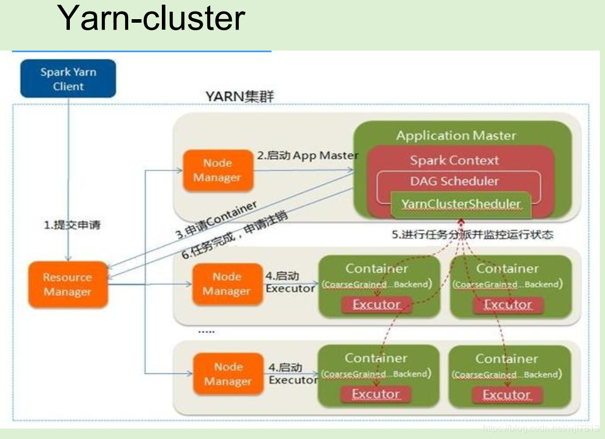
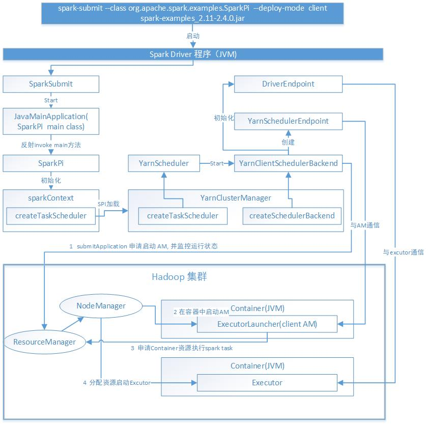

####   在yarn上运行的基本操作
* 程序提交的服务器需要包含HADOOP_CONF_DIR 或者 YARN_CONF_DIR环境变量，指向包含hadoop集群配置的文件目录
  
*	 因为程序提交时，不会指定 与 HDFS , YARN resourceMamager交互的地址和端口，是从服务器环境变量找到对于的配置文件去读取相应的配置
  
* spark on  yarn的两种运行方式：

  *	cluster 模式：客户端初始化程序后退出了，driver程序会运行在集群上的Application master中被yarn管理 
    *	日志需要登录到集群节点查看，client初始完成就结束了
    *	适用于生产环境
    *	yarn-cluster 不支持spark-shell  ， 也不支持本地启动，只能通过spark-submit
    *	
      *	基础流程：
        *	客户端程序向ResourceManager提交申请
  *	client模式：driver运行在客户端，application master只是用来从yarn申请资源
    *	适用于调试，能直接看到driver的日志，但是client断了，任务就结束了
    *	适用于交互与调试
    *	

*	日志查看方式：

  *	```
    yarn logs -applicationId <app ID>
    ```
    *	 `yarn.log-aggregation-enable`  需要开启
    *	所有application的containers产生的日志都会被打印
    
  *	也可以直接查看hdfs日志文件
  
    *	文件位置：yarn.nodemanager.remote-app-log-dir and yarn.nodemanager.remote-app-log-dir-suffix
  
  *	 Spark Web UI 也可以查看
  
    *	Spark history server 与 MapReduce history server 需要同时启动
  
  *	如果日志收集没有开启`yarn.log-aggregation-enable` =false
  
    *	日志会被保存在本地目录，配置地址YARN_APP_LOGS_DIR
    *	默认地址/tmp/logs` or `$HADOOP_HOME/logs/userlogs
  
* 启动命令

```
./bin/spark-submit --class org.apache.spark.examples.SparkPi \
    --master yarn \
    --deploy-mode cluster \
    --driver-memory 4g \
    --executor-memory 2g \
    --executor-cores 1 \
    --queue thequeue \
    examples/jars/spark-examples*.jar \
    10

 ./bin/spark-shell --master yarn --deploy-mode client
 
 
$ ./bin/spark-submit --class my.main.Class \
    --master yarn \
    --deploy-mode cluster \
    --jars my-other-jar.jar,my-other-other-jar.jar \
    my-main-jar.jar \
    app_arg1 app_arg2
```


####  sparkcontext初始化过程--on yarn

* deploy-mode为client的情况是在driver端执行目标 my.main.Class ， sparkContext的初始化也在driver端
* deploy-mode为cluster的情况，会通过yarnClient提交给ResourceManager,  启动一个Container运行AM,在AM中执行my.main.Class（driver 程序），sparkContext的初始化在Conainer中

```
1. driver端 初始化 sparkcontext, 会根据master配置适用不同的SchedulerBackend实现类, 以及taskScheduler的实现类
val (sched, ts) = SparkContext.createTaskScheduler(this, master, deployMode)

2. SparkContext##createTaskScheduler 初始化 
2.1  通过SPI加载外部ExternalClusterManager实现类 ， spark 支持kubernates,mesos，yarn集群
ServiceLoader.load(classOf[ExternalClusterManager], loader).asScala.filter(_.canCreate(url))

在spark源码resource-manamgers模块下有这三种集群的ExternalClusterManager的实现，标准的SPI扩展方式
ExternalClusterManager用来创建集群对应的scheduler 与 backend的实现类

在resource-mamagers/yarn/src/main/resources/META-INF/services/org.apache.spark.scheduler.ExternalClusterManager文件中定义了
org.apache.spark.scheduler.cluster.YarnClusterManager

2.2  YarnClusterManager负责创建yarn的scheduler 和 backend
// yarn 的 taskScheduler创建，区分cluster 与 client 模式
override def createTaskScheduler(sc: SparkContext, masterURL: String): TaskScheduler = {
    sc.deployMode match {
      case "cluster" => new YarnClusterScheduler(sc)
      case "client" => new YarnScheduler(sc)
      case _ => throw new SparkException(s"Unknown deploy mode '${sc.deployMode}' for Yarn")
    }
  }

// yarn 的schedulerBackend的创建，区分cluter 与 client
  override def createSchedulerBackend(sc: SparkContext,
      masterURL: String,
      scheduler: TaskScheduler): SchedulerBackend = {
    sc.deployMode match {
      case "cluster" =>
        new YarnClusterSchedulerBackend(scheduler.asInstanceOf[TaskSchedulerImpl], sc)
      case "client" =>
        new YarnClientSchedulerBackend(scheduler.asInstanceOf[TaskSchedulerImpl], sc)
      case  _ =>
        throw new SparkException(s"Unknown deploy mode '${sc.deployMode}' for Yarn")
    }
  }

```

#####   client模式  YarnScheduler &  YarnClientSchedulerBackend
* YarnClientSchedulerBackend 
  * 核心功能
    * sparkcontext初始化时向resourceManager提交程序，启动容器运行AM
    * 启动线程MonitorThread监控yarn app 运行状态
    * 通过YarnSchedulerEndpoint与AM通信
      * 主要接受到来自AM的事件消息
        * RegisterClusterManager -- 提交的am被成功提交到集群，返回am的通信地址
        * RequestExecutors，KillExecutors，RemoveExecutor
    * 通过DriverEndpoint与Executor通信
      * RegisterExecutor事件将executor信息记录下来，保存在executorDataMap，下次根据executorId取出信息与executor通信
      * ReviveOffers,整合可用资源，启动任务执行
*   YarnScheduler 主要还是TaskSchedulerImpl的实现逻辑
	*	借助SchedulerBackend将task发往executor执行





#####  cluster 模式  YarnClusterScheduler &  YarnClusterSchedulerBackend

* 基本同client
* 


#####  Client#submitApplication


#####  yarn ResourceManager

* 负责管理全局计算机资源分配给应用程序，资源包括：内存，cpu, 硬盘 ，网络等
* 每一个Application就是一个yarn 客户端程序，由一个或多个任务组成
* 每个运行的Application需要一段ApplicationMaster程序负责协调分配task在yarn集群上运行
  * ApplicationMaster是启动后第一个运行的程序
* 每个yarn的application 包含3部分：
  * 应用程序客户端，这是程序在群集上运行的方式。
  * ApplicationMaster 提供为application程序在yarn上申请资源的能力
  * 一个或多个在yarn container上运行的task
* 每个application在yarn集群上执行task的主要步骤：
  * appplication 启动并与ResourceManager通信
  * ResourceManager为application申请一个container容器
  * ApplicationMaster在申请的第一个container中运行
  * ApplicationMaster向ResourceManager申请运行application的task的container，并运行task
    * task在各自container运行时会上报状态给AM
  * 当所有的task运行结束时，ApplicationMaster退出。
  * application客户端退出
* RM,NM,AM一起协调工作，管理分配集群资源，确保各个程序的task可以正常运行。


##### yarn NodeManager

* 每个NodeManager负责跟踪本地资源，并且将资源配置同步给ResourceManager ,从而使群集的可用资源保持运行状态


####  参考

* https://blog.csdn.net/wjl7813/article/details/79968423
* https://www.cnblogs.com/yy3b2007com/p/10934090.html
* https://mallikarjuna_g.gitbooks.io/spark/