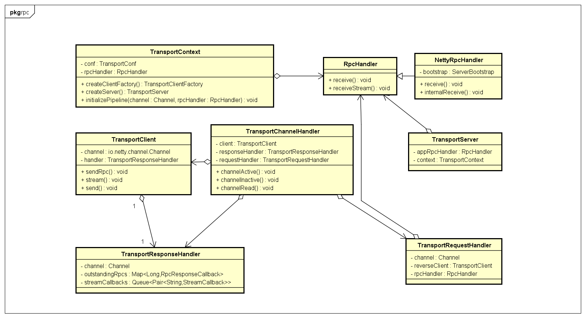
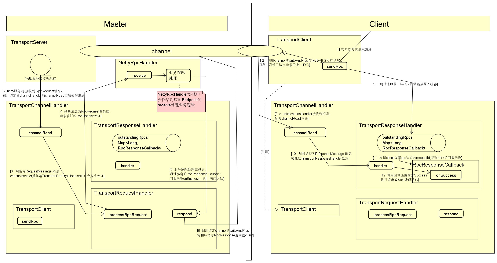
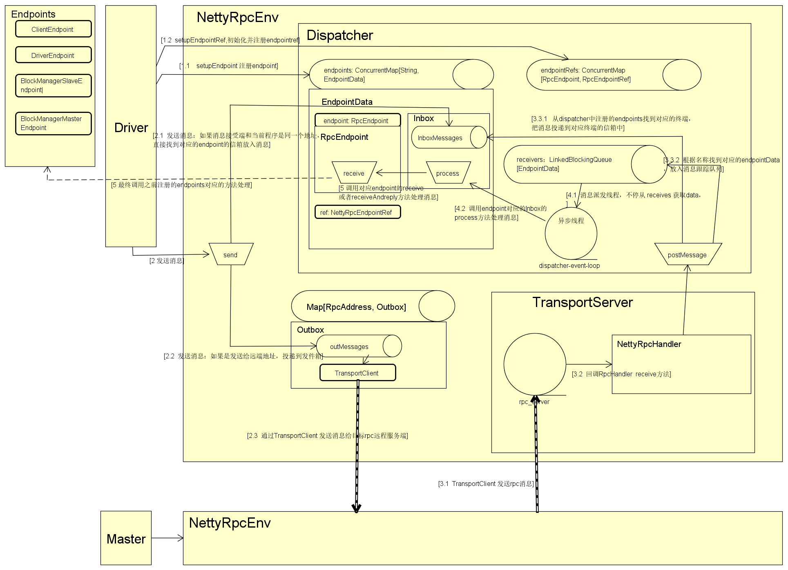

##  spark 通讯模块.md -- (v-2.4.0)
*	不同服务器上的不同角色（Driver,Master,worker)之间相互通信, 通过基于Netty的RPC通信框架实现
	*	性能好--无锁化的串行设计，零拷贝，内存池

###   概要
*  Netty 基础
*  Spark rpc 主要组件
*  应用场景

####  [Netty基础](../../../../../../language/java/base/io/nio框架/netty.md)

####  spark rpc 基础组件及功能介绍（在common模块下） 
*	org.apache.spark.network.TransportContext
	*	创建TransportServer 与 TransportClientFactory 所需要的上下文信息，通过TransportChannelHandler 设置 netty channel 管道。
*	TransportClientFactory ： 用户创建TransportClient的工厂类
	*	维护一个与其他主机的连接池，相同主机返回相同的TransportClient
	*	为所有TransportClient，提供一个共享的线程池
*	TransportClient： 发送请求到服务器，并处理服务器的响应消息，线程安全，可以多线程调用
	*	提供了两种通讯协议
		*	control-plane RPCs （面向控制）：  用于远程调用，信息交互，调用频繁，数据量小
			*	client.sendRPC(new OpenFile("/foo")) 
		*	data-plane（面向数据传输） ： 用于大数据块传输	
			*	client.fetchChunk(streamId = 100, chunkIndex = 0, callback)
	*	包含一个Channel : 与指定服务器的链路连接
*	TransportServer： 通常netty server 启动流程
	*	netty 的server  接收并处理来自客户端的请求
	*	通过传入特定的RpcHandler 实现业务逻辑处理
	*	List<TransportServerBootstrap> bootstraps： 当客户端连接时，一系列自定义客户端channel设置，如SASL权限认证等
*	TransportChannelHandler：基于netty channel的 消息处理封装
	*	消息处理的通用抽象
		*	在相互通讯的过程中，服务器启动端口监听来自客户端的消息并处理，同时会把响应结果返回给客户端，客户端连接的端口发送消息，并接收处理来自服务端的响应信息
			*	服务端 和 客户端都需要接收消息，通过RequestMessage 与 ResopnseMessage区分消息类型，本质上都是接收消息
			*	一旦客户端连接服务端后，每个TransportChannelHandler包含一个TransportClient，服务端也可以给client 发送RequestMessage
			*	所以在服务端和客户端通讯过程中，channlHandler处理是对等的，在服务端和客户端netty初始化的时候都用这个channelHandler
			*	详细参考TransportContext.initializePipeline方法，被添加到Netty的channl中作为handler
				*	在初始化TransportChannelHandler的时候，同时初始化了：
					*	 TransportResponseHandler ： 响应处理器
				    *	 TransportClient(channel, responseHandler) ： 客户端（Remote端）
				    *	 TransportRequestHandler(channel, client,rpcHandler)) ： 请求处理器，接收到消息并处理，并且附带了接收端的client，在NettyRpcHanddler中通过client获取地址信息。
	*	主要成员变量：
		*	TransportRequestHandler： 请求消息的处理器
			*	rpc相关消息处理是委托给rpcHandler处理如：NettyRpcHandler
			*	请求消息主要分类：
				*	ChunkFetchRequest ： 请求一个数据块
				*	RpcRequest ： rpc请求
				*	OneWayMessage :  单向请求
				*	StreamRequest：流数据请求
				*	UploadStream： 上传流数据请求
		*	TransportResponseHandler： 响应消息的处理器
			*	outstandingRpcs：一个key为requestId，value为RpcResponseCallback的map
				*	TransportClient发送sendRpc消息时，会生成一个requestId，以及绑定响应的回调函数
				*	当sendRpc发送成功并接收到响应消息时，会通过requestId找到对应的回调函数执行回调
			*	响应消息分类：
				*	ChunkFetchSuccess，ChunkFetchFailure：拉取数据块成功，失败
				*	RpcResponse： rpc请求响应
				*	StreamResponse： 流处理请求响应

###### 基础类图

######  概要
*	TransportContext主要用户创建TransportServer,以及TransportClient，并且维护了初始化需要的上下文信息
*	TransportChannelHandler 为 Netty channler消息处理的核心类
	*	首先，消息被分为了RequestMessage 与 ResponseMessage，第一次发送的为请求消息，响应消息一定有之前对应的一个请求消息
	*	服务端和客户端都通过这个channelHandler处理
		*	客户端通过channel发送消息，服务端接收到的就是RequestMessage，委托给TransportRequestHandler处理
			*	 TransportRequestHandler会根据消息的具体类型如RpcRequestMessage转交给TransportContext初始化绑定的RpcHandler处理如：NettyRpcHandler,完成对应消息的具体业务逻辑
		*	服务端处理业务逻辑完成后会调用注册回调函数，将处理结果通过channel返回给客户端
		*	客户端channel接收到ResponseMessage,委托给TransportResponseHanndler处理，根据请求Id，找到客户端发送对应请求的回调函数RpcResponseCallback的onsucdess方法，完成请求响应完成的业务逻辑

###### Rpc消息基础流程图

###### [模拟测试代码](https://github.com/xif10416s/spark_learn/tree/version/2.4.2)
*   spark/core/mock/communication  -- spark 通信模块
*	测试启动类NetworkClientTest，NetworkServerTest

###### TODO 数据传输相关

####  spark rpc 封装组件（core模块）
*	RpcEnv: 上层抽象的rpc环境信息，包含主要通信对象
	*	基础组件
		*	RpcEndpoint ： RPC终端对象的抽象，定义了rpc 通信终端的生命周期，以及处理接收到的消息
			*	主要方法：receive，receiveAndReply，由各种业务情况实现逻辑
			*	会有各种各样的RpcEndpoint实现
		*	RpcEndpointRef ： 一个远端RPC终端的引用，定义了一些发送消息的接口，用来给远端发送消息
			*	主要方法： send， ask
			*	NettyRpcEndpointRef实现类，主要是发送消息，基础通信实现
				*	初始化只需要url地址
			*	通过setupEndpointRef初始化并注册，或者从接受到消息中获取 //TODO
	*	setupEndpoint(name: String, endpoint: RpcEndpoint): RpcEndpointRef
		*	给定一个名称，注册该rpc终端，并返回该rpc终端的引用
			*	rpc终端（RpcEndpoint）用来处理接收到的消息，引用（RpcEndpointRef）用来给远端RPC发送消息
*	NettyRpcEnv: netty的RpcEnv实现
	*   主要成员：
		*	dispatcher: Dispatcher 负责接收消息的投递路由
		*	transportContext：TransportContext ，负责netty client ,netty server 的创建和初始化
	*	主要方法：
		*	startServer： 创建netty server 
		*	createClient:  创建 netty client
		*	setupEndpoint ： 注册终端方法
		*	发送消息方法：
			*	send ， ask
*	Inbox &  Outbox
	*	Inbox : 消息接受信箱,相当于一个接收到消息的队列，异步缓冲，提高吞吐量，及并行处理
		*	process方法为具体消息的处理
			*	Dispatcher初始化的时候专门有一个dispatcher-event-loop线程池，会多线程并发处理消息
	*   Outbox : 发送消息信箱
		*	send方法发送消息，outbox内部起了一个线程，将发送信箱的消息发送出去
*	Dispatcher ： 封装的消息路由组件，将接收到的消息传递给合适的 endpoint 处理
	*	维护了一组rpc终端以及终端的引用ref
	*	新的RpcEndpoint 终端会被注册进来
	*	主要方法：
		*	postToAll：给所有注册的终端发送消息
		*	postRemoteMessage ：发送消息给远程终端
		*	postLocalMessage ： 发送消息给本地终端
		*	postMessage ： 发送消息给指定的终端，实际上只是先将消息放入指定终端对于的Inbox接收信箱中
	*	通信方式：
		*	本地发送消息到远端
		*	本地发送消息给本地其他终端
		*	接收本地消息并处理
		*	接收远端消息并处理
*	主要消息对象
	*	InboxMessage ： 收件箱的消息，会被发送到合适的终端处理，主要在Dispatcher中使用
		*	OneWayMessage： 最终调用endpoint.receive，不需要响应消息
		*	RpcMessage ： 最终调用endpoint.receiveAndReply，消息处理后返回响应消息
	*	OutboxMessage
		*   OneWayOutboxMessage
		*	RpcOutboxMessage

######	[基础类图]
	

######	核心流程图

###### [模拟代码](https://github.com/xif10416s/spark_learn/tree/version/2.4.2)
*   test.core 测试core的模拟代码，模拟nettyRpcEnv的使用
    *   模拟driver注册到master的过程
    *   TestMaster: 模拟Master启动NettyServer,实现了ThreadSafeRpcEndpoint的receive接口，处理driver发送的注册消息
    *   TestDriver：模拟Driver端，通过ClientEndpointMock给master发送注册消息，并接收master发送的注册成功信息
    *   driver 发送的注册消息 和 master发送的注册完成消息都时单向的消息。

####  RpcEnv的初始化
*	需要用到 RpcEnv通信的主体对象为：
	*	Master对象(org.apache.spark.deploy.master.Master)，包含一个rpcEnv对象，Master节点的入口类
	*	Worker对象（org.apache.spark.deploy.worker.Worker),包含一个rpcEnv对象，Worker节点的入口类
	*	Driver程序需要初始化SparkContext，其中包含了rpcEnv
*	RpcEndpoint 与 RpcEndpointRef 初始化
*	TransportChannelHandler的初始化
	*	TransportResponseHandler，TransportClient，TransportRequestHandler一起初始化
*	TransportClient的初始化
	*	TransportClientFactory.createClient方法创建client,基本流程就是Netty client的初始化类似
	*	在初始化channl的时候会调用TransportContext的initializePipeline方法，初始化TransportChannelHandler
	*	会直接连接一次服务器，bootstrap.connect(address)，把TransportClient , channel获取到，
	*	返回client之前执行一组TransportClientBootstrap，预处理client，如：SASL authentication tokens
*	TransportServer的初始化
	*	netty server初始化类似，channelHandler也使用了通过TransportContext的initializePipeline方法,初始化的TransportChannelHandler

####  应用案例
#####  driver 初始化与 Master 节点通信，注册到master
*	Driver 启动是需要初始化SparkContext，其中rpcEnv，[SchedulerBackend](https://github.com/xif10416s/workNote/blob/master/learn/framework/bigdata/spark/%E6%BA%90%E7%A0%81/%E5%9F%BA%E7%A1%80/1-SparkContext-%E5%88%9D%E5%A7%8B%E5%8C%96.md)也会初始化
	*	以StandaloneSchedulerBackend为例，启动时会初始化StandaloneAppClient对象rpcEnv被传入该对象，负责与spark  standalone 集群通信
	*	StandaloneAppClient 主要组件
		*	ClientEndpoint 以 AppClient名字被注册到 rpcEnv
		*	ClientEndpoint：
			*	tryRegisterAllMasters：封装了向master 发送RegisterApplication 注册消息
				*	通过rpcEnv.setupEndpointRef(masterAddress, Master.ENDPOINT_NAME) 初始化master endpointRef 并注册到Dispatcher
					*	SparkContext中配置的masterUrl就可以初始化RpcEndpointRef
			*	receive：接收master的响应消息处理，不需要再响应
				*	RegisteredApplication ： 注册成功返回消息--来自master
				*	ApplicationRemoved： master 删除当前driver
				*	ExecutorAdded ， ExecutorUpdated ： executoer信息相关
				*	WorkerRemoved： worker移除消息
			*	receiveAndReply：master响应消息交互
				*	StopAppClient ： master 停止app， 并返回master UnregisterApplication取消注册 -- 来自driver
				*	RequestExecutors ： 向master请求executor -- 来自driver
	*	基础流程
		*	driver一系列初始化，StandaloneAppClient初始化的时候将ClientEndpoint注册到RPCEnv,可以开始处理投递到AppClient这个终端的消息
		*	ClientEndpoint 初始化的时候通过SparkContext配置的masterurl初始化master endpointRef并注册到RpcEnv
		*	通过masterRef 给master发送 RegisterApplication 消息，将driver注册到master 
			*	发送的消息中附带了ClientEndpoint的引用endpointRef返回给driver
		*	master本身实现了RpcEndpoint接口，RegisterApplication消息会被接收并处理，将结果消息RegisteredApplication返回给driver
			*	master从接收到的RegisterApplication中可以获取ClientEndpoint的ref,通过这个引用返回消息给ClientEndpoint
			*	同时clientendpoint被master记录，可以发送一些集群变化消息给driver,如worker添加，删除，executor添加更新等

### 参考：
