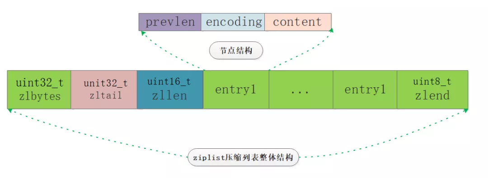
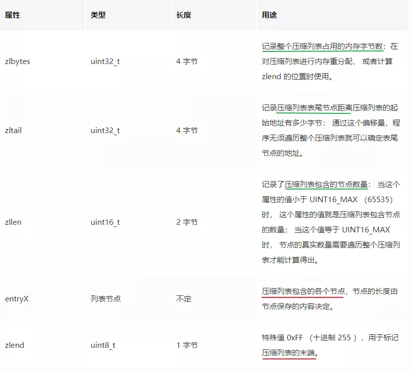
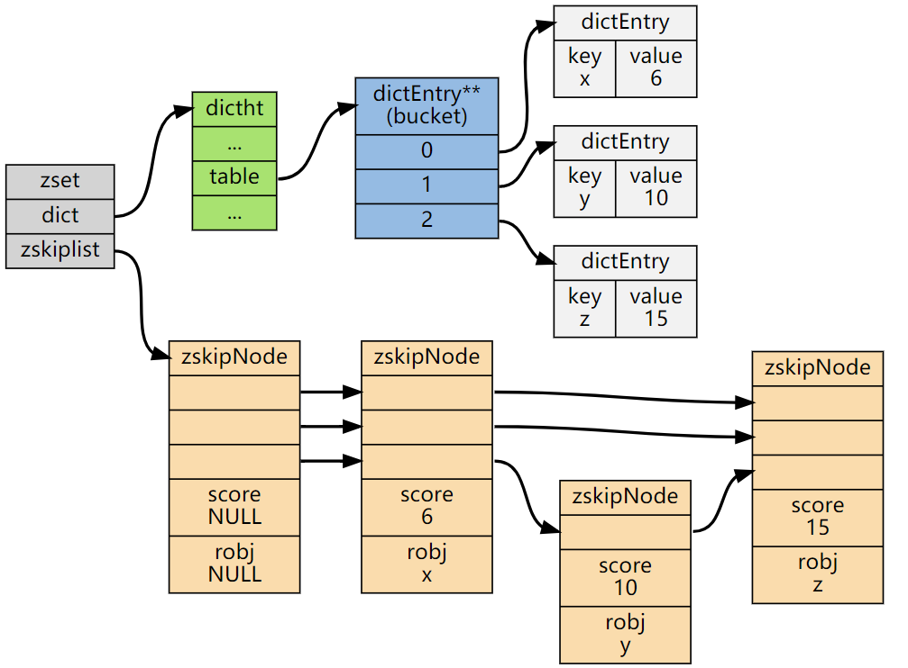
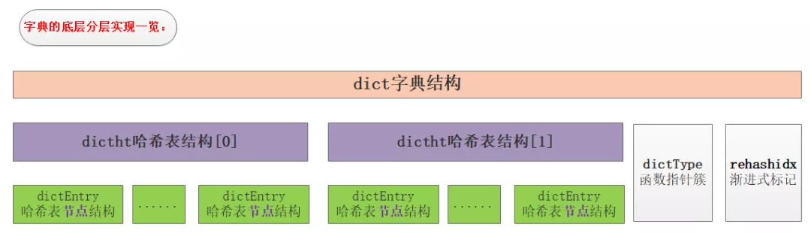
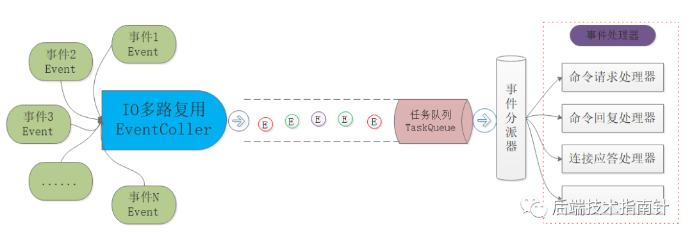
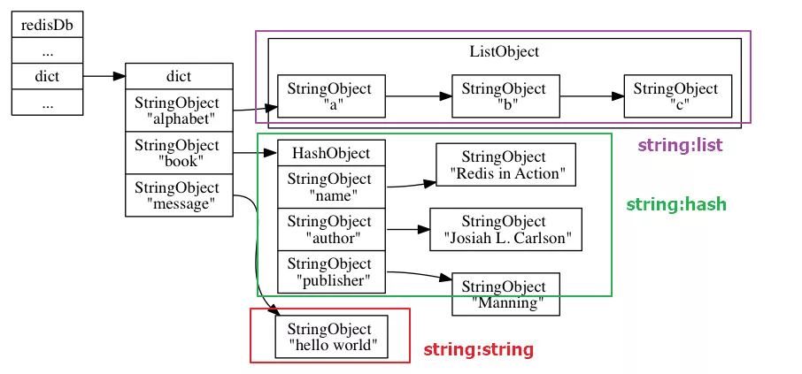
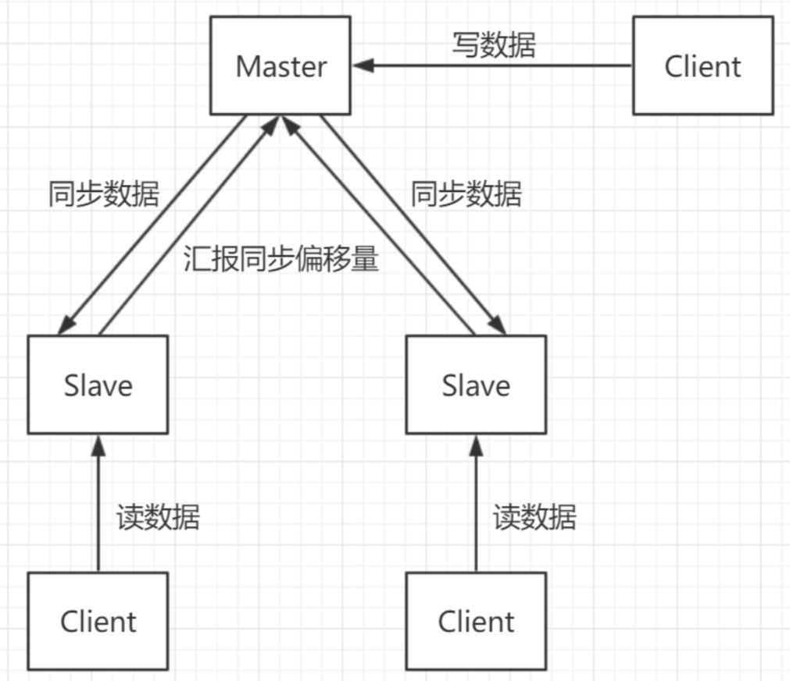

####  redis 和 memcached 有啥区别？
*	redis 支持复杂的数据结构
	*	redis 相比 memcached 来说，拥有更多的数据结构，能支持更丰富的数据操作。如果需要缓存能够支持更复杂的结构和操作， redis 会是不错的选择。
*	redis 原生支持集群模式
	*	memcached 没有原生的集群模式，需要依靠客户端来实现往集群中分片写入数据。
*	性能对比
	*	 redis 只使用单核，而 memcached 可以使用多核，所以平均每一个核上 redis 在存储小数据时比 memcached 性能更高。而在 100k 以上的数据中，memcached 性能要高于 redis，虽然 redis 最近也在存储大数据的性能上进行优化，但是比起 memcached，还是稍有逊色。
*	redis 的线程模型
  *	redis 内部使用文件事件处理器 file event handler，这个文件事件处理器是单线程的。它采用 IO 多路复用机制同时监听多个 socket，根据 socket 上的事件来选择对应的事件处理器进行处理。
    *	单线程是与客户端交互完成命令请求和回复的工作现场
    *	还有一些辅助工作，bgsave持久化刷新，惰性删除任务等会启动其他线程

#### redis 持久化机制
*	Redis的一种持久化方式叫快照（snapshotting，RDB）
	*	Redis可以通过创建快照来获得存储在内存里面的数据在某个时间点上的副本
	*	快照持久化是Redis默认采用的持久化方式，在redis.conf配置文件中有配置
	*	特点： 
		*	全量内存二进制序列化备份，恢复速度快
		*	fork一个子进程，对主进程不影响，内存加倍
		  *	当数据量较大的情况下，fork子进程这个操作很消耗cpu，可能会发生长达秒级别的阻塞情况。
		*	备份时间长，性能差，间隔不能太短，丢失数据多
*	另一种方式是只追加文件（append-only file,AOF）
	*	与快照持久化相比，AOF持久化 的实时性更好，因此已成为主流的持久化方案
	*	特点：
		*	保存的是操作明细，恢复需要重放，恢复时间慢
		*	可以配置秒级别刷新，丢失数据少
*	混合方式：
	*	按小时级别保存快照，按秒级别aof
	*	重启时按最近快照加载aof，然后更新增量aof

###### **持久化实战**

* 在实际使用中需要根据Redis作为主存还是缓存、数据完整性和缺失性的要求、CPU和内存情况等诸多因素来确定适合自己的持久化方案，一般来说稳妥的做法包括：
  * 最安全的做法是RDB与AOF同时使用，即使AOF损坏无法修复，还可以用RDB来恢复数据，当然在持久化时对性能也会有影响。
  * Redis当简单缓存，没有缓存也不会造成缓存雪崩只使用RDB即可。
  * 不推荐单独使用AOF，因为AOF对于数据的恢复载入比RDB慢，所以使用AOF的时候，最好还是有RDB作为备份。
  * 采用新版本Redis 4.0的持久化新方案。


#### fork copy-on-write
*	创建一个一模一样的进程，内存也复制
*	fork（）会产生一个和父进程完全相同的子进程，但子进程在此后多会exec系统调用，出于效率考虑，linux中引入了“写时复制“技术，也就是只有进程空间的各段的内容要发生变化时，才会将父进程的内容复制一份给子进程。
	*	 在fork之后exec之前两个进程用的是相同的物理空间（内存区），子进程的代码段、数据段、堆栈都是指向父进程的物理空间，也就是说，两者的虚拟空间不同，但其对应的物理空间是同一个
	*	写时复制技术：内核只为新生成的子进程创建虚拟空间结构，它们来复制于父进程的虚拟究竟结构，但是不为这些段分配物理内存，它们共享父进程的物理空间，当父子进程中有更改相应段的行为发生时，再为子进程相应的段分配物理空间。
*	资源的复制只有在需要写入的时候才进行，在此之前，只是以只读方式共享

#### redis使用场景
*	String 
	*	字符串 -- session，对象，小文件
	*	int -- 秒杀，限流，技术
	*	bitmap --web，离线分析
		*	统计：任意时间窗口内用户登录的次数
		*	统计活跃用户，活动 
		*	权限控制
		*	bloom 过滤器
	*	底层编码
	  *	int编码 -- 保存可以用long表示的整数
	  *	raw编码--保存长度大于44字节的字符串 -- 长字符串
	  *	emStr编码--保存长度小于44字节的字符串 -- 短字符串
	*	Redis中对于浮点型也是作为字符串保存的，在需要时再将其转换成浮点数类型
	*	编码的转换
	  *	当 int 编码保存的值不再是整数，或大小超过了long的范围时，自动转化为raw
	  *	对于 embstr 编码，由于 Redis 没有对其编写任何的修改程序（embstr 是只读的），在对embstr对象进行修改时，都会先转化为raw再进行修改，因此，只要是修改embstr对象，修改后的对象一定是raw的，无论是否达到了44个字节。
*	list --放入顺序，栈（同向） ，队列（异向），数组
	
	*	分布式 -- 数据共享，迁出状态，消息队列，利用LRANGE命令，实现基于Redis的分页功能
	*	实现数据即可狗
	  *	Stack（栈）
	    *	LPUSH+LPOP
	  *	Queue（队列）
	    - LPUSH + RPOP
	  *	Blocking MQ（阻塞队列）
	    - LPUSH+BRPOP
	*	编码
	  *	列表对象的编码可以是ziplist（压缩列表）和linkedlist（双端链表）。
	  *	编码转换
	    *	同时满足下面两个条件时使用压缩列表ziplist(长度和每个元素大小都不大的情况)：
	      *	列表保存元素个数小于512个
	      *	每个元素长度小于64字节
	    *	不能满足上面两个条件使用linkedlist（双端列表）编码
*	hashmap 
	
	*	商品详情页--固定内容，聚合场景
*	set -- 集合，去重，无序  ，成本高
	*	SRANDMEMBER  随机抽取几个元素，--抽奖
	*	推荐系统
	*	去重，
*	zset -- 有序集合
	* object encoding key :ziplist ,skiplist
	
	* 排行榜,评论+分页
	
	* 编码
	
	  * 有序集合的编码可以使ziplist或者skiplist
	
	    * ziplist  -- 数量和每个元素都不大
	
	      *	保存的元素数量小于128
	      *	保存的所有元素长度都小于64字节
	
	    *	skiplist编码的依序集合对象使用zset结构作为底层实现，一个zset结构同时包含一个字典和一个跳跃表
	
	      *	```
	        typedef struct zset{
	         //跳跃表
	        zskiplist *zsl;
	        //字典
	        dict *dice;
	        }zset
	        字典的键保存元素的值，字典的值保存元素的分值，跳跃表节点的object属性保存元素的成员，跳跃表节点的score属性保存元素的分值。这两种数据结构会通过指针来共享相同元素的成员和分值，所以不会产生重复成员和分值，造成内存的浪费。
	        ```

#### redis分布式集群

*	高可用 -- 主从备份，切换
*	压力 -- 分片集群
*	[一致性hash算法  （Canssandra也是)](../../../algorithm/一致性hash算法.md)

#### AKF -- 根据业务划分数据到不同的redis
*	x：冗余备份，高可用
*	y: 业务治理分库
*	z: 单业务分片

#### redis内存管理--过期机制
*	主动--定期删除
	*	默认10s检查一次，删除过期数据
	*	频率设置： config get hz
*	被动--惰性删除
	*	当客户端请求时，处理
*	如果redis内存占满（没有设置ttl)

#### Redis数据类型、编码、数据结构的关系

* Redis内部使用一个redisObject对象来表示所有的key和value，每次在Redis数据块中创建一个键值对时，一个是键对象，一个是值对象，而Redis中的每个对象都是由redisObject结构来表示。

  ```
  redisobject源码
  typedef struct redisObject{
       //类型:string, list , set ,zet..
       unsigned type:4;
       //编码
       unsigned encoding:4;
       //指向底层数据结构的指针
       void *ptr;
       //引用计数
       int refcount;
       //记录最后一次被程序访问的时间
       unsigned lru:22;
  }robj
  
  ```

* encoding类型

* | 编码常量（Encoding）      | 对应的底层数据结构        | redis类型              |
  | :------------------------ | ------------------------- | ---------------------- |
  | REDIS_ENCODING_INT        | long类型的整数            | String                 |
  | REDIS_ENCODING_EMBSTR     | emStr编码的简单动态字符串 | String                 |
  | REDIS_ENCODING_RAW        | 简单动态字符串SDS         | String                 |
  | REDIS_ENCODING_HT         | 字典，hashtable           | SET,HASH               |
  | REDIS_ENCODING_LINKEDLIST | 双向链表                  | List                   |
  | REDIS_ENCODING_ZIPLIST    | 压缩列表                  | List,HASH(数量小),ZSET |
  | REDIS_ENCODING_INTSET     | 整数集合                  | SET                    |
  | REDIS_ENCODING_SKIPLIST   | 跳表和字典                | ZSET                   |
  |                           |                           |                        |


#####  简单动态字符串SDS 优势、

* sds本质分为三部分：**header、buf、null结尾符**，其中header可以认为是整个sds的指引部分，给定了使用的空间大小、最大分配大小等信息
  * 

* **O(1)获取长度**: C字符串需要遍历而sds中有len可以直接获得；
* **防止缓冲区溢出bufferoverflow**: 当sds需要对字符串进行修改时，首先借助于len和alloc检查空间是否满足修改所需的要求，如果空间不够的话，SDS会自动扩展空间，避免了像C字符串操作中的覆盖情况；
* **有效降低内存分配次数**：C字符串在涉及增加或者清除操作时会改变底层数组的大小造成重新分配、sds使用了**空间预分配和惰性空间释放机制**，说白了就是每次在扩展时是成倍的多分配的，在缩容是也是先留着并不正式归还给OS，这两个机制也是比较好理解的；
* **二进制安全**：C语言字符串只能保存ascii码，对于图片、音频等信息无法保存，sds是二进制安全的，写入什么读取就是什么，不做任何过滤和限制；


##### Redis的ZIPLIST的底层设计和实现 -- TODO

* **连续内存的双面性**
  * 连续型内存减少了内存碎片，但是一大块都是连续的内存又不容易满足。

*   **压缩列表承载元素的多样性**
  * 压缩列表对元素的类型没有约束，也就是说不知道是什么数据类型和长度，这个有点像TCP粘包拆包的做法了，需要我们指定结尾符或者指定单个存储的元素的长度，要不然数据都粘在一起了。
* **属性的常数级耗时获取**
  * 我们解决了前面两点考虑，但是作为一个整体，压缩列表需要常数级消耗提供一些总体信息，比如总长度、已存储元素数量、尾节点位置(实现尾部的快速插入和删除)等，这样对于操作压缩列表意义很大。
* **数据结构对增删的支持**

###### ziplist总体结构

* 
* 


##### Redis的Zset和跳跃链表问题 -- TODO

* ZSet结构同时包含一个字典和一个跳跃表，跳跃表按score从小到大保存所有集合元素。字典保存着从member到score的映射。两种结构通过指针共享相同元素的member和score，不浪费额外内存。
* 


##### Redis的字典是如何实现的？简述渐进式rehash过程 -- 基于hashtable实现字典

* 字典结构

  * 

* ```
  //哈希节点结构 -- 类似 hashmap 中的entry ,存放数据用，
  typedef struct dictEntry {
      void *key;
      union {
          void *val;
          uint64_t u64;
          int64_t s64;
          double d;
      } v;
      struct dictEntry *next;  -- 哈希冲突的时候存放的链表结构
  } dictEntry;
  
  //封装的是字典的操作函数指针
  typedef struct dictType {
      uint64_t (*hashFunction)(const void *key);
      void *(*keyDup)(void *privdata, const void *key);
      void *(*valDup)(void *privdata, const void *obj);
      int (*keyCompare)(void *privdata, const void *key1, const void *key2);
      void (*keyDestructor)(void *privdata, void *key);
      void (*valDestructor)(void *privdata, void *obj);
  } dictType;
  
  /* This is our hash table structure. Every dictionary has two of this as we
   * implement incremental rehashing, for the old to the new table. */
  //哈希表结构 该部分是理解字典的关键
  typedef struct dictht {
      dictEntry **table;  -- 数组，每个元素都是一个指向dictEntry的结构的指针，每个dictEntry结构保存一个键值对
      unsigned long size; -- 记录了table大小
      unsigned long sizemask;  -- size -1  和 哈希值算一个建在table数组的索引时使用
      unsigned long used; -- 
  } dictht;
  
  //字典结构
  typedef struct dict {
      dictType *type;
      void *privdata;
      dictht ht[2];
      long rehashidx; /* rehashing not in progress if rehashidx == -1 */
      unsigned long iterators; /* number of iterators currently running */
  } dict;
  ```

* 字典的hash算法-- MurmurHash算法计算哈希值

  * MurmurHash算法的无论数据输入情况如何都可以给出随机分布性较好的哈希值并且计算速度非常快，目前有MurmurHash2和MurmurHash3等版本。

* **普通Rehash重新散列**

  * 扩缩容是通过执行rehash重新散列来完成，对字典的哈希表执行普通rehash的基本步骤为**分配空间->逐个迁移->交换哈希表**
  * ht[1] 作为扩容table, 容量为 ht[0]实际使用table的2倍数量的第一个2^n，因为容量都是2^n的
  * 将ht[0]数据迁移到h[1],释放h[0],将h[1]设置我h[0],给h[1]创建空白表，为下一次rehash准备

* **渐进Rehash过程**

  * Redis的rehash动作并不是一次性完成的，而是分多次、渐进式地完成的，原因在于当哈希表里保存的键值对数量很大时， 一次性将这些键值对全部rehash到ht[1]可能会导致服务器在一段时间内停止服务，这个是无法接受的。
  * 主要原理：
    * 将迁移的动作分散到每次对字典执行增删改查的操作上，避免同一时间压力
      * 对字典操作的同时，会将ht[0]在rehashidx索引上的所有键值对rehash到h[1],完成之后对rehashidx 加一
  * 渐进式避免了redis在rehash时的阻塞，但是：
    * rehash期间有两个hash表同时在使用，redis内存会增加
    * 所有操作都会从两个表里执行，先从ht[0],如果没有，再从ht[1]


#####  Redis反应堆模式reactor -- io复用 + 事件驱动

* 反应堆模式主要用于同步IO,异步IO有proactor模式
*  Redis中支持多种IO复用，源码中使用相应的宏定义进行选择，编译时就可以获取当前系统支持的最优的IO复用函数来使用，从而实现了Redis的优秀的可移植特性。
* 
* redis 主工作线程是单线程的，通过一个线程实现IO多路复用，逐一放入队列
* redis事件分派器，包含事件类型：
  * AE_READABLE 客户端写数据、关闭连接、新连接到达
  * AE_WRITEABLE 客户端读数据
* redis事件处理器：
  * 连接应答处理器：实现新连接的建立
  * 命令请求处理器：处理客户端的新命令
  * 命令回复处理器：返回客户端的请求结果
  * 复制处理器：实现主从服务器的数据复制


#### 内存回收和内存共享

* Redis占用的内存是分为两部分：存储键值对消耗和本身运行消耗
  * 键值对可以分为几种：带过期的、不带过期的、热点数据、冷数据。

  * 内存回收 ---  **因为c语言不具备自动内存回收功能，当将redisObject对象作为数据库的键或值而不是作为参数存储时其生命周期是非常长的，为了解决这个问题，Redis自己构建了一个内存回收机制，通过redisobject结构中的refcount实现.这个属性会随着对象的使用状态而不断变化。**
    * 创建一个新对象，属性初始化为1
    * 对象被一个新程序使用，属性refcount加1
    * 对象不再被一个程序使用，属性refcount减1
    * 当对象的引用计数值变为0时，对象所占用的内存就会被释放
  * 内存共享 **refcount属性除了能实现内存回收以外，还能实现内存共享**
    * 将数据块的键的值指针指向一个现有值的对象
    * 将被共享的值对象引用refcount加1 Redis的共享对象目前只支持整数值的字符串对象。之所以如此，实际上是对内存和CPU（时间）的平衡：共享对象虽然会降低内存消耗，但是判断两个对象是否相等却需要消耗额外的时间。对于整数值，判断操作复杂度为o(1),对于普通字符串，判断复杂度为o(n);而对于哈希，列表，集合和有序集合，判断的复杂度为o(n^2).虽然共享的对象只能是整数值的字符串对象，但是5种类型都可能使用共享对象。

######  **键值对的存储**

* Redis本质上就是一个大的key-value，key就是字符串，value有是几种对象：字符串、列表、有序列表、集合、哈希等，这些key-value都是存储在redisDb的dict中的，来看下**黄健宏**画的一张非常赞的图：

* ```
  
  typedef struct redisDb {
      dict *dict;                 /* The keyspace for this DB */
      dict *expires;              /* Timeout of keys with a timeout set */
      dict *blocking_keys;        /* Keys with clients waiting for data (BLPOP)*/
      dict *ready_keys;           /* Blocked keys that received a PUSH */
      dict *watched_keys;         /* WATCHED keys for MULTI/EXEC CAS */
      int id;                     /* Database ID */
      long long avg_ttl;          /* Average TTL, just for stats */
      unsigned long expires_cursor; /* Cursor of the active expire cycle. */
      list *defrag_later;         /* List of key names to attempt to defrag one by one, gradually. */
  } redisDb;
  ```

* 


####  redis 集群

* 单实例一主两从+读写分离结构:
  * 
* 集群与分片
  * 要支持集群首先要克服的就是分片问题，也就是一致性哈希问题，常见的方案有三种：
    * **客户端分片**：这种情况主要是类似于哈希取模的做法，当客户端对服务端的数量完全掌握和控制时，可以简单使用。
    * **中间层分片**：这种情况是在客户端和服务器端之间增加中间层，充当管理者和调度者，客户端的请求打向中间层，由中间层实现请求的转发和回收，当然中间层最重要的作用是对多台服务器的动态管理。
    * **服务端分片**：不使用中间层实现去中心化的管理模式，客户端直接向服务器中任意结点请求，如果被请求的Node没有所需数据，则像客户端回复MOVED，并告诉客户端所需数据的存储位置，这个过程实际上是客户端和服务端共同配合，进行请求重定向来完成的。
  * **中间层分片的集群版Redis**
    * 核心思想都是在多个Redis服务器和客户端Client中间增加分片层，由分片层来完成数据的一致性哈希和分片问题，每一家的做法有一定的区别，但是要解决的核心问题都是多台Redis场景下的扩缩容、故障转移、数据完整性、数据一致性、请求处理延时等问题。
      * 国内豌豆荚的Codis、国外Twiter的twemproxy
  * **服务端分片的官方集群版本**
    * Gossip协议：解决集群中多结点状态通知的问题，充当了中间层的管理部分的通信协议
      * 去中心化和通信机制


#### redis 客户端

| 名称     | 特点                                                         | 优缺点                                                       | 适用场景                                           |
| -------- | ------------------------------------------------------------ | ------------------------------------------------------------ | -------------------------------------------------- |
| jedis    | API提供了比较全面的Redis命令的支持,Java方法基本和Redis的API保持着一致 | 比较全面的Redis命令的支持<br />不支持异步操作。Jedis客户端实例不是线程安全的，需要通过连接池来使用Jedis。 | springboot 1.5.x版本的默认的Redis客户端            |
| Redisson | 实现了分布式和可扩展的Java数据结构，提供很多分布式相关操作服务，例如，分布式锁，分布式集合，可通过Redis支持延迟队列 | 功能较为简单，不支持字符串操作，不支持排序、事务、管道、分区等Redis特性 |                                                    |
| Lettuce  | 基于Netty框架的事件驱动的通信层，其方法调用是异步的。Lettuce的API是线程安全的，所以可以操作单个Lettuce连接来完成各种操作。 | 用于线程安全同步，异步和响应使用，支持集群，Sentinel，管道和编码器 | springboot 2.x版本中默认客户端是用 lettuce实现的。 |
|          |                                                              |                                                              |                                                    |


####  redis sprintboot集成

#####  redisson
* 参考：
  * https://github.com/redisson/redisson/blob/master/redisson-spring-boot-starter/README.md
  * https://www.ithere.net/article/174
* 客户端
  * RedissonClient
  * RedisTemplate
  * ReactiveRedisTemplate
  


#### Lettuce --TODO


#### 测试代码地址  
*	https://github.com/xif10416s/java_test
   

  

##### 参考：

*	https://gitee.com/SnailClimb/JavaGuide/blob/master/docs/database/Redis/Redis.md
*	https://www.icodingedu.com/course/41
*	https://www.runoob.com/redis/redis-conf.html
*	https://gitee.com/SnailClimb/JavaGuide/blob/master/docs/database/Redis/redis-collection/Redis(10)%E2%80%94%E2%80%94Redis%E6%95%B0%E6%8D%AE%E7%B1%BB%E5%9E%8B%E3%80%81%E7%BC%96%E7%A0%81%E3%80%81%E6%95%B0%E6%8D%AE%E7%BB%93%E6%9E%84%E7%9A%84%E5%85%B3%E7%B3%BB.md
*	https://cloud.tencent.com/developer/article/1500854
*	Jedis api 在线网址：http://tool.oschina.net/uploads/apidocs/redis/clients/jedis/Jedis.html
*	redisson 官网地址：https://redisson.org/
*	redisson git项目地址：https://github.com/redisson/redisson
*	lettuce 官网地址：https://lettuce.io/
*	lettuce git项目地址：https://github.com/lettuce-io/lettuce-core
*	https://www.cnblogs.com/yangzhilong/p/7605807.html
*	https://github.com/redisson/redisson/wiki/目录
*	https://github.com/redisson/redisson/wiki/%E7%9B%AE%E5%BD%95
*	https://mp.weixin.qq.com/s?__biz=MzA5MTc0NTMwNQ==&mid=2650719859&idx=1&sn=b55cd8838329737c3056681a4ed1e430&chksm=887ddb05bf0a52138f027cf0b20a8b3a80c6f256baaf290b121f6ac74396169355ae9e083bbd&scene=126&sessionid=1588727501&key=99ef7414318fbe187906b9d55955ae67700442af3a87c5d6ae82c4d182176b0f85cd13de5d5439fceab6b2ba4bc6b91782b12b149cd872059c18184f02e017fbd2b1621f9606ff8878ecf4c18e0e49c2&ascene=1&uin=Mjk1NTAwNzcwMg%3D%3D&devicetype=Windows+10&version=62080079&lang=zh_CN&exportkey=AfrwBXccwRBcndnocCkYjcE%3D&pass_ticket=LPSbkDJNYtM03WvFhUCwCDhlPxk2J8JL7vu0h%2FKRQNaVG30YE5Z7z3K%2FQ4ckpqvB

