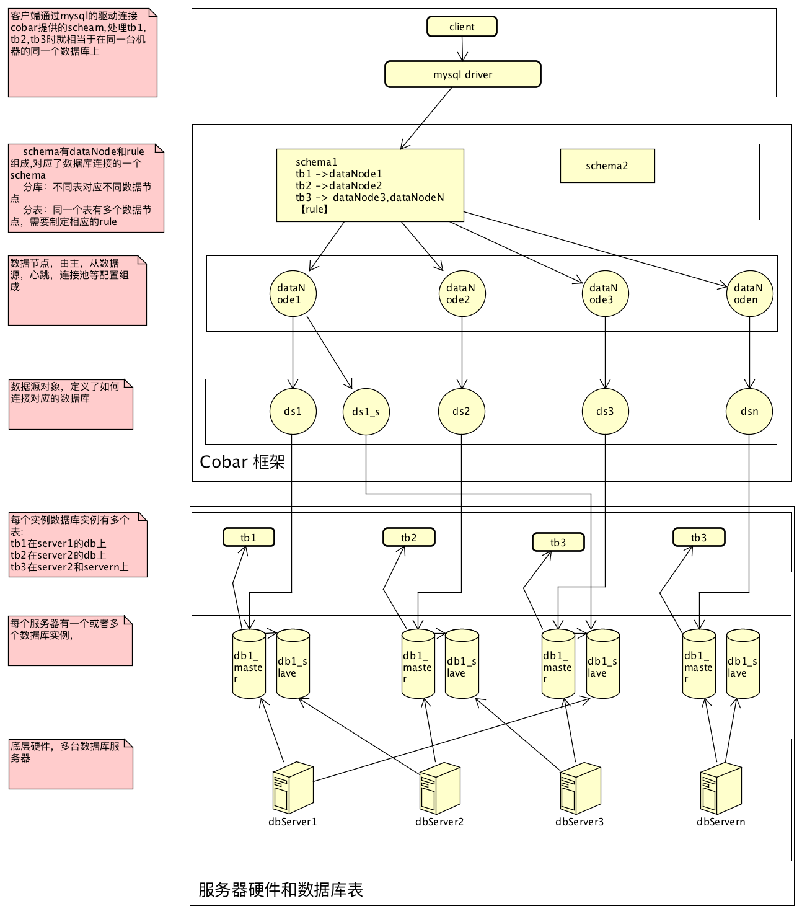
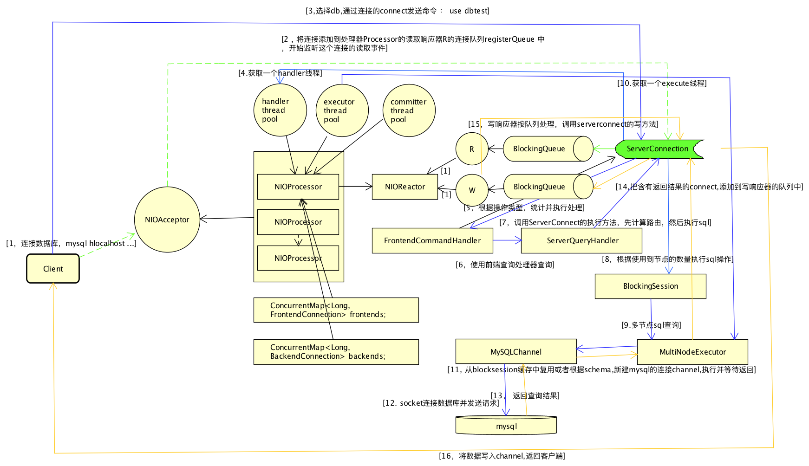
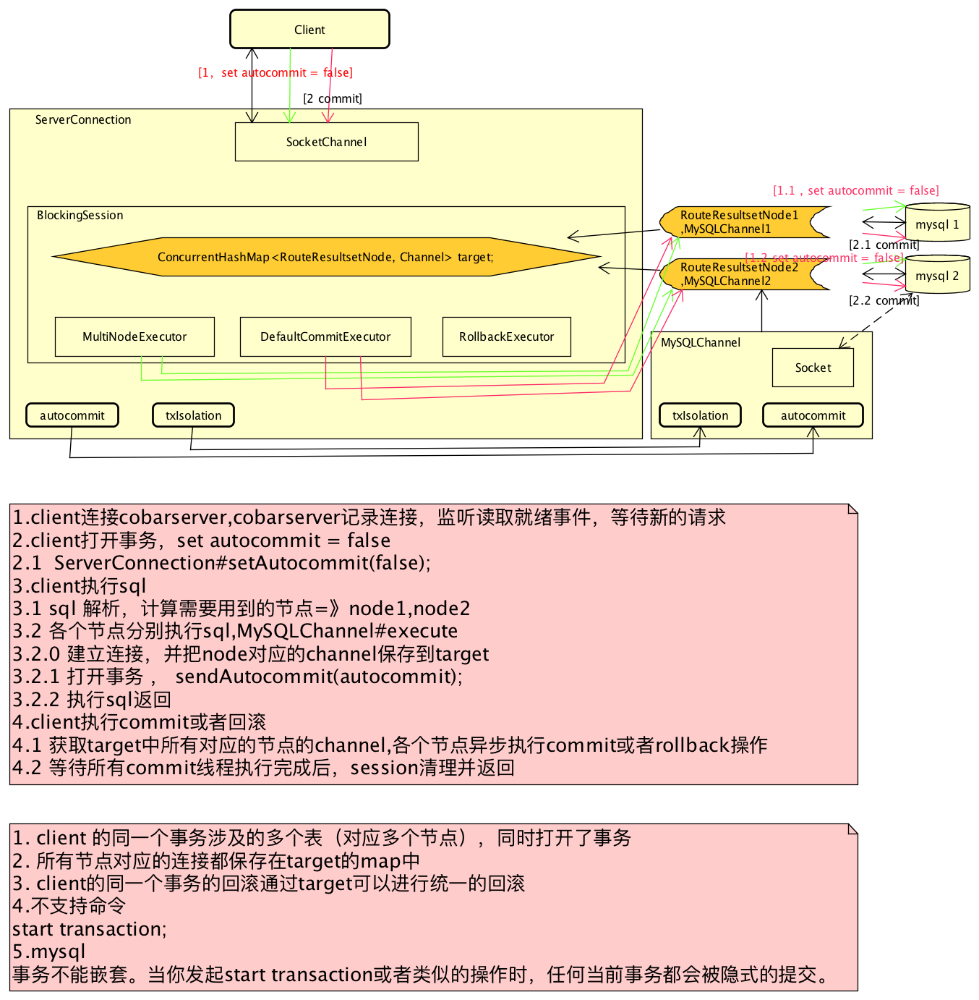
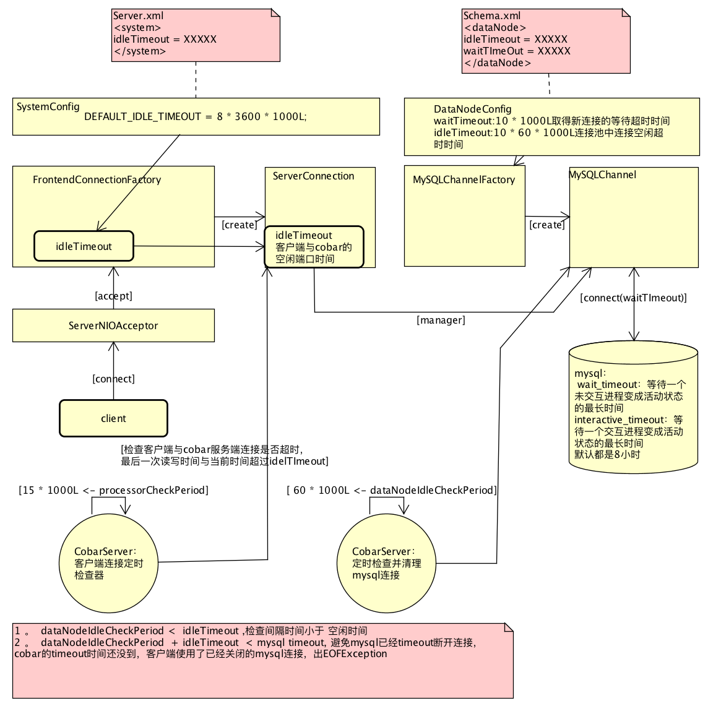

#Cobar 学习--Cobar是提供分布式数据库服务的中间件
*   Client -> Cobar -> mysql

##基本功能结构内容


##优点
*   数据和访问从集中式改变为分布式
*   提供数据节点的failover。
*   解决连接数过大的问题。
*   对业务代码侵入性少。
*   MySQL采用异步的复制机制,因此多份replica间 的读写分离会造成一定程度的数据不一致,因此 没有被Cobar采用。

##源码
###Cobar启动流程 ==>CobarServer#startup()
*   1 . 初始化主要组件
    -   1.1  初始化配置信息CobarConfig
    -   1.2  initExecutor，线程池，
    -   1.3  timerExecutor，线程池，
    -   1.4  managerExecutor，线程池，
    -   1.5  SQLRecorder，SQL统计排序记录器
*   2 . 启动服务
    -   2.1  初始化并启动处理器NIOProcessor </br>
        `processors = new NIOProcessor[system.getProcessors()];` </br>
        `for (int i = 0; i < processors.length; i++) {` </br>
        `    processors[i] = new NIOProcessor("Processor" + i, handler,  executor, committer);` </br>
        `   processors[i].startup();` </br>
        `} ` </br>
    -   2.2 定时检查前端、后端连接，删除空连接，清理已经关闭的连接
    -   2.3 初始化connector：NIOConnector
        +   后端线程建立连接 `channel.connect(new InetSocketAddress(host, port))`
        +   后端线程连接完成后，通知process,添加BackendConnection
            *   ` reactorR.registerQueue.offer(c);`
            *   `reactorR.selector.wakeup();`
    -   2.4 初始化dataNodes
        -   初始化数据源连接池，`initSource(MySQLDataSource ds, int size)`
        -   数据节点定时连接空闲超时检查任务`dataNodeIdleCheck`   
        -   数据节点定时心跳任务,与mysql进行心跳，执行设置的心跳sql语句 </br>
            `MySQLDetector detector#heartbeat`
    -   2.5 初始化管理连接工厂，提供后台管理管理连接，`ManagerConnectionFactory mf = new ManagerConnectionFactory();`
        +   初始化连接，new ManagerConnection(channel);
        +   连接使用管理处理器，c.setQueryHandler(new ManagerQueryHandler(c));
    -   2.6 启动一个线程：NIOAcceptor， 管理器服务启动,提供后台管理操作
    -   2.7 初始化sql服务连接工厂，提供sql服务连接
    -   2.8 启动一个线程：NIOAcceptor，启动sql服务，提供sql操作


###实例
####client连接8066，发送查询语句"select * from tb1"
*   1 cmd 连接数据库，`mysql -h127.0.0.1 -utest -p -P8066` 
    -   server监听线程监听连接事件，NIOAcceptor#accept
    *   从ServerSocketChannel获取SocketChannel,`channel = serverChannel.accept();`
    *   socketChannel转换为ServerConnection，FrontendConnection c = factory.make(channel);
    *   获取一个处理器，`NIOProcessor processor = nextProcessor();`
    *   绑定处理器到服务端连接ServerConnection,`c.setProcessor(processor);`
    *   将连接添加读事件响应器的注册队列，有了与客户的连接，reactorR，监听并交给handler处理`reactorR.registerQueue.offer(c);`
*   2  cmd 选择schema,`use dbtest`
    -   reactorR监听到读取事件调用，` ServerConnection#read()`
        +   读取数据
        +   调用handler，从processor的handler线程池中获取一个线程，异步处理数据
        +   前端命令处理器处理数据，FrontendCommandHandler#handle(byte[] data)
            *   匹配操作类型，` case MySQLPacket.COM_QUERY:`
            *   调用ServerConnection#query(byte[] data)查询数据
                -   取得语句
                -   使用指定的编码来读取数据`show tables`
                -   交给ServerQueryHandler的query(String sql)执行查询
                -   匹配操作类型`case ServerParse.SHOW:`
                    +   执行ShowHandler#handle(String stmt, ServerConnection c, int offset)
        +   调用ServerConnection#execute(String sql, int type) 执行查询
            *   获取db的schema配置信息` SchemaConfig schema = CobarServer.getInstance().getConfig().getSchemas().get(db);`
            *   路由计算,计算出sql在哪个节点处理，如何处理，`RouteResultset    rrs = ServerRouter.route(schema, sql, this.charset, this);`
            *   session执行，发送到各个节点执行s'q'l,` session.execute(rrs, type);`
        +   session执行sql,BlockingSession#execute(RouteResultset rrs, int type)
            *   判断如果是调用多点数据处理MultiNodeExecutor#execute
        +   从processor的Executor线程池中获取一个线程， 数据通道执行，
            *   执行sql并等待返回,  </br> `MySQLChannel mc = (MySQLChannel) c;` </br>
            `BinaryPacket bin = mc.execute(rrn, sc, sc.isAutocommit());`
            *   接收和处理返回数据，
            *   通过客户端连接返回结果数据`bin.write(buffer, source)`

####流程图



####功能点
#####cobar 分表查询处理 --> 分节点查询 + 结果合并
*   1 . 路由计算,根据sql,和schema中定义，找到对应的dataNode，如果分表，where in 语句，根据id和路由规则，重新生成in 语句
*   2 . 在各个节点执行查询，返回内容存放在同一个 ByteBuffer中`buffer = bin.write(buffer, source);`
*   3 . 读取并处理数据完成后，unfinishedNodeCount 同步减去1，直到所有节点处理完成，unfinishedNodeCount == 0 ，通过ServerConnection将buffer数据写入，最终返回客户端`source.write(bin.write(buffer, source));`


#####cobar 事物



#####Cobar 各连接管理，空闲，断开
*   结构

*   常见异常
    -   EOFException
        -   原因：
            +   mysql的timeout 小于  cobar的idleTimeout，mysql的connection已经被关闭
        -   解决：
            +   idleTimeout  + dataNodeIdleCheckPeriod < mysql的timeout
*   线上配置
```
// cobar schema.xml datanode
<dataNode name="">
    <property name="poolSize">512</property>
    <property name="waitTimeout">3000</property>
    <property name="idleTimeout">120000</property> //空闲2分钟
    <property name="heartbeatSQL">select user()</property>
  </dataNode>

// mysql   
interactive_timeout = 1800 //30分钟
wait_timeout = 1800 // 30分钟

```


###主要组件
######CobarConfig
*   cobar配置信息，所有成员都有两份，支持配置修改后reload和恢复
*   默认配置信息+server.xml+schema.xml+rule.xml解析后的内容
*   成员：
    -   SystemConfig，系统默认配置信息，如默认端口号，默认空闲时间，可以被用户定义覆盖
    -   UserConfig，用户信息，账号密码
    -   SchemaConfig，对应解析schema.xml中的schema元素,</br>` <table name="task_info" dataNode="dnTest2,dnTest3" rule="rule1" />`
        +   表对应的哪些数据节点
        +   表使用什么rule
    -   MySQLDataNode,数据节点配置
        +   连接池配置
        +   主从机器心跳检测配置
        +   数据源连接信息


######NIOReactor --网络事件反应器
*   reactor 模式
*   R reactorR -- 读响应器，接受并监控读取就绪事件，通知注册的hander(NIOConnection)处理读取和写入事件，如：客户端建立一个连接，发送sql执行请求，
    -   成员
        +   Selector selector，nio选择器，
        +   BlockingQueue<NIOConnection> registerQueue，需要注册事件的队列，如客户端过来的一个连接，处理sql查询的语句
    -   方法
        +   register(Selector selector) ，将registerQueue中的对象注册到selector
        +   read(NIOConnection c) ,回调NIOConnection的读取方法
        +   write(NIOConnection c)，回调写方法
        +   run()
            *   循环监听事件
*   W reactorW

######NIOConnection
*   连接处理的相关操作，客户端与cobar的连接，cobar与mysql server的连接
*   方法
    -   register(Selector selector) ，注册网络事件
    -    read()，读取数据
    -    handle(byte[] data);，处理数据
    -     write(ByteBuffer buffer);写出一块缓存数据
    -     writeByQueue() ，基于处理器队列的方式写数据
    -     writeByEvent()， 基于监听事件的方式写数据

######AbstractConnection implements NIOConnection
*   基本读写方法实现
*   子类
    -   FrontendConnection
        +   负责客户端连接，认证操作,处理查询等操作
        +   主要成员：
            *   handler：FrontendAuthenticator，前端认证处理器
        +   主要方法：
            *   initDB(byte[] data)
                -   设定db,`this.schema = db;`
                -   检查schema是否有效
                -   用户权限检查，账号密码是否对
                -   用户是否有权限方法schema
            *   query(byte[] data)
                -   从连接中获取数据data
                -   委托给queryHandler：FrontendQueryHandler查询处理
            *   stmtPrepare(byte[] data)
                -   statment预编译sql处理
                -   获取数据委托给prepareHandler：FrontendPrepareHandler
            *   handle(final byte[] data)
                -   从hander的线程池取一个线程异步调用hander做认证处理
            *   子类
                -   ServerConnection extends FrontendConnection
                    +   cobar服务端的连接,处理client的sql查询等操作语句
                    +   主要成员
                        *   BlockingSession session;
                            -   由前后端参与的一次执行会话过程
                        *   NonBlockingSession session2;
                            -   由前后端参与的一次执行会话过程，非阻塞
                    +   主要方法
                        *   execute(String sql, int type) *TODO*
                            -   路由计算,根据schema中table 对应的 datanode 和rule计算需要用哪些node ，</br>
                            `rrs = ServerRouter.route(schema, sql, this.charset, this);`
                            -   交给session执行
                        *    commit()，提交事务`session.commit();`
                        *    rollback(),回滚事务,`session.rollback();`
                -   ManagerConnection extends FrontendConnection
                    +   cobar管理的连接，处理sql处理管理的操作，Cobar通过9066端口向用户提供了一些管理和监控命令。
                        *   数据源、数据节点查看，show @@datanode [where schema = ?]
                        *   配置重载与回滚，reload @@config ，rollback @@config
    -   BackendConnection -- Cobar集群，mysql集群的监控
        *   子类
            -   CobarDetector extends BackendConnection
                +   Cobar检测器，cobar集群监控维护
                +   heartbeat()，心跳
                    *   初始化HeartbeatPacket extends MySQLPacket对象，
            -   MySQLConnection extends BackendConnection
                +   同步
        
######NIOProcessor
*   逻辑处理容器，一组资源
*   主要成员
    -   NIOReactor reactor，接受I/O请求，回调NioConnection处理
    -   BufferPool bufferPool，字节buffer数组的缓存池
    -   NameableExecutor handler，hander的线程池
    -   NameableExecutor executor， executor的线程池
    -   NameableExecutor committer，committer的线程池
    -   ConcurrentMap<Long, FrontendConnection> frontends，一组和客户端的连接
    -   ConcurrentMap<Long, BackendConnection> backends;

######FrontendAuthenticator implements NIOHandler
*   前端认证处理器
*   检查用户是否有权限访问schema,cobar的schema


######ServerRouter
*   路由计算，如何分库分表，需要在哪些数据节点上计算
*   路由算法 </br> `RouteResultset route(SchemaConfig schema, String stmt, String charset, Object info)`
    -   检查是否含有cobar hint
        +   执行`HintRouter.routeFromHint(info, schema, rrs, prefixIndex, stmt);`
    -   检查schema是否含有拆分库
    -   生成和展开AST
    -   如果sql包含用户自定义的schema，则路由到default节点
    -   元数据语句路由
    -   匹配规则
    -   规则匹配处理，表级别和列级别。
    -   规则计算
    -   判断路由结果是单库还是多库

######BlockingSession
*   主要成员
    -   ConcurrentHashMap<RouteResultsetNode, Channel> target;需要使用的节点集合
    -   SingleNodeExecutor singleNodeExecutor;单节点数据执行器
        +   调用MySQLChannel#execute,与mysql通信执行sql
    -   MultiNodeExecutor multiNodeExecutor;多数据节点执行器 //TODO
        +   同时多个调用MySQLChannel#execute,与mysql通信执行sql
    -   DefaultCommitExecutor commitExecutor;提交事务
        +   MySQLChannel#commit,所有节点提交
        +   decrementCountBy(int finished),等待所有任务完成后执行,检查commit的返回结果，都commit完成的情况返回成功
    -   RollbackExecutor rollbackExecutor;事务回滚执行器
        +   MySQLChannel#rollback，所有节点回滚


######MySQLChannel implements Channel
*   与mysql 服务连接对象
*   持有与mysql服务通信的socket 和输入输出流
*   BinaryPacket execute(RouteResultsetNode rrn, ServerConnection sc, boolean autocommit)
    -   socket通信，发送sql语句执行并返回结果


######NIOConnector extends Thread 
*   后端线程的启动和检测
*   持有后端线程队列，connectQueue：BlockingQueue<BackendConnection> 以及 processors：NIOProcessor[]处理器列表
*   run()
    -   connect(selector);连接后端线程
    -   监听连接成功事件，回调processor.postRegister(c);


######MySQLDataSource
*   mysql数据源对象
*   与mysql定期发送心跳检测
*   数据源连接池功能，缓存连接


######ManagerQueryHandler
*   cobar管理操作处理
*   监控命令
    -   数据源、数据节点查看
    -    sql执行状况查询
    -    内部状态查询
    -    连接状况查询
    -    心跳状态查询
    -    Server信息查询
*   管理命令
    -   配置重载与回滚
    -   节点切换
    -   连接断开

######NIOAcceptor extends Thread
*   监听管理端口，处理
*   成员
    -   Selector selector，监听网络事件
    -   ServerSocketChannel serverChannel，
