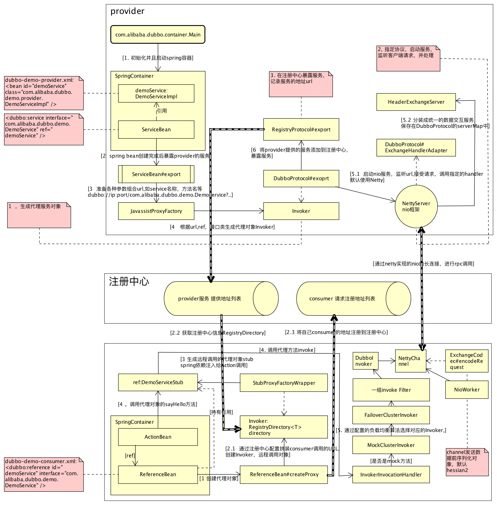

#DUBBO([文档](http://dubbo.io/))
##基本流程

##dubbo协议NIO框架模型

##协议--描述如何进行远程调用，不同的协议使用不同的连接方式
*   Dubbo协议 （default)
    -   采用NIO复用单一长连接，并使用线程池并发处理请求，减少握手和加大并发效率，性能较好
        +   使用NIO框架，默认使用Netty
    -   在大文件传输时，单一连接会成为瓶颈
*   Rmi协议
    -   可与原生RMI互操作，基于TCP协议
*   Hessian协议
    -   可与原生Hessian互操作，基于HTTP协议
        +   JettyHttpBinder
        +   ServletHttpBinder
    -   需hessian.jar支持，http短连接的开销大

##序列化方式--描述传输对象的格式
*   Hessian ，性能较好，多语言支持（推荐使用）默认
*   Dubbo ，通过不传送POJO的类元信息，在大量POJO传输时，性能较好
*   Json ，性能较差  
*   Java Serialization ，性能较差    

##传输框架
*   Netty，JBoss的NIO框架，性能较好，默认
*   Mina

##负载均衡
*   Random ，按权重设置随机概率（推荐使用）
*   RoundRobin ，轮循，按公约后的权重设置轮循比率
*   LeastActive 

##事务