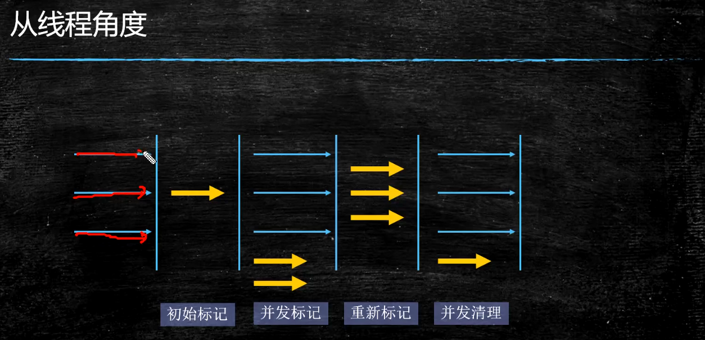
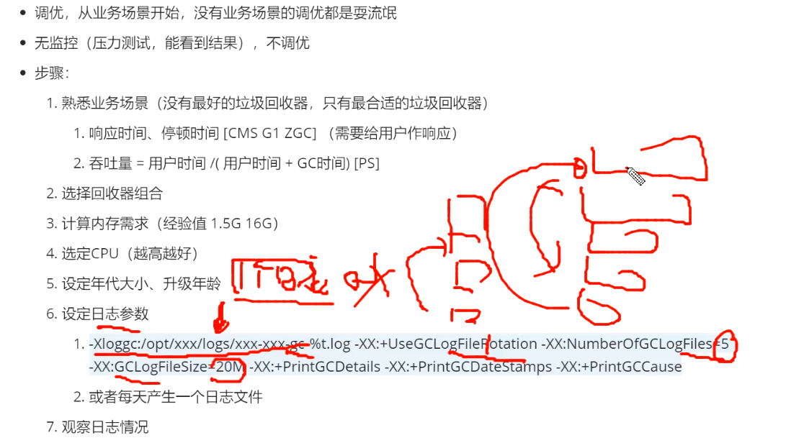

#		The Java® Virtual Machine Specification
##	Java SE 8 Edition
###	Reference Types and Values

*   三种Reference类型：
    -   class 类型 - 值 指向动态创建的类实例
    -   array 类型 - 值 指向动态创建的数组
    -   interface 类型 -值 指向实现接口的类实例
*   null reference


###		Heap 堆内存

* jvm的堆内存被所有线程共享

* 堆内存是运行时数据内存区域，存放类的实例，和数组

* 数组或者实例无法在栈里面存储，因为frame创建后大小固定

* jvm启动时，堆内存被创建

* 给堆使用的内存不需要连续

* 当对象太多，堆内存管理系统无法有效管理时，OutOfMemoryError

* 随着JIT编译器的发展，栈上分配，标量替换优化技术，使得所有对象都分配在堆上边的不那么绝对

  

  ###		Method Area 方法区

* 方法区被所有jvm线程共享

* 编译后的代码存储区域，每个class 结构
  -   类加载引用
  -   运行时常量Run time constant poll
      +   数值常量
      +   字段引用
      +   方法引用
      +   属性
  -   字段
      +   每个字段
          *   名称
          *   类型
          *   限定符
          *   属性
  -   方法数据
      +   每个方法
          *   名称
          *   返回类型
          *   参数类型
          *   限定符
          *   属性
  -   方法代码
      +   每个方法
          *   字节码
          *   操作栈大小
          *   本地变量大小
          *   本地变量table
          *   异常table
              -   每个异常处理
                  +   开始点
                  +   结束点
                  +   pc 代码执行点
                  +   被捕捉异常类的常量池索引
  -   方法和构造器的代码

* 在jvm启动时被创建

* 所有线程共享方法区，必须线程安全

* 可以固定，也可以动态扩展

* OutOfMemoryError

* 与永久代关系
  -   方法区与永久代并不等价，只是HotSpot虚拟机吧GC分代收集扩展至方法区，使用永久代实现方法区，这样Hotspot的垃圾收集器可以管理这部分内存
  -   其他虚拟机没有永久代

###    Run-Time Constant Pool 运行时常量池，方法区的一部分

*   在一个class文件中代表每个类或者每个接口运行时的常量表
*   每个常量池在jvm方法区分配
*   OutOfMemoryError，创建一个类或者一个接口构造常量池要求内存不够时

###    JDK1.8中JVM把String常量池移入了堆中，同时取消了“永久代”，改用元空间代替（Metaspace）

###   运行时常量池与Class文件常量池区别

*   JVM对Class文件中每一部分的格式都有严格的要求，每一个字节用于存储那种数据都必须符合规范上的要求才会被虚拟机认可、装载和执行；但运行时常量池没有这些限制，除了保存Class文件中描述的符号引用，还会把翻译出来的直接引用也存储在运行时常量区
*   相较于Class文件常量池，运行时常量池更具动态性，在运行期间也可以将新的变量放入常量池中，而不是一定要在编译时确定的常量才能放入。最主要的运用便是String类的intern()方法
*   在方法区中，常量池有运行时常量池和Class文件常量池；
*   Class文件中的常量池
    -   在Class文件结构中，最头的4个字节用于存储魔数Magic Number，用于确定一个文件是否能被JVM接受，再接着4个字节用于存储版本号，前2个字节存储次版本号，后2个存储主版本号，再接着是用于存放常量的常量池，由于常量的数量是不固定的，所以常量池的入口放置一个U2类型的数据(constant_pool_count)存储常量池容量计数值。
    -   常量池主要用于存放两大类常量：字面量(Literal)和符号引用量(Symbolic References)，字面量相当于Java语言层面常量的概念，如文本字符串，声明为final的常量值等，符号引用则属于编译原理方面的概念，包括了如下三种类型的常量
        +   类和接口的全限定名
        +   字段名称和描述符
        +   方法名称和描述符
*   方法区中的运行时常量池
    -   运行时常量池是方法区的一部分。
    -   CLass文件中除了有类的版本、字段、方法、接口等描述信息外，还有一项信息是常量池，用于存放编译期生成的各种字面量和符号引用，这部分内容将在类加载后进入方法区的运行时常量池中存放。
    -   运行期间也可能将新的常量放入池中，这种特性被开发人员利用比较多的就是String类的intern()方法。

###    直接内存

*   不是虚拟机运行时的一部分
*   NIO中，基于Channel与Buffer的IO,使用native函数直接分配堆外内存，通过java堆中DirectByteBuffer对象作为这块内存的应用进行操作

###   Frames

*   用来存储数据和部分结果，方法返回值，发送异常，常量池引用
*   每次当方法调用的时候新的frame被创建
*   当方法调用结束的时候frame被销毁
*   线程的栈分配frame
*   结构：{Frame [ReturnValue] [LocalVariables[][][][]...] [OperandStack [][][]...] [ConstPoolRef] }


###    local variables

*   每个frame包含一组变量称为本地变量
*   frame的本地变量数组的长度在编译时被确定，代表的类或者接口中与方法相关的frame的二进制代码提供
*   一个本地变量持有类型：
    -   boolean
    -   byte
    -   char
    -   short
    -   int
    -   float
    -   reference
    -   returnAddress
*   一对变量可以持有long,double
*   本地变量由索引标识，从0开始
*   jvm使用本地变量在方法调用时传递参数
    -   类方法调用，传递连续的索引从0开始的本地变量数组
    -   实例的方法调用，索引为0的本地变量为当前方法调用的对象（也就是this),其他的参数从1开始

###    Operand Stacks 操作栈

*   每个frame包含一个后进先出的栈称为操作栈
*   操作栈用来执行二进制代码指令，作用类似于本地cpu执行指令时用的寄存器
*   绝大部分时间都用在把jvm 二进制代码 对操作栈的压入，弹出，执行操作
*   指令操作二进制代码在本地数组变量和操作栈之间频繁操作
*   frame的操作栈的最大深度在编译时方法关联的frame的代码确定
*   frame被创建时，操作栈是空的
*   jvm提供说明，如何从本地变量或者字段中加载常量或者值到操作栈中
*   其他说明如，从栈中获取内容，操作内容，把结果放回操作栈
*   操作栈也被用来准备要传递给方法的参数，和接受方法的返回结果
*   instruction，说明如何操作栈，指令
    -   iadd,把两个int相加
        +   在之前的操作把两个值放在栈的顶端
        +   pop出这两个值
        +   相加
        +   把结果push会操作栈

###   Dynamic Linking--方法符号到方法实际代码的映射

*   每个frame包含一个运行时常量池的引用，当前方法动态链接到方法代码
*   class文件中的方法的代码，方法的调用和变量的访问通过一些符号，动态链接就是将这些符号映射到实际代码
*   class编译后，所有变量和方法的引用被存储在常量池称为符号引用
*   符号引用是逻辑引用，不是指向实际内存地址

###   Special Methods

*   init,初始化方法，由编译器提供

###   Non-Heap Memory

*   Permanent Generation
    -   方法区
    -   interned strings
*   Code cache
    -   jit 编译的本地代码的编译与存储

###   Just In Time Compilation

*   Java字节码的解释执行速度没有本地代码的执行速度快
*   为了提高性能，将热点java 字节码（经常调用，循环）编译成本地代码，存储在非堆内存

###   对象创建与操作

*   类的实例和数组都是对象，使用不同的指令创建
*   类实例： new
*   数组：newarray,anewarry,multianewarray
*   访问类字段（static fields,类变量）:getstatic,putstatic
*   访问类实例字段（非static字段，实例变量）：getfield，putfield
*   加载数组到操作栈，：baload,caload,saload,iaload,laload,faload
*   存储在操作栈里面的值作为数组，bastore,castore

###   指令集合

*   加载和保存指令-本地变量和操作栈之间传递
    -   加载本地变量：从本地变量加载到操作栈，iload,lload,fload,dload,aload
    -   保存本地变量：从操作栈获取值保存到本地变量，istore,lstore,fstore,astore
    -   加载常量：将常量加载到操作栈，bipush,sipush,ldc,
*   计算指令-在操作栈上的两个值的计算，并将计算结果放回操作栈
    -   两种主要的计算指令
        +   整数操作指令
        +   浮点数操作指令
*   类型转换指令-数字类型之间转换
*   条件控制指令
    -   条件分支：ifeq,ifne。。。
    -   符合条件分支：tablesswitch,lookupswitch
    -   非条件分支：got,jsr，ret
*   方法调用和返回指令
    -   invokevirtual（虚拟调用指令）：调用类实例方法，方法引用 
    -   invokeinterface（接口调用）：调用接口方法，查找运行时对象合适的实现方法
    -   invokespecial（特殊调用）：使用对私有方法，超类方法和实例初始化方法的特殊处理来调用实例方法。 
    -   invokestatic（静态调用）：调用类的方法
    -   invokedynamic（动态调用）：检查的主体过程是在运行期而不是编译
        +   每一处含有invokedynamic指令的位置都被称作“动态调用点（Dynamic Call Site）”，这条指令的第一个参数不再是代表方法符号引用的CONSTANT_Methodref_info常量，而是变为JDK 7新加入的CONSTANT_InvokeDynamic_info常量，从这个新常量中可以得到3项信息：引导方法（Bootstrap Method，此方法存放在新增的BootstrapMethods属性中）、方法类型（MethodType）和名称。引导方法是有固定的参数，并且返回值是java.lang.invoke.CallSite对象，这个代表真正要执行的目标方法调用。根据CONSTANT_InvokeDynamic_info常量中提供的信息，虚拟机可以找到并且执行引导方法，从而获得一个CallSite对象，最终调用要执行的目标方法上。
        +    http://www.infoq.com/cn/articles/Invokedynamic-Javas-secret-weapon
*   异常抛出指令
    -   jvm支持方法之间或者方法内一系列指令的同步，通过monitor
    -   方法级别的同步隐式执行
        -   同步方法可以通过运行时常量池的method_info 结构中的ACC_SYNCHRONIZED标记区分
        -   当调用ACC_SYNCHRONIZED标记的方法时，执行的线程进入一个monitor,调用方法，离开monitor,异常抛出是自动离开
    -   方法快同步，jvm提供monitorenter和monitorexit指令

###    Thread 线程

*   jvm system threads,后台运行线程
    -   VM Thread ，该线程等待出现需要JVM到达安全点的操作 //TODO
    -   Periodic task thread,负责时间事件，计划执行周期操作
    -   GC threads,垃圾回收线程
    -   compiler threads，运行时编译二进制代码成本地代码
    -   signal dispatcher Thread，接受信号，发送给jvm处理
*   每个线程都有的组件：
    -   program counter(PC)
        +   程序计数器是一块较小的内存空间，看作当前线程所执行的字节码的行号指示器，字节码的解释器工作就是通过改变这个计数器的值来选取吓一跳需要执行的字节码指令，分支，循环，跳转，异常处理等功能需要依赖这个计数器
        +   每个线程有自己的pc寄存器
        +   如果当前方法不是naive方法，pc 寄存器包含了当前jvm执行指令的地址
        +   如果当前方法是native方法，pc寄存器的值不会被定义
        +   JVM 使用PC跟踪执行的指令
        +   PC实际上指向方法区的内存地址
    -   stack  栈
        +   每个线程有私有的栈，在创建线程的时候一起被创建
        +   为当前线程执行的每一个方法持有一个frame
        +   每次方法调用时会创建一个新的frame,添加到栈顶，方法执行完成（正常结束，或者异常）被移除
        +   栈的作用
            *   存储本地变量，在方法里面定义的变量（基本类型，或者引用地址）
            *   部分结果
            *   方法调用和返回
        +   jvm的栈内存不需要连续
        +   栈可以是固定大小或者有计算得到动态扩展
        +   每个固定大小的jvm栈的大小在被创建时独立设置
        +   与jvm stack相关的异常
            *   方法计算超过了允许的栈的大小，StackOverflowError
            *   如果栈是动态扩展的，当没有足够的内存用来扩展时，或者没有足够的内存创建一个新线程的栈内存时，OutOfMemoryError
        +   结构：{JVM Stack [Frame][Frame][Frame]... }  
    -   Native Method statcks 本地方法栈
        *   jvm使用c 栈，支持native方法，c语言的方法
        *   StackOverflowError，OutOfMemoryError  

###    jvm主内存与工作内存

*   参考：http://blog.csdn.net/sc313121000/article/details/40266531
*   主内存=方法区+堆内存
*   线程工作内存 = 栈内存 + 对主内存变量拷贝的寄存器
*   JVM规范定义了线程对内存间交互操作：
    -    Lock(锁定)：作用于主内存中的变量，把一个变量标识为一条线程独占的状态。
    -    Read(读取)：作用于主内存中的变量，把一个变量的值从主内存传输到线程的工作内存中。
    -    Load(加载)：作用于工作内存中的变量，把read操作从主内存中得到的变量的值放入工作内存的变量副本中。
    -    Use(使用)：作用于工作内存中的变量，把工作内存中一个变量的值传递给执行引擎。
    -    Assign(赋值)：作用于工作内存中的变量，把一个从执行引擎接收到的值赋值给工作内存中的变量。
    -    Store(存储)：作用于工作内存中的变量，把工作内存中的一个变量的值传送到主内存中。
    -    Write(写入)：作用于主内存中的变量，把store操作从工作内存中得到的变量的值放入主内存的变量中。
    -    Unlock(解锁)：作用于主内存中的变量，把一个处于锁定状态的变量释放出来，之后可被其它线程锁定。


###   Classloader 类加载

*   Jvm启动通过bootstrap classloader加载初始类
*   这个类链接并且初始化，在main函数调用之前
*   依次驱动其他的类和接口的加载、链接和初始化。
    -   loading,加载
        +   通过名称查找代表这个类或者接口类型的class文件，读取到byte数组，
        +   解析byte数组，确认他们所代表的类对象是否有正确的主次版本。
        +   任何类或者结构的直接父类也加载，
    -   linking,连接，一些列步骤
        +   verifying，验证
            *   确认类或者结构结构是否准确
                -   符号表symbol table 一致性和准确性
                -   final 方法 和类 没有被 重写
                -   方法访问控制关键字
                -   方法是否有正确的参数
                -   字节码不正确地操作堆栈
                -   变量在读取之前被初始化
                -   变量的值类型正确
        -   preparing,准备
            +   静态存储的内存分配以及JVM（如方法表）所使用的任何数据结构。
            +   静态字段的创建与初始化默认值
        -   resolving,解析,可选步骤
            +   检查符号引用是否正确
    -   initializaion，初始化
        
        +   执行类或者接口的一系列初始化方法
*   JVM各种类加载器
    -   bootstrap classloader,
        +   通常由native 代码实现，在 jvm 加载之前初始化
        +   负责加载基本java api，包括rt.jar
        +   只加载boot classpath发现的类，高信任度
        +   path:jre/lib/rt.jar or Xbootclasspath 指定
    -   extension classloader
        +   加载标准扩展java api，如何 安全扩展
        +   jre/lib/ext/*.jar or Djava.ext.dirs
    -   System classloader
        +   默认类加载，从 classpath 加载 程序类
        +   Djava.class.path
    -   user defined classloaders
        +   用户自定义类加载

##   JVM编译
###    指令格式

*   <index> <opcode> [ <operand1> [ <operand2>... ]] [<comment>]

###   Switch 指令

*   tableswitch
    -   case中的值连续时，编译成tableswitch，解释执行时从table数组根据case值计算下标来取值，从数组中取到的，便是要跳转的行数。
*   lookupswitch
    -   当case中的值不连续时，编译成lookupswitch，解释执行时需要从头到尾遍历找到case对应的代码行。
    -   因为case对应的值不是连续的，如果仍然用表来保存case对应的行号，会浪费大量空间。
    


##   JAVA class 格式

*   每个class文件由一系列8位字节流组成
*   u1,u2,u4代表1，2，4个无符号字节
*   class 文件结构
```
ClassFile {
              u4             magic;
              u2             minor_version;
              u2             major_version;
              u2             constant_pool_count;
              cp_info        constant_pool[constant_pool_count-1];
              u2             access_flags;
              u2             this_class;
              u2             super_class;
              u2             interfaces_count;
              u2             interfaces[interfaces_count];
              u2             fields_count;
              field_info     fields[fields_count];
              u2             methods_count;
              method_info    methods[methods_count];
              u2             attributes_count;
              attribute_info attributes[attributes_count];
}
```
*   表是由多个无符号数或者其代表作为数据项构成的符合数据类型，习惯以_info结尾
    -   表用于描述有层次关系的符合结构的数据，整个class文件本质上就是一张表
*   魔数magic number，每个class文件的头4个字节称为 ，确定整个文件是否为一个能被虚拟机接受的class文件
    -   很多文件存储标准中都使用魔数进行身份识别
*   5，6字节次版本，7，8字节主版本
*   常量池  <-  在主次版本之后是常量池入口
    -   是class文件的资源仓库，第一个表类型数据项目
    -   常量池中的常量数量是不固定的，所以入口放置一项u2类型，代表常量池容量计数值，从1开始
    -   第0项常量空出来表示，不引用任何一个常量池项目
    -   其他集合类型，接口索引集合，字段表集合，方法表集合都是从0开始
    -   存储内存
        +   字面量literal
            *   java中的常量，文本，final类型值
        +   符号引用symbolic reference（编译原理）
            *   种类
                -   类和接口的全限定名 full  qualified name
                -   字段的名称和描述符 descriptor
                -   方法名和描述符
            *   使用
                -   虚拟机加载class文件的时候动态连接
                -   class文件中不会保存各个方法，字段的最终内存布局信息，因此字段方法的符号引用不经过运行期转换的话无法得到正真的内存入口地址
                -   当虚拟机运行时，需要从常量池获得对应的符号引用，再在类创建时或者运行时解析，翻译得到具体的内存地址
    -   常量池的每一项都是一个表
*   访问标记  <- 常量池结束后
    -   方法里面的Java代码，经过编译器编译成字节码指令后，存放在方法属性表集合中一个名为code的属性里面，属性表作为class文件格式中最具扩展的一种数据项目
*   ConstantValue  属性
    -   如果同时使用final static来修饰，并且类型是基本类型或者String，就生成ConstantValue属性来初始化，如果这个宾利没有final，或者非基本类型及字符串，会使用clinit方法初始化
*   Signature  属性
    -   1.5以后泛型功能，记录泛型类型
    -   Java泛型采用擦除法实现，在字节码code属性中，反省信息被擦除
*   BootstrapMethods  属性
    -   1.7后动态调用功能，变长属性，位于类文件的属性表中
    -   用于保存invokedynamic指令的引导方法限定符
    -   最多只能有一个bootstrapmethod属性
    -   javac暂时无发生成invokedynamic指令和BootstrapMethods  属性


###    字节码指令

*   操作码，opcode
    -   一个字节长度的，代表某种特定操作含义的数字，
*   操作数，operands 
    -   以及跟随其后的零到多个代表次操作所需的参数

##    Loading, Linking, and Initializing

*   loading
    -   通过指定的名称从二进制文件中查找类和接口对应的二进制代码
    -   根据二进制代码创建类或者接口
*   linking
    -   将类或者接口结合到JVM运行时，以便执行
*   Initialization
    -   执行类或者方法的初始化方法 <clinit> 

###   The Run-Time Constant Pool

*   JVM维护每个类型一个的常量池
*   JVM中运行时常量池在方法区中
*   用于存放编译期生成的各种字面量和符号引用
*   运行时常量池中的符号引用来自类或接口的二进制表示中的结构
    -   类或者接口的符号引用来自于CONSTANT_Class_info结构
        +   非数组类或者接口就是类或者接口的二进制名称
        +   n维度的数组由n个‘[’开始，接元素的类型名称
            *   基本类型，相应的字段描述
            *   引用类型，L开头的二进制名称
    -   字段的符号引用来自于CONSTANT_Fieldref_info结构
    -   类方法的符号引用来自于CONSTANT_Methodref_info
    -   接口方法的符号引用来自于CONSTANT_InterfaceMethodref_info
    -   方法处理的符号引用来自于CONSTANT_MethodHandle_info
    -   方法类型的符号引用来自于CONSTANT_MethodType_info
    -   调用符的符号引用来自于CONSTANT_InvokeDynamic_info
    -   string的字面量引用字符串实例，来自于CONSTANT_String_info
    -   运行时常量值来自于CONSTANT_Integer_info, CONSTANT_Float_info, CONSTANT_Long_info, or CONSTANT_Double_info


### jvm 启动
*   通过 bootstrap class loader创建初始类，连接初始类，然后初始化，调用main方法


###   HotSpot

*   热点代码探测
*   通过执行计数器找出最具有编译价值的代码，然后通知jit编译器以方法为单位进行编译。
    -   一个频繁调用的方法
    -   循环的代码

###   64位jvm

*   指针膨胀数据类型对齐，需要更多内存，相比32位多10%~30%
*   运行速度慢于32位
*   使用场景，需要使用大于4g内存的场合
*   指针压缩开启，会增加执行代码数量

###   对象创建

*   new指令，检查指令的参数在常量池中能否定位到一个类的符号引用
*   检查这个符号引用代表的类是否被加载解析和初始化
*   类加载检查通过后，为新对象分配内存，
    -   对象所需的内存大小在类加载完成后可以确定
    -   为对象分配空间的任务就是从java堆中划分一块确定大小的内存
*   对象创建频繁，并发情况线程不安全
    -   同步处理，cas+失败重试确保更新操作原子性
    -   把内存分配的操作按照线程划分在不同的空间进行，每个线程在java堆中预分配一块内存，称为本地线程分配缓冲（Thread local allocation buffer , TLAB)，
*   内存分配完成后，将分配的内存空间初始化零值（不包括对象头）
*   对对象进行设置，是哪个类的实例，元数据信息，存放在对象头中
*   新对象产生后，执行初始化方法

###   对象的内存结构，hotspot

*   对象头,header
    -   运行时数据
        +   哈希吗，gc分代年龄，锁状态标记，线程持有的锁等
        +   32位虚拟机长度为32bit，64位虚拟机未压缩，长度64bit
    -   类型指针，指向对象类的元数据的指针
*   实例数据，instance data
    -   各种类型字段
*   对象填充，padding
    -   Hotspot内存管理需要起始地址是8个字节整数倍，填充补齐

###    对象的访问定位

*   java程序需要通过栈上的reference数据来操作堆上的具体对象
*   reference类型在java虚拟机规范中只定义了一个指向对象的引用，没有定义这个引用通过何种方式定位，访问对中的具体位置，取决于虚拟机实现
*   主流访问方式
    -   句柄
        +   划分一块内存作为句柄，reference中存储的就是对象的句柄地址，句柄包含了实例数据与类型各自的具体地址信息
        +   reference中存储的句柄地址，对象移动时只会改变句柄的实例数据指针，reference不需要修改
    -   直接指针
        +   速度快，节省一次指针定位的时间开销

###    GC内存管理
####    对象是否不再使用

*   引用计数算法
    -   给对象添加一个引用计数器，引用时加一，不用时减一
    -   无法解决循环引用
    -   虚拟机不是通过引用计数算法判断
*   可达性分析算法
    -   通过一些列gc roots的对象作为起始点，从这些节点往下搜索，搜索所走过的路径称为引用链，当一个对象到GC roots 没有任何引用链，就是不可用
*   在Java中，可作为GC roots的对象：
    -   虚拟机栈（栈帧中的本地变量表）中引用的对象
    -   方法去中类静态属性引用的对象
    -   方法区中常量引用的对象
    -   本地方法栈中引用的对象

####   引用的类型

*   强引用
    -   只要存在，垃圾回收器不会回收对象
*   软引用
    -   描述一些还有用但不是必须的对象
    -   内存不足时被回收
*   弱引用
    -   非必须对象
    -   下一次垃圾收集之前可能被回收
*   虚引用

####   对象回收之前要执行finalize()方法，如果重新与引用链上的任何一个对象建立关联，会被移除即将回收的队列

###    垃圾收集算法
####      mark-sweep 标记清除算法

*   先标记所有需要回收的对象，标记完成后统一回收所有被标记的对象
*   缺点  
    -   效率低
    -   空间碎片多

####     复制算法

*   把内存划分2块，每次只用一块，当一块用完了就将还活着的复制到另一块，把原来的内存一次清理掉
*   缺点
    -   内存使用量小了一半

####     标记-整理算法 mark - compact

*    标记对象，让所有存活对象向一端移动，直接清理边界以外的内存

####     分代收集算法

*   根据对象存活周期划分几块
    -   新生代
        +   每次收集都有大批死去，少量存活，用复制算法，只需要付出少量存活对象的复制成本
    -   老年代
        +   存活率高，标记清理算法

###    垃圾收集器

*   serial收集器
    -   单线程一个cpu或者一条线程，必须暂停其他所有线程
*   ParNew收集器
    -   多线程，适用多cpu
*   cms收集器concurrent mark sweep
    -   获取最短回收停顿时间为目标的收集器
    -   基于标记-清除算法
        +   初始标记   
        +   并发标记
        +   重新标记
        +   并发清除
    -   
    -   缺点
        +   占用cpu资源，线程多
        +   并发清理阶段用户线程运行，产生新的垃圾，在标记之后，无法处理，等下一次处理，称为浮动垃圾
        +   空间碎片增加
    -   g1(garbage-first)  -- 逻辑分代，物理不分代
        +   面向服务端应用垃圾收集器。
        +   充分利用多cpu，多核优势，使用多个cpu,缩短stop-the-world停顿时间
        +   步骤
            *   初始标记
            *   并发标记
            *   最终标记
            *   筛选回收
        +   三色标记算法
*   常用垃圾会收集组合参数
    *   -XX:+UseSerialGC = Serial New  + Serial Old
        *   小型程序，默认不适用
    *   -XX:+UseParNewGC = ParNew + SerialOld
        *   少用
    *   -XX:+UseConcMarkSweepGC = ParNew + CMS + Serial old
    *   -XX:+UseParrallelGC = Parrallel Scavenge + Parallel old 默认
    *   -XX:+UseG1GC  = G1

###     内存分配与回收策略

*   对象主要分配在新生代的eden区域，如果启动了本地线程分配缓冲，将按线程优先在TLAB上分配
    -   当eden没有足够空间分配，将发起minor gc  
*   少数情况可能直接分配在老年代
    -   大对象直接进入老年代，如很长的字符串
*   长期存活的对象将进入老年代，默认15次minor gc 后进入老年代

###    加载、链接与初始化

*   加载
    -   1.通过一个类的全限定名来获取定义此类的二进制字节流。
    -   2.将这个字节流所代表的静态存储结构转化为方法区的运行时数据结构。
    -   3.在java堆中生成一个代表这个类的java.lang.Class对象，作为方法区这些数据的访问入口。 
    -   类加载器可以大致划分为以下三类：
        -   启动类加载器：Bootstrap ClassLoader，跟上面相同。它负责加载存放在JDK\jre\lib(JDK代表JDK的安装目录，下同)下，或被-Xbootclasspath参数指定的路径中的，并且能被虚拟机识别的类库（如rt.jar，所有的java.*开头的类均被Bootstrap ClassLoader加载）。启动类加载器是无法被Java程序直接引用的。
        -   扩展类加载器：Extension ClassLoader，该加载器由sun.misc.Launcher$ExtClassLoader实现，它负责加载JDK\jre\lib\ext目录中，或者由java.ext.dirs系统变量指定的路径中的所有类库（如javax.*开头的类），开发者可以直接使用扩展类加载器。
        -   应用程序类加载器：Application ClassLoader，该类加载器由sun.misc.Launcher$AppClassLoader来实现，它负责加载用户类路径（ClassPath）所指定的类，开发者可以直接使用该类加载器，如果应用程序中没有自定义过自己的类加载器，一般情况下这个就是程序中默认的类加载器。
*   链接
    *   为了让类或接口可以被 Java 虚拟机执行,而将类或接口并入虚拟机运行时状态的过程
    *   解析的过程就是确保这些被引用的类能被正确的找到。解析的过程可能会导致其它的 Java类被加载。
*   初始化
    -   指执行类或接口的初始化方法<clinit>

   

####  生产jvm配置



##    reference

*   《java虚拟机（第二版）》
*   http://blog.csdn.net/sc313121000/article/details/40266531
*   http://www.infoq.com/cn/articles/Invokedynamic-Javas-secret-weapon
*   http://blog.jamesdbloom.com/JVMInternals.html
*   http://www.cnblogs.com/caca/p/jvm_stack_frame.html
    


