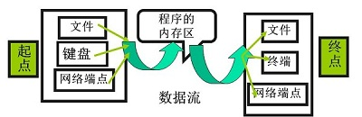
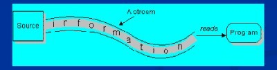
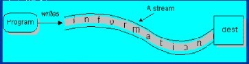
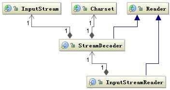

#   I/O
*   I/O（英语：Input/Output），即输入/输出，通常指数据在内部存储器和外部存储器或其他周边设备之间的输入和输出。
*   在 Java 编程中，直到最近一直使用 流 的方式完成 I/O。所有 I/O 都被视为单个的字节的移动，通过一个称为 Stream 的对象一次移动一个字节byte。


#   数据流的基本概念
*   流从概念上来说是一个连续的数据流。你既可以从流中读取数据，也可以往流中写数据。流与数据源或者数据流向的媒介相关联。在Java IO中流既可以是字节流(以字节为单位进行读写)，也可以是字符流(以字符为单位进行读写)。
*   将数据从外存中读取到内存中的称为**输入流**，将数据从内存写入外存中的称为**输出流**。
    *   
    *   Input  Stream不关心数据源来自何种设备（键盘，文件，网络）
    *   Output  Stream不关心数据的目的是何种设备（键盘，文件，网络）
*    程序从输入流读取数据源。数据源包括外界(键盘、文件、网络…)，即是将数据源读入到程序的通信通道。
    -   
*   程序向输出流写入数据。将程序中的数据输出到外界（显示器、打印机、文件、网络…）的通信通道。
    -   


#   流的分类
*   根据流的来源分：结点流(原始流)，处理流(链接流)
    -   结点流(原始流)：直接从指定的位置（如磁盘文件或内存区域）读或写，这类流称为结点流(node stream)
        +   ByteArrayInputStream：为多线程的通信提供缓冲区操作功能，接收一个Byte数组作为流的源。
        +   FileInputStream:建立一个与文件有关的输入流。接收一个File对象作为流的源。
        +   PipedInputStream：可以与PipedOutputStream配合使用，用于读入一个数据管道的数据，接收一个PipedOutputStream作为源。
        +   StringBufferInputStream：将一个字符串缓冲区转换为一个输入流
    -   处理流(链接流)：其它的流，过滤器输入流往往是以其它输入流作为它的输入源，经过过滤或处理后再以新的输入流的形式提供给用户，过滤器输出流的原理也类似。 
        +   FilterInputStream称为过滤输入流，它将另一个输入流作为流源。这个类的子类包括以下几种：
            *   BufferedInputStream：用来从硬盘将数据读入到一个内存缓冲区中，并从缓冲区提供数据。
                *   支持 buf 缓冲
                *   支持 mark , reset 可重复读取功能
            *   DataInputStream：提供基于多字节的读取方法，可以读取原始类型的数据。
                -   支持读取java 基本类型的方法，readBoolean，readShort，readInt。。  
            *   LineNumberInputStream：提供带有行计数功能的过滤输入流。
                -   支持读取当前行号
            *   PushbackInputStream：提供特殊的功能，可以将已经读取的字节“推回”到输入流中。
        +   装饰器模式的应用： </br>
            *   FilterInputStream继承了InputStream,也引用了InputStream,而它有四个子类,这就是所谓的Decorator模式
            *   链接流链接流对象接收一个原始流对象或者另外一个链接流对象作为流源；另一方面他们对流源的内部工作方法做了相应的改变，这种改变是装饰模式所要达到的目的
*   根据它们操作对象的类型是字符还是字节可分为两大类： 字符流和字节流。
    -   JAVA字节流：InputStream是所有字节输入流的祖先，而OutputStream是所有字节输出流的祖先。
    -   Java的字符流：Reader是所有读取字符串输入流的祖先，而writer是所有输出字符串的祖先。
    -   适配器模式的应用： 从byte流到char流的适配
        +    InputStreamReader是从byte输入流到char输入流的一个适配器。InputStream的具体子类链接的时候，可以从InputStream的输出读入byte类型的数据，将之转换成为char类型的数据
        +    InputStream 到 Reader 的过程要指定编码字符集，否则将采用操作系统默认字符集，很可能会出现乱码问题。
            *    
```
public class InputStreamReader extends Reader {
        public InputStreamReader(InputStream in) {
        ...
        }
}
```


#   磁盘 I/O 工作机制
*   创建文件对象file:`new File(path)`
    -   FileSystem fs:文件操作，都是native的方法
        +   delete
        +   list
        +   rename
*   创建 FileReader对象：`new FileReader(file)`
    -   FileReader extends InputStreamReader
        +   StreamDecoder sd: 创建一个解码器，
            *   InputStreamReader(InputStream in, String charsetName)，可以指定编码
        -   InputStreamReader(InputStream in)，需要一个输入字节流
            *   创建一个 fileInputStream 对象：`new  FileInputStream( file );`
                +   FileDescriptor：创建FileInputStream的时候回创建，都是native的方法：`fd = new FileDescriptor()`
                    *   关联真实存在的磁盘文件的文件描述符
                    *   真正读取文件的操作对象
```
        File file = new File(fileName);
        BufferedReader reader = null;
        try {
            System.out.println("以行为单位读取文件内容，一次读一整行：");
            reader = new BufferedReader(new FileReader(file));
            String tempString = null;
            int line = 1;
            // 一次读入一行，直到读入null为文件结束
            while ((tempString = reader.readLine()) != null) {
                //do some thing
                line++;
            }
            reader.close();
        } ....    
```


#   Java Socket 的工作机制
*   **Socket**
    -   网络上的两个程序通过一个双向的通信连接实现数据的交换，这个连接的一端称为一个socket。
    -   HTTP是轿车，提供了封装或者显示数据的具体形式；Socket是发动机，提供了网络通信的能力。
    -   Socket实质上提供了进程通信的端点，进程通信之前，双方首先必须各自创建一个端点，否则是没有办法建立联系并相互通信的。正如打电话之前，双方必须各自拥有一台电话机一样。
*   通信过程
    -   主机 A 的应用程序要能和主机 B 的应用程序通信，必须通过 Socket 建立连接，
    -   而建立 Socket 连接必须需要底层 TCP/IP 协议来建立 TCP 连接。
    -   建立 TCP 连接需要底层 IP 协议来寻址网络中的主机。我们知道网络层使用的 IP 协议可以帮助我们根据 IP 地址来找到目标主机，但是一台主机上可能运行着多个应用程序，如何才能与指定的应用程序通信就要通过 TCP 或 UPD 的地址也就是端口号来指定。这样就可以通过一个 Socket 实例唯一代表一个主机上的一个应用程序的通信链路了。
    -   
*   java Socket 通信：
    -   
    -   客户端：
        +   客户端首先要创建一个 Socket 实例，操作系统将为这个 Socket 实例分配一个没有被使用的本地端口号，
        +   在创建 Socket 实例的构造函数正确返回之前，将要进行 TCP 的三次握手协议，TCP 握手协议完成后，Socket 实例对象将创建完成，否则将抛出 IOException 错误。
    -   服务端：
        +   服务端将创建一个 ServerSocket 实例，ServerSocket 创建比较简单只要指定的端口号没有被占用，一般实例创建都会成功。
        +   accept()方法：
            +   进入阻塞状态，等待客户端的请求
            +   当一个新的请求到来时，将为这个连接创建一个新的socket，该套接字数据的信息包含的地址和端口信息正是请求源地址和端口。
            +   这个新创建的数据结构将会关联到 ServerSocket 实例的一个未完成的连接数据结构列表中，注意这时服务端与之对应的 Socket 实例并没有完成创建，而要等到与客户端的三次握手完成后，这个服务端的 Socket 实例才会返回，并将这个 Socket 实例对应的数据结构从未完成列表中移到已完成列表中。
            +   所以 ServerSocket 所关联的列表中每个数据结构，都代表与一个客户端的建立的 TCP 连接。
        +   backlog 参数，ServerSocket初始化是可以指定，默认50
            *   一个队列的最大长度，服务端监听端口，等待客户端连接，客户端连接到来时先进入该队列，accept()方法从里面取出连接处理返回一个新的socket与客户端socket通信
            *   如果客户端并发过高，accept来不及处理，导致等待accept处理的连接超过指定的队列长度，客户端就会java.net.ConnectException: Operation timed out
*   数据传输
    -   连接已经建立成功，服务端和客户端都会拥有一个 Socket 实例，每个 Socket 实例都有一个 InputStream 和 OutputStream，正是通过这两个对象来交换数据。
    -   当 Socket 对象创建时，操作系统将会为 InputStream 和 OutputStream 分别分配一定大小的缓冲区，数据的写入和读取都是通过这个缓存区完成的。
    -   写入端将数据写到 OutputStream 对应的 SendQ 队列中，当队列填满时，数据将被发送到另一端 InputStream 的 RecvQ 队列中，如果这时 RecvQ 已经满了，那么 OutputStream 的 write 方法将会阻塞直到 RecvQ 队列有足够的空间容纳 SendQ 发送的数据。
    -   这个缓存区的大小以及写入端的速度和读取端的速度非常影响这个连接的数据传输效率，由于可能会发生阻塞，所以网络 I/O 与磁盘 I/O 在数据的写入和读取还要有一个协调的过程，如果两边同时传送数据时可能会产生死锁。

#   zero copy来实现高效的数据传输
##  传统的数据传输方式
*   场景：从文件读取数据然后将数据通过网络传输给其他的程序（web服务器处理静态内容时，ftp服务器，邮件服务器等等）
    -   读文件：File.read(fileDesc,buf,len);
    -   网络传输： Socket.send(socket,buf,len);
*   经历四次用户态和内核态的切换以及四次的数据复制操作。
*   传统的数据复制方式
    -   DMA copy: 是内存到内存，会大大提升内存拷贝的速度。
    -   CPU copy: 用户空间和内核空间内存的拷贝，消耗cpu,速度慢
    -   
*   传统方式的上下文切换过程
    -   
*   具体过程：
    -   read()的调用引起了从用户态到内核态的切换，内部是通过sys_read()（或者类似的方法）发起对文件数据的读取。数据的第一次复制是通过DMA(直接内存访问)，将磁盘上的数据复制到内核空间的缓冲区中。
    -   数据从内核空间的缓冲区复制到用户空间的缓冲区后，read()方法也就返回了。此时内核态又切换回用户态，现在数据也已经复制到了用户地址空间的缓存中。
    -   socket的send()方法的调用又会引起用户态到内核的切换，第三次数据复制又将数据从用户空间缓冲区复制到了内核空间的缓冲区，这次数据被放在了不同于之前的内核缓冲区中，这个缓冲区与数据将要被传输到的socket关联。
    -   send()系统调用返回后，就产生了第四次用户态和内核态的切换。随着DMA单独异步的将数据从内核态的缓冲区中传输到协议引擎发送到网络上，有了第四次数据复制。
*   内核空间的缓冲区[read buffer , socket buffer in kernel ] 目的？
    -   目的：
        -   如果读取的数据小于这个中介缓冲区的容量，那么中介缓冲区就可以提前缓存一大部分数据以供程序下次读取使用，从而提高性能。
        -   从应用程序写数据来说，这个中介缓冲区可以用来实现异步功能（当数据缓冲区数据满了后再写出去，减少了系统调用的次数）。
    *   问题：
        -   当应用程序读取的数据比这个中介缓冲区的容量大很多的时候，数据就会在磁盘、内核空间、用户空间之间复制多次后才最终被传给应用程序。

##  使用zero copy的数据传输方式：
*   传统的方式，你会发现实际上第二次和第三次数据拷贝是没有必要的。应用程序除了缓存一下数据然后传回到socket的缓冲区中啥也没干。我们可以通过直接从内核缓冲区把数据传输到socket关联的缓冲区来代替传统的方式。
    -   `transferTo(long position,long count,WritableByteChannel target);`
        +   将数据从一个channel传输到另一个可写的channel上，其内部实现依赖于操作系统对zero copy技术的支持。
        +   unix操作系统和各种linux的发型版本中，这种功能最终是通过sendfile()系统调用实现。
        +   可以通过调用transferTo()方法来替代上边的File.read()、Socket.send()
            *   `transferTo(position, count, writableChannel);`
*   transferTo实现数据传输的路径：
    -   
*   内核态、用户态的切换情况：
    -   
*   具体过程：
    -   transferTo调用会引起DMA将文件内容复制到读缓冲区(内核空间的缓冲区)，然后数据从这个缓冲区复制到另一个与socket输出相关的内核缓冲区中。
    -   第三次数据复制就是DMA把socket关联的缓冲区中的数据复制到协议引擎上发送到网络上。
    -   比较：
        +   上下文切换次数： 4次 --> 2次
        +   数据的复制次数： 4次 --> 3次  只有一次用到cpu资源 readbuffer -> socketbuffer的拷贝
*   真正zero copy
    -   内核为2.4或者以上版本的linux系统，socket缓冲区描述符将被用来满足这个需求
    -   
    -   具体过程：
        +   调用transferTo方法后数据被DMA从文件复制到了内核的一个缓冲区中。
        +   数据不再被复制到socket关联的缓冲区中了，仅仅是将一个描述符（包含了数据的位置和长度等信息）追加到socket关联的缓冲区中。DMA直接将内核中的缓冲区中的数据传输给协议引擎，消除了仅剩的一次需要cpu周期的数据复制。
*   文件传输服务器测试性能比较（内核为2.6版本的linux上运行）：


File size  |Normal file transfer (ms)  |transferTo (ms)
----|-----------------------|-------------------
7MB |156    |45
21MB    |337    |128
63MB    |843    |387
98MB    |1320   |617
200MB   |2124   |1150
350MB   |3631   |1762
700MB   |13498  |4422
1GB |18399  |8537   

##  zero copy应用
*   Kafka,分布式发布订阅消息系统
*   Netty,javaNIO的框架


#   什么是同步，异步，阻塞，非阻塞

##  他们产生关系的领域CPU中断与IO
*   没有IO操作，所有的代码基本都是同步的
*   有了IO操作后，如果没有多进程多线程，所有代码还是同步的
*   有了IO操作，有了多进程多线程，代码才有了异步的可能性，同时也产生了阻塞与非阻塞


##  io操作流程
*   1 用户进程调用系统命令recvfrom
*   2 系统调用内核kernel处理
    -   2.1   数据准备，等待数据准备完成
        +   对于一个套接字上的输入操作，第一步通常涉及等待数据从网络中到达。当所有等待分组到达时，它被复制到内核中的某个缓冲区。
    -   2.2   将数据从内核拷贝到用户空间
        +   第二步就是把数据从内核缓冲区复制到应用程序缓冲区。
        
##  同步 & 异步
*   同步 & 异步 是针对**应用程序和内核**的交互而言的，调用recvfrom后的动作。（操作流程的步骤 1）
*   同步是指代码调用IO操作时，必须等待IO操作完成才返回的调用方式，导致请求进程阻塞，直到I/O操作完成；
*   异步是指代码调用IO操作时，不必等IO操作完成就返回的调用方式，不导致请求进程阻塞。 （两个阶段都不阻塞，那么就是异步I/O）
*   同步是最原始的调用方式，异步则需要多线程，多CPU或者非阻塞IO的支持。


##  阻塞 & 非阻塞
*   阻塞和非阻塞是针对于**进程在访问数据**的时候，根据IO操作的就绪状态来采取的不同方式。（操作流程的步骤 2.1）
*   阻塞是指调用线程或者进程被操作系统挂起，阻塞方式下读取或者写入函数将一直等待
*   非阻塞是指调用线程或者进程不会被操作系统挂起，非阻塞方式下，读取或者写入函数会立即返回一个状态值。


名称 |  解释  |               例子
----|-----------------------|-------------------
同步 | 用户进程触发IO操作并等待或者轮询的去查看IO操作<br>是否就绪  | 自己（程序）亲自去银行（核心）取钱
异步 | 用户进程触发IO操作以后便开始做自己的事情，<br>而当IO操作已经完成的时候会得到IO完成的通知<br>（异步的特点就是通知     |  委托一小弟拿银行卡到银行取钱，然后给你（使用异步IO时，<br>Java将IO读写委托给OS处理，需要将数据缓冲区地址和大小<br>传给OS(银行卡和密码)，OS需要支持异步IO操作API）
阻塞  |所谓阻塞方式的意思是指, 当试图对该文件描述符进行读写时,<br> 如果当时没有东西可读,或者暂时不可写, <br>程序就进入等待 状态, 直到有东西可读或者可写为止   | ATM排队取款，你只能等待（使用阻塞IO时，<br>Java调用会一直阻塞到读写完成才返回）
非阻塞| 非阻塞状态下, 如果没有东西可读, 或者不可写, <br>读写函数马上返回, 而不会等待 |  柜台取款，取个号，然后坐在椅子上做其它事，<br>等号广播会通知你办理，


##   5中I/O模型
*   Java BIO ： 同步并阻塞 I/O
    -   服务器实现模式为一个连接一个线程，如果这个连接不做任何事情会造成不必要的线程开销，当然可以通过线程池机制改善。
    -   进程从调用recvfrom开始到返回的整个时段都是阻塞的，recvfrom成功返回后，应用进程才开始处理数据报。
    -   
*   Non-blocking IO：同步非阻塞I/O 
    -   非阻塞I/O在第一阶段数据没有准备好的时候，不阻塞，而是直接返回一个错误（EWOULDBLOCK）。
    -   所以一般采用轮询（polling）的方式，应用进程持续轮询内核，查看数据是否准备好。当数据准备好时，被复制到应用进程缓冲区（第二阶段）。
    -   当第一阶段数据准备完成后，进入第二阶段，内核向内存的复制。这一阶段仍然是阻塞的
    -   默认创建的socket都是阻塞的，非阻塞IO要求socket被设置为NONBLOCK。注意这里所说的NIO并非Java的NIO（New IO）库。**？？？**
    -   
*   Java NIO： I/O复用  multiplexing（Java NIO就是这种模型） 
    -   通过一种机制，一个进程可以监视多个描述符，一旦某个描述符就绪（一般是读就绪或者写就绪），能够通知程序进行相应的读写操作。
    -   I/O复用最常见的就是select和epoll，其阻塞发生在上述两个系统调用之一，而不是真正的I/O系统调用上。
    -   当用户进程调用了select，那么整个进程会被阻塞与select。内核会“监视”所有select负责的套接字，当任何一个套接字中的数据准备好了，select就会返回。(进程阻塞)
    -   
*   信号驱动式I/O ,异步I/O 
    -   这类函数的工作机制是告知内核启动某个操作，并让内核在整个操作（包括将数据从内核拷贝到用户空间）完成后通知我们。
    -   
*   阻塞式I/O， 非阻塞I/O， I/O复用由于都导致了请求进程阻塞，所以均属于同步I/O。
    -   非阻塞I/O，其在第二阶段内核向内存复制数据是会导致用户进程的阻塞，所以也属于同步I/O


##  I/O复用机制  select、poll、epoll
### select
*   select 函数监视的文件描述符分3类，分别是writefds、readfds、和exceptfds。
*   用后select函数会阻塞，直到有描述符就绪（有数据 可读、可写、或者有except），或者超时（timeout指定等待时间，如果立即返回设为null即可），函数返回。
*   当select函数返回后，可以通过遍历fdset，来找到就绪的描述符。
*   优点:
    -   select目前几乎在所有的平台上支持，其良好跨平台支持也是它的一个。
*   缺点:
    -   select的一个在于单个进程能够监视的文件描述符的数量存在最大限制，在Linux上一般为1024，可以通过修改宏定义甚至重新编译内核的方式提升这一限制，但是这样也会造成效率的降低。
        -   一般来说这个数目和系统内存关系很大，具体数目可以cat /proc/sys/fs/file-max察看。32位机默认是1024个。64位机默认是2048.
    -   对socket进行扫描时是线性扫描，即采用轮询的方法，效率较低。
        +   当套接字比较多的时候，每次select()都要通过遍历FD_SETSIZE个Socket来完成调度，不管哪个Socket是活跃的，都遍历一遍。这会浪费很多CPU时间。
    -   需要维护一个用来存放大量fd的数据结构，这样会使得用户空间和内核空间在传递该结构时复制开销大。
*   

### poll
*   poll本质上和select没有区别，它将用户传入的数组拷贝到内核空间，然后查询每个fd对应的设备状态，如果设备就绪则在设备等待队列中加入一项并继续遍历，如果遍历完所有fd后没有发现就绪设备，则挂起当前进程，直到设备就绪或者主动超时，被唤醒后它又要再次遍历fd。这个过程经历了多次无谓的遍历。
*   它没有最大连接数的限制，原因是它是基于链表来存储的，但是同样有一个缺点：
    -   大量的fd的数组被整体复制于用户态和内核地址空间之间，而不管这样的复制是不是有意义。
    -   poll还有一个特点是“水平触发”，如果报告了fd后，没有被处理，那么下次poll时会再次报告该fd。

### epoll
*   epoll是在2.6内核中提出的，是之前的select和poll的增强版本。
*   相对于select和poll来说，epoll更加灵活，没有描述符限制。
*   epoll使用一个文件描述符管理多个描述符，将用户关系的文件描述符的事件存放到内核的一个事件表中，这样在用户空间和内核空间的copy只需一次。
*   基本原理：
    -   epoll支持水平触发和边缘触发，最大的特点在于边缘触发，它只告诉进程哪些fd刚刚变为就绪态，并且只会通知一次。
    -   epoll使用“事件”的就绪通知方式，通过epoll_ctl注册fd，一旦该fd就绪，内核就会采用类似**callback的回调机制**来激活该fd，epoll_wait便可以收到通知。
*   优点：
    -   没有最大并发连接的限制，能打开的FD的上限远大于1024（1G的内存上能监听约10万个端口）。
    -   效率提升，不是轮询的方式，回调方式，不会随着FD数目的增加效率下降。
    -   只有活跃可用的FD才会调用callback函数；即Epoll最大的优点就在于它只管你“活跃”的连接，而跟连接总数无关，因此在实际的网络环境中，Epoll的效率就会远远高于select和poll。
    -   内存拷贝，利用mmap()文件映射内存加速与内核空间的消息传递；即epoll使用mmap减少复制开销。

### select和poll都需要在返回后，通过遍历文件描述符来获取已经就绪的socket。
*   都是轮询方式
*   同时连接的大量客户端在一时刻可能只有很少的处于就绪状态，因此随着监视的描述符数量的增长，其效率也会线性下降。

### 总结
*   支持一个进程所能打开的最大连接数：
    -   select & poll 有最大限制，1024-2048
    -   epoll 基本没有，1g 内存 10万个 
*   FD剧增后带来的IO效率问题：
    -   select & poll  线性遍历所有FD，性能线性下降
    -   epoll , 回调方式，只有活跃可用的FD才会调用callback函数，socket 少的情况，没有影响，活跃sokcet多的时候有
*   消息传递方式：
    -   select & poll 内核需要将消息传递给用户空间，都需要内核拷贝动作
    -   epoll , 内核 和 用户空间 共享内存
*   使用场景：
    -   表面上看epoll的性能最好，但是在连接数少并且连接都十分活跃的情况下，select和poll的性能可能比epoll好，毕竟epoll的通知机制需要很多函数回调。
    -   select低效是因为每次它都需要轮询。但低效也是相对的，视情况而定，也可通过良好的设计改善。


##  Java BIO、NIO、AIO 
###  BIO
*   同步并阻塞，服务器实现模式为一个连接一个线程，即客户端有连接请求时服务器端就需要启动一个线程进行处理
*   一个连接，要求Server对应一个处理线程
*   BIO方式适用于连接数目比较小且固定的架构，这种方式对服务器资源要求比较高，并发局限于应用中，JDK1.4以前的唯一选择，但程序直观简单易理解。 
```
            server = new ServerSocket(port);  
            System.out.println("服务器已启动，端口号：" + port);  
            //通过无线循环监听客户端连接  
            //如果没有客户端接入，将阻塞在accept操作上。  
            while(true){  
                Socket socket = server.accept();  
                //当有新的客户端接入时，会执行下面的代码  
                //然后创建一个新的线程处理这条Socket链路  
                new Thread(new ServerHandler(socket)).start();  
            }  
```

### NIO
*   I/O复用,同步非阻塞
*   NIO的最重要的地方是当一个连接创建后，不需要对应一个线程，这个连接会被注册到多路复用器上面，所以所有的连接只需要一个线程就可以搞定，当这个线程中的多路复用器进行轮询的时候，发现连接上有请求的话，才开启一个线程进行处理，也就是一个请求一个线程模式。
*   NIO方式适用于连接数目多且连接比较短（轻操作）的架构，比如聊天服务器，并发局限于应用中，编程比较复杂，JDK1.4开始支持。

```
        Selector selector = Selector.open();
        //打开ServerSocketChannel，监听客户端连接
        ServerSocketChannel ssc = ServerSocketChannel.open();
        // OP_ACCEPT在新的连接建立时所发生的事件。这是适用于 ServerSocketChannel 的唯一事件类型。
        // SelectionKey 代表这个通道在此 Selector 上的这个注册。
        ssc.register(selector, SelectionKey.OP_ACCEPT);
        while (true) {
            // 调用 Selector 的 select() 方法。这个方法会阻塞，直到至少有一个已注册的事件发生。
            int num = selector.select();
            // 遍历所有key
            Set selectedKeys = selector.selectedKeys();
            Iterator it = selectedKeys.iterator();
            while (it.hasNext()) {
                SelectionKey key = (SelectionKey) it.next();
                if ((key.readyOps() & SelectionKey.OP_ACCEPT) == SelectionKey.OP_ACCEPT) {
                    // 客户端连接状态
                    ServerSocketChannel ssc2 = (ServerSocketChannel) key.channel();
                    SocketChannel sc = ssc2.accept();
                    sc.configureBlocking(false);
                    // 给客户端连接的新channel 注册 读取事件
                    SelectionKey newKey = sc.register(selector, SelectionKey.OP_READ);
                    it.remove();
                    System.out.println("Got connection from " + sc);
                } else if ((key.readyOps() & SelectionKey.OP_READ) == SelectionKey.OP_READ) {
                    // 读取事件
                    SocketChannel sc = (SocketChannel) key.channel();
                    。。。。
                    it.remove();
                }
            }

```

## AIO
*   异步非阻塞IO，一个有效的请求一个线程
*   异步的套接字通道时真正的异步非阻塞I/O，对应于UNIX网络编程中的事件驱动I/O（AIO）
*   AIO方式使用于连接数目多且连接比较长（重操作）的架构，比如相册服务器，充分调用OS参与并发操作，编程比较复杂，JDK7开始支持。 
*   实现
    -   windows上，AIO的实现是通过IOCP来完成的
    -   在linux上，AIO的实现是通过epoll来完成的

```
AsynchronousChannelGroup group = AsynchronousChannelGroup.withThreadPool(Executors.newFixedThreadPool(4));
        AsynchronousServerSocketChannel server = AsynchronousServerSocketChannel.open(group).bind(new InetSocketAddress("0.0.0.0", 8013));
        // 回调函数
        server.accept(null, new CompletionHandler<AsynchronousSocketChannel, Void>() {
            @Override
            public void completed(AsynchronousSocketChannel result, Void attachment) {
                server.accept(null, this); // 接受下一个连接
                try {
                     String now = new Date().toString();
                     ByteBuffer buffer = encoder.encode(CharBuffer.wrap(now + "\r\n"));
                    //result.write(buffer, null, new CompletionHandler<Integer,Void>(){...}); //callback or
                    Future<Integer> f = result.write(buffer);
                    f.get();
                    System.out.println("sent to client: " + now);
                    result.close();
                } catch (IOException | InterruptedException | ExecutionException e) {
                    e.printStackTrace();
                }
            }
            @Override
            public void failed(Throwable exc, Void attachment) {
                exc.printStackTrace();
            }
        });
```

#   参考
*   [https://www.ibm.com/developerworks/linux/library/j-zerocopy/](https://www.ibm.com/developerworks/linux/library/j-zerocopy/)
*   [http://www.cnblogs.com/metoy/p/4033366.html](http://www.cnblogs.com/metoy/p/4033366.html)
*   [http://www.jianshu.com/p/dfd940e7fca2](http://www.jianshu.com/p/dfd940e7fca2)
*   [http://www.jianshu.com/p/a6a38ed93fc2](http://www.jianshu.com/p/a6a38ed93fc2)
*   [java IO Stream详细解读](http://www.cnblogs.com/lcw/p/3499935.html)
*   [深入分析 Java I/O 的工作机制](https://www.ibm.com/developerworks/cn/java/j-lo-javaio/index.html)
*   [http://qindongliang.iteye.com/blog/2018539](http://qindongliang.iteye.com/blog/2018539)
*   [https://github.com/calidion/calidion.github.io/issues/40](https://github.com/calidion/calidion.github.io/issues/40)