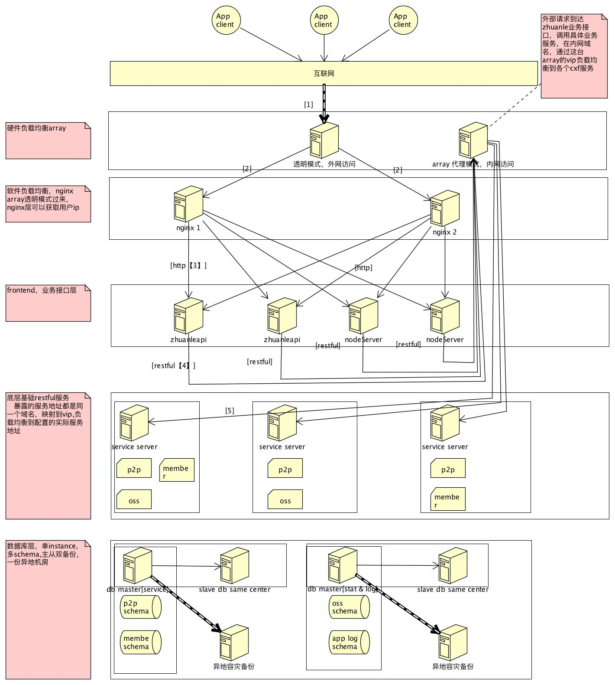

#基本架构
##项目结构
*   p2p-facade,业务接口以及相关参数定义
    -   业务接口
    -   请求，响应参数
*   p2p-service，业务接口实现

##技术结构
*   数据库
    -   数据源 , Druid
    -   orm ,mybatis
*   统计
    -   Prometheus
*   Apache CXF = Celtix + XFire ,org.apache.cxf
    -   
*   web,restful webservice
*   swagger
    -   restful api 规范
    -   scan config : <bean id="swaggerConfig" class="io.swagger.jaxrs.config.BeanConfig">
    -   message body write provider： <bean class="io.swagger.jaxrs.listing.SwaggerSerializers" />
    -   service： <bean id="swaggerResource" class="io.swagger.jaxrs.listing.ApiListingResource" />
*   缓存，redis

##服务部署
*   supervisord启动
*   运行在tomcat容器中，整合spring 通过CXF提供restful服务
*   架构图

##服务器硬件结构
*   array负载均衡
    -   Array APV是属于应用前端加速产品的设计方向，当数据包到达array时，通过使用SpeedStack技术，即一次处理数据所有功能，使数据处理效率与速度大大提高。
*    array负载均衡设备支持三种转发模式：
    -    Reverse Proxy Mode（反向代理模式）
        +    Array APV 的反向代理模式是指负载均衡接收到用户的请求后，以代理的方式转发给内部的服务器。因此，与后台服务器建连的源地址为APV的接口地址。反向代理模式下，无需对原有网络进行额外调整，同时结合TCP连接服用技术，对应用性能进行优化，但是不好的地方就是在服务器那里看不到客户端的IP地址，无法分析数据
    -   Transparent Mode (透明模式)
        +   Array APV的透明模式是指 Array APV 在转发用户请求时，透明地将客户端的连接定向到特定的服务器上，即用户的源 IP 地址对服务器是透明的，服务器可以知道哪个客户对其进行了访问。透明模式实现时，服务器可以记录下哪些 IP 地址的客户端曾经进行过访问。但这种方式实现时结构和路由设计必须保障服务器端对源地址来的响应必须经过 APV，同时由于每个请求的源 IP 地址都不一样，因此无法利用连接池技术进行优化。
    +   Triangle Mode（三角模式）
        *   该模式需要服务器配置loopback地址，该地址和负载均衡器上的VIP地址一样。客户请求到array时，请求被抛给服务器，服务器处理后，直接返回给用户，不经过array了。通常是视频应用会使用该技术，可以减少array的开销。

##业务结构
*   action（facade） -> service -> dao
*   XXXVo 
    -   service 层返回对象
*   XXXDto
    -   facade 层请求返回对象
*   XXXEntity
    -   dao 层请求、返回对象

##应用监控模块
###[prometheus](https://prometheus.io/)
*   业务监控
*   实现功能：
    -   多维度数据模型（时间序列指标，键值对）
    -   灵活的查询语言查询这些维度
    -   不依赖分布式存储
    -   通过http拉取时间序列数据集合
    -   支持立即推送数据集合
    -   多种模式的图表和仪表板支持
*   实现组件：
    -   main Prometheus server，聚集并存储时间序列数据
    -   client libraries for instrumenting application code
    -   push gateway 支持实时任务
    -   special-purpose exporters (for HAProxy, StatsD, Graphite, etc.)
    -   通知管理
*   适用环境：
    *   适合记录时间序列的纯数字
    *   快速诊断错误
*   不适用环境：
    *   高精度情况，因为收集的数据可能不会详细和完整不够  
*   http://www.cnblogs.com/vovlie/p/Prometheus_CONCEPTS.html
*   应用：
    -   PrometheusStatsFilter，统计收集信息
        +   请求异常次数
        +   uri请求区间
    -   MetricsServlet，提供拉取数据的接口

###sentry 日志监控

##业务模块
*   基础服务

##项目模块
*   hry-openapi
    -   第三方合作接口接入
*   p2p，标的管理
    +   运营
        +   发标，审核，修改标的
    +   投资用户
        *   查询标的，购买标的
    +   融资人
        *   某个标的融资收款，某个标的还款
*   payment,支付相关查询业务，只有查询相关的业务，下单业务
*   member,金融会员
    -   基金相关信息查询
        +   开户，购买基金，提现
    -   金融会员相关信息
        +   会员登录，验证
        +   推广信息
        +   会员消息管理
        +   会员注册，认证，绑定
*   fund,就一个接口？判断是否开通基金账户，废弃
*   oss,运营管理，运营，内部接口
    -   活动运营管理
        +   返卷，签到，理财金，加速收益
    -   推广
    -   会员等级
*   operation,咨询管理，运营，内部接口，废弃
*   ocp,存管业务
    -   通过跨界通

##问题
*   facade没有事务控制，原子性如何保证
*   购买的标的到期了，投资用户取回收益属于哪个业务模块

##事务管理

##缓存使用

##配置中心appolo

